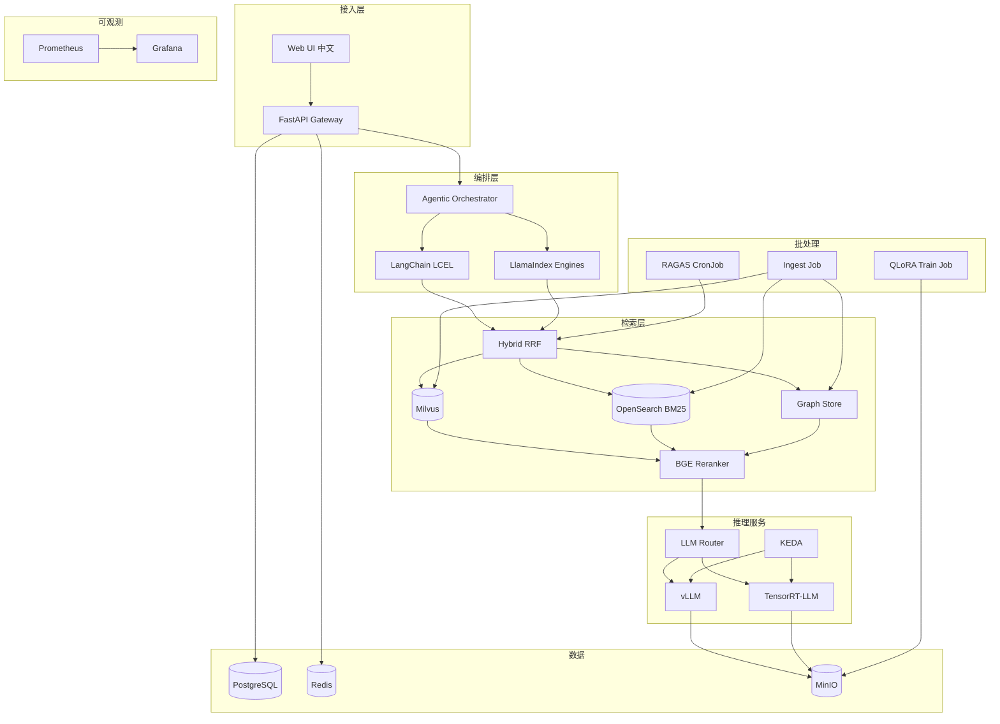
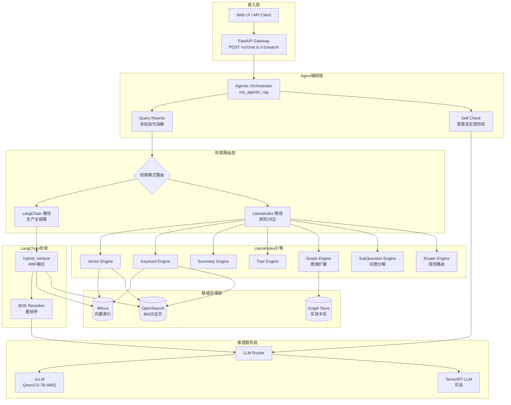
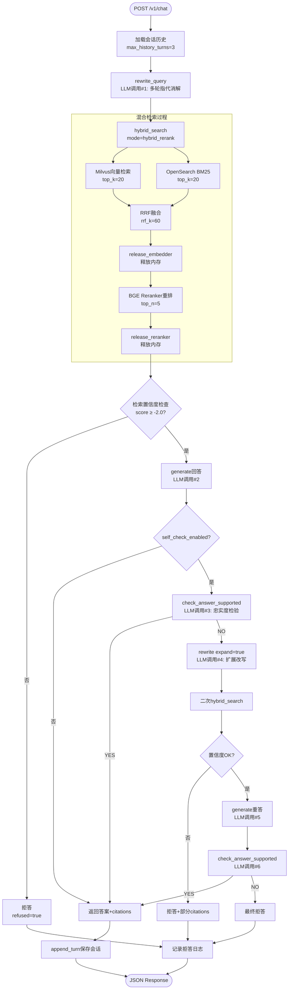

# 系统架构

**M0 详解**（双路径、profile、Compose、K8s）：[m0_infra.md](./m0_infra.md)

## 1. 总览

IndustrialOps-RAG 采用分层微服务形态，Kubernetes 为最终运行环境；本地通过 `dev-single-node` profile 在单节点上启用**全部组件**（通过资源 limits 与 GPU 互斥保证可启动）。



## 2. 请求时序（问答）

1. `POST /v1/chat` 携带 `session_id`, `query`
2. Gateway 加载会话历史（PostgreSQL）
3. Agent：query rewrite（多轮指代）
4. Router：选择 LangChain 路径 / LlamaIndex 路径 / 混合
5. Hybrid 检索：Milvus(top_k) + OpenSearch(top_k) → RRF → Rerank(top_n)
6. 可选 Graph 扩展（故障码/部件关系）
7. Prompt 组装：系统提示 + few-shot + CoT 模板 + contexts
8. LLM Router → 当前 active backend（vLLM 或 TRT）
9. Self-check：是否被 context 支持；不支持则拒答或二次检索
10. 响应：答案 + citations + `retrieval_log_id`
11. 异步写入检索日志供排查

**M3 详解**（流程图、拒答、多轮、verify_m3）：[m3_agent.md](./m3_agent.md)

## 3. 双编排分工

### 3.1 框架职责对比

| 框架 | 职责 |
|------|------|
| **LangChain** | 生产主链路：Agent、Tools、LCEL、与 Gateway 集成 |
| **LlamaIndex** | 检索模式研究与对比：Vector/Summary/Tree/Graph/Router/SubQuestion |

两路检索结果可在 Router 层融合或 A/B 评测（见 [m2_retrieval.md](./m2_retrieval.md)）。

**M2 详解**（hybrid_rerank、RRF、verify_m2）：[m2_retrieval.md](./m2_retrieval.md)

### 3.2 双框架协作架构图



### 3.3 LangChain 生产链路详细流程

M3 Agent 固定使用 `hybrid_rerank` 模式的完整流程：



**关键特点：**
- **正常路径**：3次LLM调用 + 1次CPU检索
- **自检失败重试**：最多6次LLM调用
- **内存优化**：embedder和reranker分时加载（16GB RAM限制）
- **耗时**：本机单次chat约数分钟（含模型加载卸载）

详见 [m3_agent.md](./m3_agent.md)。

## 4. 推理双引擎

| 引擎 | 角色 |
|------|------|
| **vLLM** | 日常开发、动态 batching、OpenAI 兼容 API |
| **TensorRT-LLM** | 编译引擎、低延迟对比、生产路径演示 |

`mutual_exclusive_gpu: true` 时同一时刻仅一个 Deployment 占用 GPU（KEDA 或 Helm 开关切换）。

**M4 详解**（流程图、压测、KEDA、vLLM↔TRT 切换）：[m4_serving.md](./m4_serving.md)

## 5. 数据流（Ingest）

**M1 详解**（流程图、参数、verify）：[m1_ingest.md](./m1_ingest.md)

```
原始文档(PDF/MD/DOCX)
  → deepdoc 解析（RAGFlow 思路：版面/表格）— M1 当前为 md/txt
  → 切块 + 中文 metadata(device_model, fault_code, ...)
  → Embedding(bge-m3) → Milvus
  → 全文/BM25 索引 → OpenSearch
  → 实体关系抽取 → Graph Store
```

## 6. 安全与可用性（逻辑生产）

- liveness / readiness 探针
- PDB：`minAvailable: 1`（推理服务）
- NetworkPolicy：仅 Gateway 访问 Milvus/OpenSearch
- 限流：Gateway 层 QPS（`apps/rate_limit.py` + Redis）
- SLO 文档化：单机为 dev SLO；生产 overlay 目标 99.9%

## 7. 配置入口

- Profile：`deploy/profiles/dev-single-node.yaml`
- Helm values：`deploy/helm/industrial-ops-rag/values-dev-single-node.yaml`
- 环境变量：`.env`（由 `.env.example` 复制）
