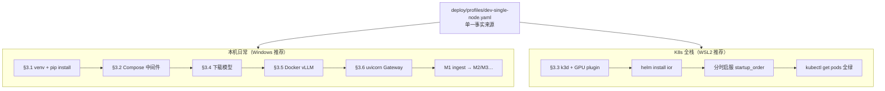

# M0 — 基础设施、Profile、Compose 与 K8s/Helm

> **学习入口**：M0 双路径（本机 Compose vs K8s 全栈）、启服顺序、验收集中在此。  
> **操作命令**：[COLLABORATION.md](./COLLABORATION.md) §3.1–3.3、§3.5。  
> **下游 M1**：[m1_ingest.md](./m1_ingest.md)（依赖 Compose 中 Milvus + OpenSearch）。

---

## 1. M0 解决什么问题？

| 里程碑 | 关注点 | 典型问题 |
|--------|--------|----------|
| **M0** | 基础设施 | Python 环境、中间件、Profile、K8s 骨架、GPU 能否推理？ |
| **M1** | 数据入库 | ingest 进 Milvus/OpenSearch |

M0 **原则**：架构组件 **不删减**，仅通过 `deploy/profiles/*.yaml` 调参；本机 6GB 用 **Compose 子集 + Docker vLLM**，K8s 路径用于 **全栈演示与生产对齐**。

---

## 2. 两条开发路径



| 路径 | 何时用 | M0 验收 |
|------|--------|---------|
| **Compose + Docker vLLM** | 日常 M1–M4 开发、16GB RAM | `verify_m0.py` Compose + 可选 vLLM |
| **k3d + Helm** | 面试演示、K8s 学习、生产对齐 | `kubectl get pods` 分时全绿 |

---

## 3. 模块与文件地图

```
deploy/profiles/dev-single-node.yaml   ← 资源、启服顺序、组件开关（L5 注释）
deploy/profiles/production.yaml        ← 生产数值 overlay
deploy/compose/docker-compose.yml      ← 本地中间件
deploy/helm/industrial-ops-rag/        ← K8s 模板（gateway/vllm/trt/keda）
scripts/load_profile.py                ← 校验 profile YAML
scripts/verify_m0.py                   ← M0 验收（Compose/Profile）
.env.example → .env                      ← 连接串与端口
serving/vllm/README.md                   ← Docker vLLM 参数（§3.5）
k8s-learning/checklist.md              ← K8s 能力打卡
```

---

## 4. Profile：单一事实来源

`dev-single-node.yaml` 驱动：

- Compose / Helm **资源 limits** 对齐
- `startup_order` **分时启服**（防 OOM）
- `llm` / `embedding` / `keda` 等后续里程碑参数

```powershell
python scripts/load_profile.py dev-single-node
```

### 4.1 `startup_order`（K8s 分时启服）


**本机 Compose**：`docker compose up -d` 一次拉起中间件；**vLLM 单独 Docker**（不占 Compose 网络亦可，localhost 互通）。

**勿同时**：vLLM Docker + QLoRA 训练 + TRT 编译（GPU/RAM 互斥，见 [m4_serving.md §3.2](./m4_serving.md#32-vllm--tensorrt-llm-分时切换6gb-单卡)）。

### 4.2 `cluster` / `gpu` 段

| 字段 | dev 值 | 含义 |
|------|--------|------|
| `kubernetes_distribution` | k3d | 亦可选 kind / minikube |
| `gpu.count` | 1 | 单卡 |
| `gpu.vram_gb` | 6 | RTX 3060 参考 |
| `gpu.mutual_exclusive_gpu` | true | vLLM/TRT 不同时占 GPU |

### 4.3 `services.*` 段

各组件 `enabled: true` + `requests/limits_memory` — **架构全保留**，仅数值压缩。与 Helm `values-dev-single-node.yaml` 同步修改。

---

## 5. Compose 中间件（§3.2）

```powershell
docker compose -f deploy/compose/docker-compose.yml up -d
docker compose -f deploy/compose/docker-compose.yml ps
```

| 服务 | 容器名 | 端口 | M1 需要 |
|------|--------|------|---------|
| PostgreSQL | ior-postgresql | 5432 | M6+ 会话持久化 |
| Redis | ior-redis | 6379 | Gateway 限流占位 |
| MinIO | ior-minio | 9000/9001 | Milvus 后端 |
| etcd | ior-etcd | — | Milvus 元数据 |
| **Milvus** | ior-milvus | **19530** | **M1 必须** |
| **OpenSearch** | ior-opensearch | **9200** | **M1 必须** |

验证：

```powershell
curl http://localhost:9200
```

**省资源**：Compose 未起 vLLM；LLM 用 [serving/vllm/README.md](../serving/vllm/README.md) Docker 单独跑。

---

## 6. K8s + Helm（§3.3）

### 6.1 k3d 创建集群

```powershell
k3d cluster create industrial-rag --agents 1 --gpus 1
kubectl cluster-info
```

| 参数 | 作用 |
|------|------|
| `--agents 1` | 单 worker |
| `--gpus 1` | GPU 透传（WSL2 + NVIDIA 容器工具链） |

**Windows 原生 Docker Desktop**：GPU 透传行为因版本而异；**M0 K8s 建议在 WSL2 Ubuntu 内执行**。

### 6.2 NVIDIA Device Plugin

vLLM Pod `Pending` 且 `nvidia.com/gpu` 不可调度时：

```bash
kubectl apply -f https://raw.githubusercontent.com/NVIDIA/k8s-device-plugin/v0.14.5/nvidia-device-plugin.yml
kubectl -n kube-system rollout status daemonset/nvidia-device-plugin-daemonset
```

### 6.3 Helm 安装

```powershell
helm upgrade --install ior ./deploy/helm/industrial-ops-rag `
  -f ./deploy/helm/industrial-ops-rag/values-dev-single-node.yaml `
  -n industrial-ops --create-namespace
```

| 模板 | 组件 |
|------|------|
| `gateway-deployment.yaml` | FastAPI Gateway |
| `vllm-deployment.yaml` | vLLM 推理 |
| `tensorrt-llm-deployment.yaml` | TRT（默认 replicas=0） |
| `keda-scaledobject-vllm.yaml` | 扩缩（dev max=1） |

**ImagePullBackOff**：Chart 默认占位镜像，需本地 build 或改 values；M0 可先以 **Compose 路径** 完成 M1–M4。

### 6.4 M0 K8s 验收

```powershell
kubectl -n industrial-ops get pods
```

目标：按 `startup_order` 分时启服后 **Running/Completed**；GPU 服务同时只启 vLLM 或 TRT 之一。

---

## 7. Python 环境与模型（§3.1、§3.4）

```powershell
python -m venv .venv
.\.venv\Scripts\activate
pip install -e ".[dev]"
copy .env.example .env
```

| 模型 | 用途 | 本地路径 |
|------|------|----------|
| Qwen2.5-7B-Instruct-AWQ | vLLM | `models/Qwen2.5-7B-Instruct-AWQ` |
| bge-m3 | ingest/检索 | `models/bge-m3` |
| bge-reranker-v2-m3 | rerank | `models/bge-reranker-v2-m3` |

下载命令见 COLLABORATION §3.4（用户本机跑，省对话 token）。

---

## 8. vLLM 单条通（M0 推理验收）

```powershell
curl http://localhost:8000/v1/models
```

Docker 启动见 [serving/vllm/README.md](../serving/vllm/README.md) 与 COLLABORATION §3.5。  
返回 JSON 含 `model id` → 写入 `.env` 的 `VLLM_MODEL`。

---

## 9. 验收 `verify_m0.py`

```powershell
# 本机 Compose 路径（默认）
python scripts/verify_m0.py --write-report

# 含 vLLM 探活
python scripts/verify_m0.py --check-vllm --write-report

# Compose 未起时只验 profile
python scripts/verify_m0.py --skip-compose --write-report
```

| 参数 | 作用 |
|------|------|
| `--skip-compose` | 跳过 OpenSearch/Milvus HTTP 检查 |
| `--check-vllm` | 额外 GET `VLLM_BASE_URL/models` |
| `--write-report` | 写 `reports/m0_verify.json` |

| 用例 | 验证什么 |
|------|----------|
| profile | `startup_order`、关键 services enabled |
| opensearch | `:9200` 可达 |
| milvus | `:19530` 可达 |
| vllm | （可选）OpenAI /v1/models |

**K8s 全绿**仍用 `kubectl get pods` 人工验收（脚本打印提醒）。

---

## 10. 与 M1 的衔接


M0 不必等 K8s 全绿即可进入 M1（只需 Milvus + OpenSearch）。

---

## 11. M0 验收清单

**本机 Compose 路径（最低）**

- [ ] `pip install -e ".[dev]"` + `.env`
- [ ] `docker compose up -d` → OpenSearch/Milvus 可达
- [ ] `python scripts/verify_m0.py --write-report`
- [ ] （可选）Docker vLLM + `curl :8000/v1/models`

**K8s 路径（扩展）**

- [ ] k3d + device plugin
- [ ] `helm upgrade --install ior ...`
- [ ] `kubectl -n industrial-ops get pods` 分时全绿

---

## 12. 相关文档

- [milestones/README.md](./milestones/README.md) — 文档分层约定
- [deploy/compose/README.md](../deploy/compose/README.md) — Compose 速查
- [deploy/helm/industrial-ops-rag/README.md](../deploy/helm/industrial-ops-rag/README.md) — Helm 速查
- [k8s-learning/checklist.md](../k8s-learning/checklist.md) — K8s 打卡
