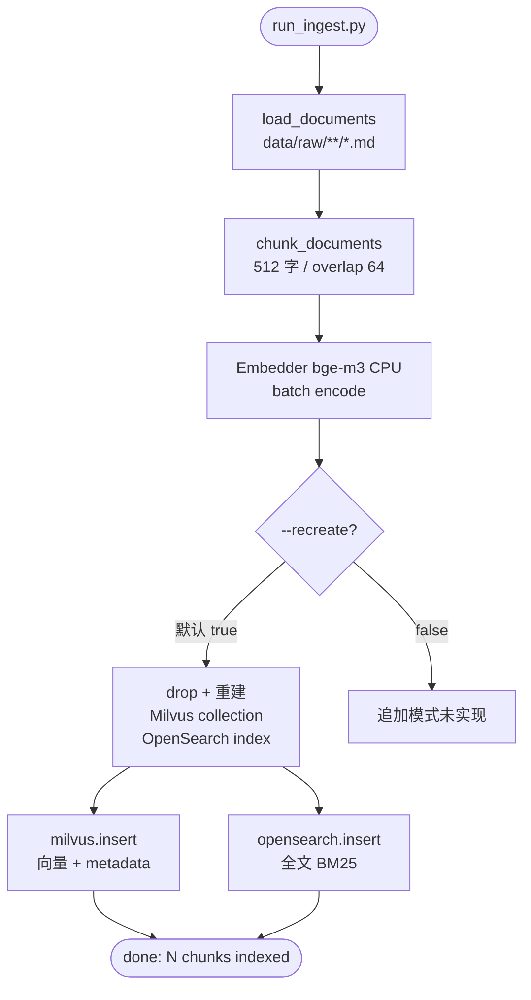

# M1 — 语料 Ingest、Milvus + OpenSearch、metadata 中文

> **学习入口**：M1 入库链路、索引结构、验收集中在此。  
> **前提 M0**：[m0_infra.md](./m0_infra.md)（Compose Milvus + OpenSearch）。  
> **操作命令**：[COLLABORATION.md](./COLLABORATION.md) §3.7。
> **指标演进**：ingest 通过后 `--write-evolution` 写入 [evolution.md](./evolution.md)。  
> **下游 M2**：[m2_retrieval.md](./m2_retrieval.md)（混合检索依赖本里程碑索引）。

---

## 1. M1 解决什么问题？

| 里程碑 | 关注点 | 典型问题 |
|--------|--------|----------|
| **M0** | 基础设施 | Compose / K8s 能否起来？ |
| **M1** | 数据入库 | 文档能否切块、双向量化索引、中文 metadata？ |
| **M2** | 检索策略 | 向量/BM25/混合谁更好？ |

M1 **不需要 vLLM**；验收只测 **Milvus 向量** 与 **OpenSearch BM25** 各自 Top5 能否命中期望文档。

---

## 2. 模块与文件地图

```
pipelines/ingest/run_ingest.py     ← CLI 入口
pipelines/ingest/documents.py      ← 加载 data/raw 下 md/txt
pipelines/ingest/chunker.py        ← 中文友好切块
pipelines/ingest/indexer.py        ← Embedder + Milvus + OpenSearch
pipelines/ingest/deepdoc/          ← PDF/表格解析（占位，后续扩展）
scripts/verify_m1.py               ← 10 题 Top5 验收
data/raw/                          ← 原始语料（示例 3 篇 MD）
deploy/compose/docker-compose.yml  ← Milvus + OpenSearch 等中间件
.env / apps/config.py              ← MILVUS_* / OPENSEARCH_* 连接
```

---

## 3. Ingest 流程图



### 3.1 双写索引（架构保留）

| 存储 | 内容 | M1 用途 |
|------|------|---------|
| **Milvus** | `embedding` + chunk metadata | 语义检索（verify 向量路） |
| **OpenSearch** | `text` 全文 + 相同 metadata | BM25（verify BM25 路） |

两路 **同一套 chunk**，保证 M2 hybrid/RRF 有对齐的 `chunk_id`。

### 3.2 Chunk metadata 字段

| 字段 | 示例 | 说明 |
|------|------|------|
| `chunk_id` | `samples/pump_p101_manual#0` | 主键 |
| `doc_id` | `samples/pump_p101_manual` | 逻辑文档 ID |
| `source_file` | `samples/pump_p101_manual.md` | **验收命中依据**（verify 比对此字段） |
| `title` | 首行 `# 标题` 或文件名 | 中文标题 |
| `chunk_index` | 0, 1, 2… | 文档内顺序 |
| `text` | 切块正文 | 中文运维内容 |

---

## 4. 语料准备

### 4.1 目录约定

```
data/raw/
  samples/                   ← python scripts/seed_demo_corpus.py 从 data/corpus/demo 复制
    pump_p101_manual.md      ← 离心泵 P-101
    reactor_r201_sop.md      ← 反应釜 R-201
    compressor_sa01_fault_codes.md  ← 空压机 SA-01
    heat_exchanger_e301_manual.md   ← 换热器 E-301
    conveyor_cv110_sop.md    ← 皮带机 CV-110
```

- 支持后缀：`.md` / `.txt` / `.markdown`
- 跳过 `README.md`；空文件跳过
- 自有语料：放入 `data/raw/` 任意子目录即可

### 4.2 中文切块参数（`chunker.py`）

| 参数 | 默认 | 作用 |
|------|------|------|
| `chunk_size` | 512 | 字符数上限（非 token） |
| `chunk_overlap` | 64 | 相邻块重叠，避免句断 |
| `separators` | `\n\n`, `\n`, `。`, `！`, `？`… | 优先在段落/句号处切 |

**场景**：故障码表、点检条目较长时可略增 `chunk_size`；需与 M3 `max_model_len` 总 context 协调。

---

## 5. `run_ingest.py` 参数

```powershell
python pipelines/ingest/run_ingest.py --input data/raw --batch-size 8
```

| 参数 | 默认 | 作用 | 何时改 |
|------|------|------|--------|
| `--input` | `data/raw` | 原始文档根目录 | 自有语料路径 |
| `--batch-size` | 8 | embedding 批大小 | OOM 降到 4；CPU 慢可保持 8 |
| `--recreate` | **true** | 重建 Milvus/OpenSearch | 增量入库需 false（当前未实现追加逻辑，改语料后建议 true 全量重建） |
| `--no-recreate` | — | 关闭重建 | 仅当索引空且手动管理时用 |

**成功标志**：终端输出 `[ingest] done: N chunks indexed`。

**模型路径**：优先 `models/bge-m3/` 本地目录，否则 HuggingFace `BAAI/bge-m3`（需 §3.4 下载）。

**日志**（省 token）：

```powershell
python pipelines/ingest/run_ingest.py --input data/raw 2>&1 | Tee-Object -FilePath reports\ingest_last.log
```

---

## 6. 前提：中间件（Compose）

M1 ingest **依赖** Milvus + OpenSearch 已启动（M0 Compose 子集）：

```powershell
docker compose -f deploy/compose/docker-compose.yml up -d
docker compose -f deploy/compose/docker-compose.yml ps
```

| 服务 | 端口 | 环境变量 |
|------|------|----------|
| Milvus | 19530 | `MILVUS_HOST`, `MILVUS_PORT`, `MILVUS_COLLECTION` |
| OpenSearch | 9200 | `OPENSEARCH_HOST`, `OPENSEARCH_PORT`, `OPENSEARCH_INDEX` |

默认 collection/index 名见 `.env.example`：`industrial_ops_chunks` / `industrial_ops_bm25`。

验证：

```powershell
curl http://localhost:9200
# Milvus 需客户端或 ingest 成功即说明可达
```

---

## 7. 验收 `verify_m1.py`

### 7.1 逻辑

- 内置 **10 题**（与 M2 golden 同源语料），每题期望命中某 `source_file`
- 分别跑 **Vector Top5**（Milvus）与 **BM25 Top5**（OpenSearch）
- **通过线**：向量路与 BM25 路 **各自** ≥ **8/10**

### 7.2 命令参数

| 参数 | 默认 | 作用 |
|------|------|------|
| `--output` | `reports/m1_verify.json` | JSON 报告 |
| `--write-evolution` | off | 追加一行到 `docs/evolution.md` |

```powershell
python scripts/verify_m1.py --write-evolution
```

**不需要 Gateway / vLLM**；脚本直连 Milvus + OpenSearch + 本地 embedder。

### 7.3 报告解读

终端示例：

```
Vector Top5: 10/10
BM25 Top5:  10/10
M1 验收: PASS (各路需 ≥8/10)
```

FAIL 时会打印未命中题的 `vector top1` / `bm25 top1` 便于排查（切块、语料缺失、索引未 ingest）。

---

## 8. 与 M0 / M2 的关系


| | M1 | M2 |
|--|----|----|
| 测什么 | 单路 vector / bm25 | hybrid + rerank + router |
| 脚本 | `verify_m1.py` | `verify_m2.py` |
| 数据集 | 脚本内置 10 题 | `m2_golden.jsonl` |

---

## 9. 扩展占位（非 M1 必做）

| 模块 | 路径 | 计划 |
|------|------|------|
| DeepDoc | `pipelines/ingest/deepdoc/` | PDF 版面、故障码表按行切（RAGFlow 思路） |
| 多模态 | `pipelines/ingest/multimodal/` | 图片页 OCR POC |

当前 M1 验收 **仅 md/txt** 路径即可 PASS。

---

## 10. M1 验收清单

- [ ] `.env` 已从 `.env.example` 复制
- [ ] `models/bge-m3` 已下载（或 HF 可拉取）
- [ ] Compose：`Milvus` + `OpenSearch` healthy
- [ ] `python pipelines/ingest/run_ingest.py --input data/raw`
- [ ] `python scripts/verify_m1.py --write-evolution` → 两路 ≥8/10
- [ ] （可选）检查 `reports/m1_verify.json`

---

## 11. 相关文档

- [architecture.md §5](./architecture.md) — 数据流 Ingest 总览
- [pipelines/ingest/README.md](../pipelines/ingest/README.md) — 目录速查
- [scaling-data.md](./scaling-data.md) — 语料规模扩展
