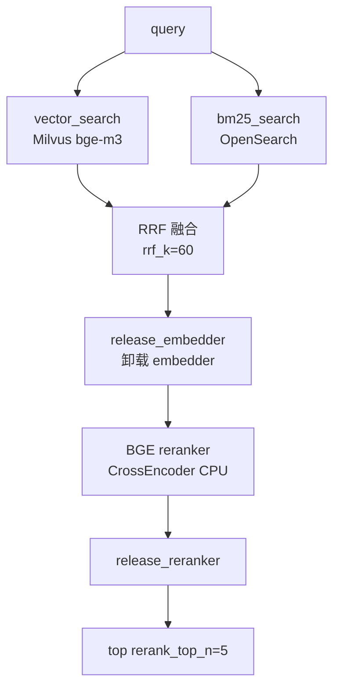
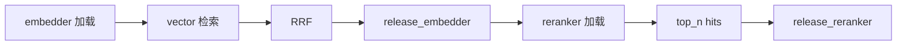
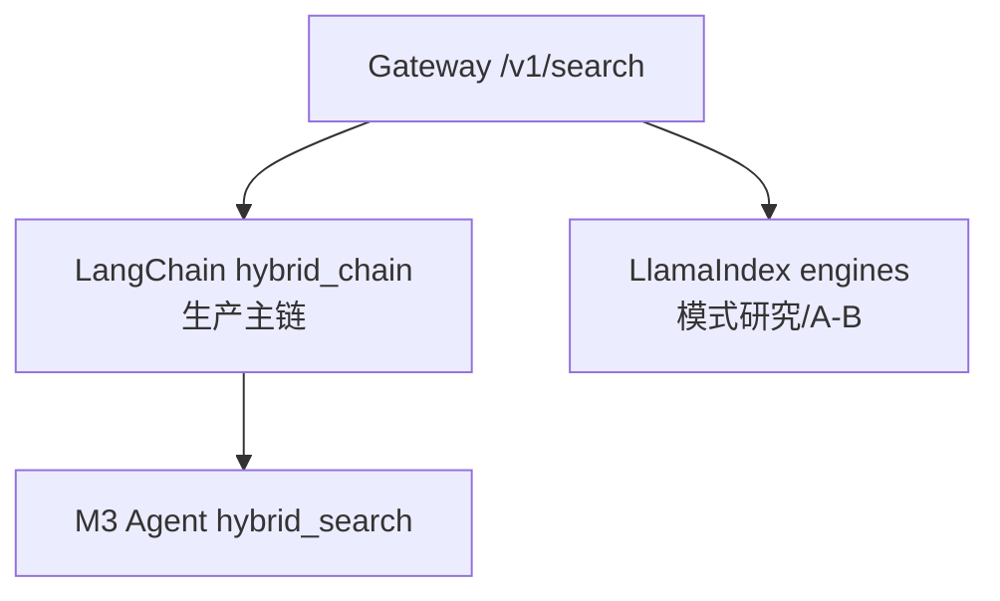

# M2 — 混合检索、RRF、Rerank 与 LlamaIndex 全模式

> **学习入口**：M2 检索链路、模式对比、验收集中在此。  
> **指标演进表**（Recall@5 / P95）：[retrieval_modes.md](./retrieval_modes.md)。  
> **操作命令**：[COLLABORATION.md](./COLLABORATION.md) §3.7.1。  
> **下游 M3**：Agent 固定用 `hybrid_rerank`，见 [m3_agent.md](./m3_agent.md)。

---

## 1. M2 解决什么问题？

| 里程碑 | 关注点 | 典型问题 |
|--------|--------|----------|
| **M1** | 数据进索引 | ingest 后 Milvus/OpenSearch 能否命中？ |
| **M2** | 检索策略 | 向量、BM25、混合、Rerank 谁更好？LlamaIndex 各模式如何对比？ |
| **M3** | Agent | 在 M2 最优链路上加改写、生成、拒答 |

M2 **不调用 LLM**（`sub_question` 等可扩展 LLM）；验收看 **Recall@5** 与 **P95 延迟**。

---

## 2. 模块与文件地图

```
apps/retrieval/core.py              ← vector_search / bm25_search / ChunkHit
apps/retrieval/hybrid/merge.py      ← hybrid_retrieve（双路 + RRF）
apps/retrieval/hybrid/rrf.py        ← reciprocal_rank_fusion
apps/retrieval/langchain/hybrid_chain.py  ← retrieve_context 主入口
apps/retrieval/rerank/bge_reranker.py     ← BGE CrossEncoder rerank
apps/retrieval/llamaindex/*.py      ← Vector/Summary/Tree/Graph/Router/SubQuestion
apps/gateway/main.py                ← POST /v1/search 多 mode 分发
scripts/verify_m2.py                ← 10 题 golden × 5 模式对比
data/eval/m2_golden.jsonl           ← M2 评测集（question + doc_ids）
tests/test_rrf.py                   ← RRF 单元测试
deploy/profiles/dev-single-node.yaml  ← retrieval.* / rerank.*
```

---

## 3. 生产主链路：hybrid_rerank

M3 Agent 与 Gateway 默认生产路径均为 **hybrid → RRF → BGE rerank**。



### 3.1 各阶段说明

| 阶段 | 存储 | 模型 | top_k 来源 |
|------|------|------|------------|
| Vector | Milvus | bge-m3（CPU） | `retrieval.vector_top_k`（20） |
| BM25 | OpenSearch | 内置 BM25 | `retrieval.bm25_top_k`（20） |
| RRF | 内存 | 无 | 融合后取 `rerank_top_n * 3` 条进 rerank |
| Rerank | CPU | bge-reranker-v2-m3 | 输出 `rerank.top_n` / `rerank_top_n`（5） |

### 3.2 RRF 公式（通俗）

两路排名列表里，每个 chunk 得分 += `1 / (k + rank)`，`k` 默认 60。  
**直觉**：在 vector 和 BM25 都靠前的 chunk 总分更高，缓解单路偏科。

### 3.3 exclusive 内存（与 M3 相同）

16GB RAM 不能同时常驻 embedder 与 reranker：



**勿改 release 逻辑**（防 OOM）。`hybrid_rerank` P95 在本机可达 **数秒～十余秒**（含两次模型加载）。

---

## 4. 检索模式一览

### 4.1 LangChain 路径（生产 + verify_m2 前四模式）

| mode | 路径 | rerank | 适用场景 |
|------|------|--------|----------|
| `vector` | Milvus 语义 | 否 | 现象描述、口语化问法 |
| `bm25` / `keyword` | OpenSearch 关键词 | 否 | 故障码、型号、精确词 |
| `hybrid` | RRF 融合 | 否 | 对比 RRF 增益 |
| **`hybrid_rerank`** | RRF + BGE | **是** | **M3 默认 / M2 验收口径** |

### 4.2 LlamaIndex 路径（研究 / Gateway 扩展 mode）

| mode | 模块 | 说明 |
|------|------|------|
| `vector` | `vector_engine.py` | 封装 `core.vector_search` |
| `bm25` | `keyword_engine.py` | 封装 `core.bm25_search` |
| `summary` | `summary_engine.py` | 章节级 summary 索引粗召回 |
| `tree` | `tree_engine.py` | 手册目录树检索 |
| `graph` | `graph_engine.py` | 部件/故障关系图谱 |
| `router` | `router_engine.py` | 规则路由：故障码→keyword，否则 hybrid_rerank |
| `sub_question` | `subquestion_engine.py` | 复杂问题拆子问 |

**Router 规则**（`router_engine.py`）：匹配 `E01`、`ALM-101`、`故障码 xxx` 等 → 优先 BM25；否则走 hybrid_rerank。

### 4.3 双编排分工



| 框架 | M2 角色 |
|------|---------|
| **LangChain** | hybrid + RRF + rerank，M3 生产链 |
| **LlamaIndex** | 七种 QueryEngine；**graph** 已接 `relations.yaml` 1-hop 扩展 |

---

## 5. Gateway API：`POST /v1/search`

```json
{
  "query": "P-101 出口压力正常范围",
  "mode": "hybrid_rerank",
  "top_k": 5
}
```

| 字段 | 说明 |
|------|------|
| `mode` | 见 §4；默认 `hybrid_rerank` |
| `top_k` | 返回条数上限 1–50 |

响应 `hits[]`：`chunk_id`, `doc_id`, `source_file`, `title`, `text`, `score`, `retriever`。

**Windows**：用 `curl.exe` + UTF-8 JSON 文件，见 COLLABORATION §3.7.1。

---

## 6. Profile 配置（`retrieval` / `rerank` / `embedding`）

| 路径 | dev 默认 | 含义 | 何时改 |
|------|----------|------|--------|
| `retrieval.vector_top_k` | 20 | Milvus 召回数 | 增大提 recall、增延迟 |
| `retrieval.bm25_top_k` | 20 | OpenSearch 召回数 | 同上 |
| `retrieval.rrf_k` | 60 | RRF 平滑常数 | 越小 top 排名权重越大 |
| `retrieval.rerank_top_n` | 5 | 最终进下游 chunk 数 | M3 context 默认同源 |
| `rerank.top_n` | 5 | rerank 输出条数 | 与上对齐 |
| `embedding.device` | cpu | bge-m3 设备 | 6GB GPU 留给 LLM |
| `rerank.device` | cpu | reranker 设备 | 同上 |

---

## 7. 验收 `verify_m2.py`

### 7.1 评测逻辑

- 读 `data/eval/m2_golden.jsonl`（10 题）
- 每题：某 mode 检索 Top5，`source_file` 是否含期望 `doc_ids` 之一 → 命中
- **M2 通过线**：`hybrid_rerank` ≥ **8/10**

### 7.2 对比的 5 种 mode

| verify 名称 | 实现 |
|-------------|------|
| vector | `retrieve_context(..., mode=vector, rerank=False)` |
| bm25 | `mode=bm25` |
| hybrid | `mode=hybrid, rerank=False` |
| hybrid_rerank | `mode=hybrid_rerank` |
| router | `query_router` |

### 7.3 命令参数

| 参数 | 默认 | 作用 |
|------|------|------|
| `--golden` | `data/eval/m2_golden.jsonl` | 评测集路径 |
| `--output` | `reports/m2_verify.json` | JSON 报告 |
| `--write-evolution` | off | 回填 `retrieval_modes.md` 指标表 |

```powershell
# 前提：Compose 中间件 + ingest（M1）+ Gateway 可选（verify 直连 Python API）
python scripts/verify_m2.py --write-evolution
```

**排障**：`WinError 10055` 端口耗尽 → 停 python 进程、sleep 30s 再跑（COLLABORATION §3.7.1）。

### 7.4 golden 文件格式

```json
{"question": "P-101 出口压力正常范围是多少？", "doc_ids": ["pump_p101_manual.md"], "category": "parameter"}
```

| 字段 | 必填 | 说明 |
|------|------|------|
| `question` | 是 | 中文问句 |
| `doc_ids` | 是 | 期望命中的 source 文件名（可多个取 OR） |
| `category` | 否 | 题类标签，便于分析 |

与 `golden.jsonl`（RAGAS，含 `ground_truth`）**不是同一文件**。

---

## 8. 与 M1 / M3 的关系

| | M1 | M2 | M3 |
|--|----|----|-----|
| 脚本 | `verify_m1.py` | `verify_m2.py` | `verify_m3.py` |
| 指标 | 向量/BM25 各 ≥8/10 | hybrid_rerank ≥8/10 | 多轮+拒答+引用 |
| LLM | 无 | 无 | 有 |
| API | 直连 core | `retrieve_context` / `/v1/search` | `/v1/chat` |

---

## 9. M2 验收清单

- [ ] M1 ingest 完成 — 见 [m1_ingest.md §10](./m1_ingest.md#10-m1-验收清单)
- [ ] Compose：Milvus + OpenSearch 健康
- [ ] `pytest tests/test_rrf.py -q`
- [ ] `python scripts/verify_m2.py --write-evolution` → hybrid_rerank ≥8/10
- [ ] （可选）curl `/v1/search` 单条自测

---

## 10. 相关文档

- [architecture.md §3–4](./architecture.md) — 双编排与推理层分界
- [apps/retrieval/README.md](../apps/retrieval/README.md) — 目录速查
- [decisions.md](./decisions.md) — embedder/reranker 分时释放
