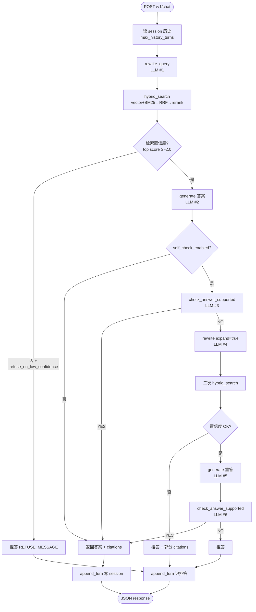
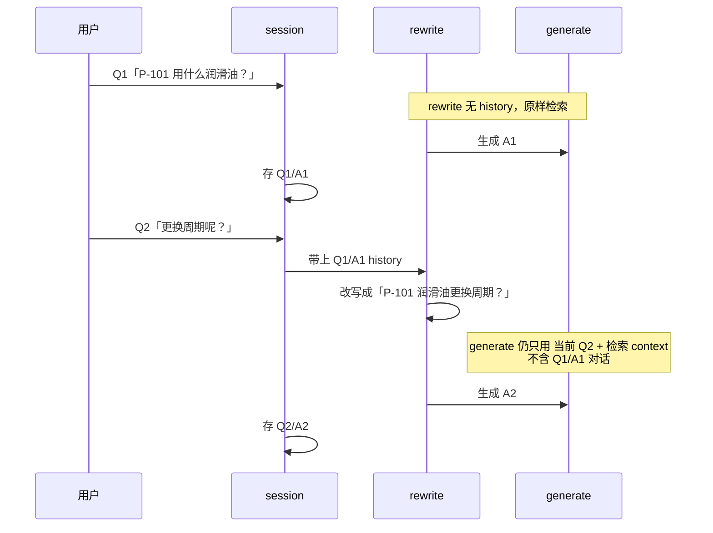
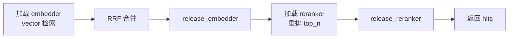

# M3 — Agentic RAG、多轮、拒答、引用

> **学习入口**：M3 流程、参数、验收用例集中在此。  
> **操作命令**：[COLLABORATION.md](./COLLABORATION.md) §3.7.2。  
> **检索基础**（M2）：[m2_retrieval.md](./m2_retrieval.md)（指标表 [retrieval_modes.md](./retrieval_modes.md)）。  
> **推理层**（M4）：[m4_serving.md](./m4_serving.md)（M3 慢常来自检索+多次 LLM，不是 M4 压测对象）。

---

## 1. M3 解决什么问题？

| 里程碑 | 关注点 | 典型问题 |
|--------|--------|----------|
| **M2** | 检索质量 | Top5 能否命中？各检索模式 Recall？ |
| **M3** | Agent 业务 | 能否多轮追问？库外能否拒答？答案有无引用？ |

M3 在 M2 的 `hybrid_rerank` 之上，增加 **改写 → 生成 → 自检 → 拒答/二次检索** 的 Agent 管道，通过 `POST /v1/chat` 对外服务。

---

## 2. 模块与文件地图

```
apps/agent/pipeline.py          ← 主管道 run_agentic_rag
apps/agent/rewrite.py           ← 多轮 query 改写（用 history）
apps/agent/session.py           ← 会话内存（M6+ 换 PostgreSQL）
apps/agent/prompts.py           ← 系统提示、拒答文案、context 格式化
apps/agent/tools/hybrid_search.py  ← 调 M2 hybrid_rerank
apps/agent/tools/self_check.py  ← 检索置信度 + 答案忠实度
apps/gateway/main.py            ← POST /v1/chat
apps/generation/prompts/system_zh.txt  ← 中文系统 prompt
scripts/verify_m3.py            ← M3 验收（你本机跑）
tests/test_agent_m3.py          ← 单元测试（无需 vLLM）
apps/web/demo_ui.py             ← Gradio 业务演示（M7）
deploy/profiles/dev-single-node.yaml  ← agent.* 配置
```

---

## 3. 主管道流程图

### 3.1 单次 `/v1/chat` 全链路



**记忆口诀**：

- **改写**用 history，**生成**默认不用 history（见 ADR）
- 正常路径约 **3 次 LLM** + **1 次 CPU 检索**；自检失败重试最多 **6 次 LLM**
- 本机 16GB + exclusive 检索：单次 chat **数分钟** 属预期

### 3.2 多轮追问时 history 怎么用？



| 阶段 | 是否用 session history | 原因 |
|------|------------------------|------|
| `rewrite_query` | **是** | 解析「更换周期呢？」等指代 |
| `generate`（默认） | **否** | 控制 prompt 长度；上下文靠检索 chunk |
| `generate`（`include_history_in_generation: true`） | 是 | 实验用，非默认 |

### 3.3 拒答的两条路径

| 路径 | 触发条件 | `refused` | `citations` |
|------|----------|-----------|-------------|
| **检索置信度低** | 无 hit 或 rerank score < -2.0 | true | `[]` |
| **自检不通过** | LLM 回答 YES/NO 判定为 NO（含二次检索仍失败） | true | 可能有（二次检索命中时） |

拒答固定文案见 `prompts.REFUSE_MESSAGE`（中文，提示勿凭猜测操作）。

---

## 4. CPU 检索「exclusive 不 warm」

16GB RAM 无法同时常驻 bge-m3 与 reranker。`hybrid_chain.py` 在 rerank 前 `release_embedder()`，结束后 `release_reranker()`。



**本机勿改** release 逻辑（防 OOM）。代价：每次 `/v1/chat` 都经历 **加载→推理→卸载**，故比 M2 单次 `/v1/search` 更慢。

**Gateway 建议单 worker**：`uvicorn ...` 默认单进程，避免多 worker 各载一份模型。

---

## 5. Profile 配置（`agent` 段）

| 字段 | dev 默认 | 含义 | 何时改 |
|------|----------|------|--------|
| `max_history_turns` | 3 | rewrite 可见最近 N 轮对话 | 指代更长可增；prompt 变长 |
| `include_history_in_generation` | false | 生成阶段是否拼接 history | 一般保持 false |
| `self_check_enabled` | true | 是否 LLM 质检答案 | 调试可关以省 1～3 次 LLM |
| `refuse_on_low_confidence` | true | 低 rerank 分直接拒答 | 关则易幻觉 |
| `context_top_k` | （缺省→`rerank_top_n`=5） | 进 prompt 的 chunk 数 | 勿为验收单独压到 1 |
| `max_chars_per_chunk` | （未设） | 单 chunk 截断字符 | context 超 `max_model_len` 时用 |

与 LLM context 对齐：`llm.backends.vllm.max_model_len`（本机 Docker 常用 2048）。

---

## 6. Gateway API

### `POST /v1/chat`

```json
{
  "session_id": "user-001",
  "query": "P-101 出口压力正常范围是多少？"
}
```

响应：

```json
{
  "answer": "...",
  "citations": [
    {"doc_id": "...", "chunk_id": "...", "source_file": "...", "title": "...", "score": 1.2}
  ],
  "retrieval_log_id": "uuid",
  "refused": false
}
```

| 字段 | 说明 |
|------|------|
| `session_id` | 同 ID 共享多轮 history（内存，重启 Gateway 丢失） |
| `citations` | 来自 rerank 后的 hits，非 LLM 编造 |
| `refused` | true 表示拒答路径 |
| `retrieval_log_id` | UUID；写入 `retrieval_logs`（file/PostgreSQL） |

**Windows 测 API**：用 `curl.exe` + UTF-8 JSON 文件，勿用 `Invoke-RestMethod`（易乱码）。见 COLLABORATION §3.7.2。

---

## 7. 验收脚本 `verify_m3.py`

### 7.1 三条用例

| Case | 别名 | 做什么 | 通过条件 |
|------|------|--------|----------|
| 1 | `in_domain` | 库内单问 | 未拒答且 `citations` 非空 |
| 2 | `followup` | 同 session 连续 3 问 | 第 3 答含 P-101/轴承等上下文 |
| 3 | `out_of_corpus` | A 股投资建议 | `refused: true` |

### 7.2 命令参数

| 参数 | 默认 | 作用 | 场景 |
|------|------|------|------|
| `--gateway` | `http://localhost:8080` | Gateway 地址 | 非默认端口时改 |
| `--timeout` | `1200` | **单次** chat 超时秒 | Case2 三次 chat 各算一次；超时加大 |
| `--case` | `all` | `1/2/3` 或 `in_domain/followup/out_of_corpus` | 分步验收、省时间 |
| `--write-report` | off | 写 `reports/m3_verify.json` | 留档 |

### 7.3 推荐验收顺序（本机 16GB）

```powershell
# 1. 健康检查
curl http://localhost:8080/v1/health

# 2. 最快：库内单问
python scripts/verify_m3.py --case 1 --write-report

# 3. 最慢：三轮追问（单独跑，timeout 默认 1200s/次）
python scripts/verify_m3.py --case 2 --write-report

# 4. 库外拒答
python scripts/verify_m3.py --case 3 --write-report
```

前提：Compose 中间件 + ingest + **vLLM Docker** + **Gateway 单 worker**。详见 COLLABORATION §3.2–3.7.2。

---

## 8. 自检与阈值

| 函数 | 文件 | 逻辑 |
|------|------|------|
| `check_retrieval_confidence` | `self_check.py` | 有 hit 且 top `score >= -2.0`（BGE rerank 原始分） |
| `check_answer_supported` | `self_check.py` | LLM 首行 YES/NO，判答案是否被 context 完全支持 |

`expand=True` 改写时多一句：「若指代不清，结合历史补全设备编号与故障上下文。」

---

## 9. 与 M2 / M4 的分工

| | M2 | M3 | M4 |
|--|----|----|-----|
| 入口 | `/v1/search` | `/v1/chat` | `benchmark_serving.py` |
| 检索 | 直接测 mode | Agent 内固定 hybrid_rerank | 不经过检索 |
| LLM | 无 | 改写+生成+自检（多次） | 单次流式压测 |
| 验收 | `verify_m2.py` | `verify_m3.py` | `verify_m4.py` |

---

## 10. Web UI

`apps/web/demo_ui.py` — Gradio 调 `/v1/chat` 与 `/v1/feedback`。M3 验收仍以 API + `verify_m3.py` 为准。

---

## 11. M3 验收清单

- [ ] ingest 完成（M1）
- [ ] vLLM + Gateway 已起
- [ ] `verify_m3 --case 1` PASS（库内+引用）
- [ ] `verify_m3 --case 2` PASS（3 轮追问）
- [ ] `verify_m3 --case 3` PASS（库外拒答）
- [ ] `pytest tests/test_agent_m3.py` 通过（无需 GPU）

---

## 12. 相关文档

- [architecture.md §2](./architecture.md) — 问答时序总览
- [decisions.md](./decisions.md) — 生成不含 history、embedder/reranker 分时释放
- [apps/agent/README.md](../apps/agent/README.md) — 组件级速查
