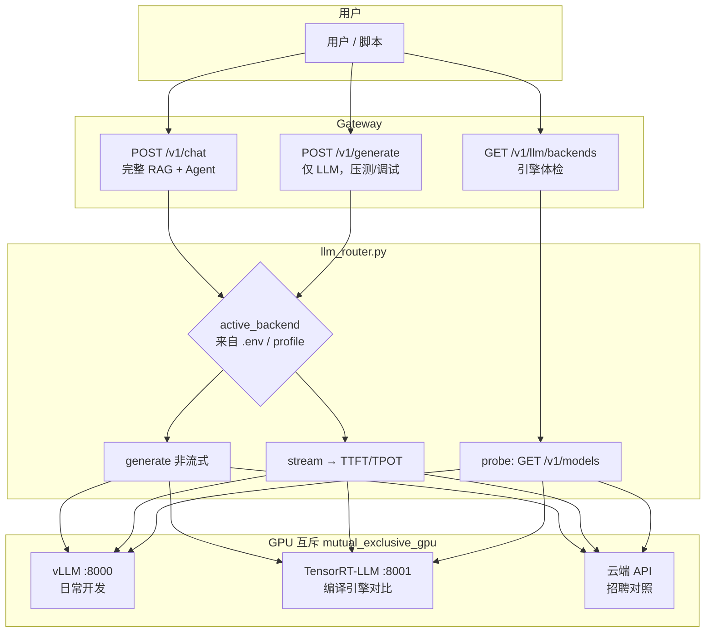
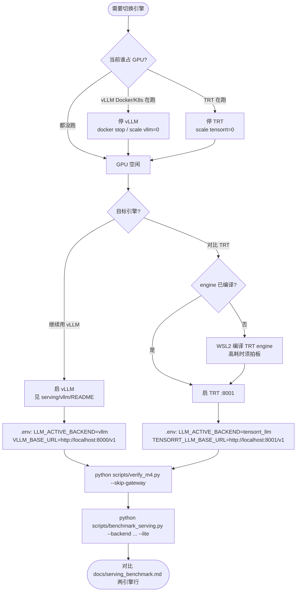
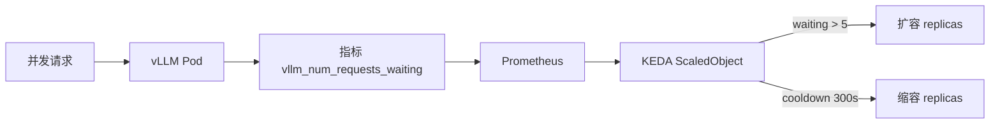

# M4 — 推理 Serving、Router、KEDA 与压测

> **学习入口**：M4 全部概念、流程图、参数说明集中在此。  
> **操作命令**：可复制步骤见 [COLLABORATION.md](./COLLABORATION.md) §3.7.3。  
> **压测结果表**： [serving_benchmark.md](./serving_benchmark.md)（跑 `--update-doc` 后自动回填）。  
> **后续里程碑**：M0–M3 将按同样层级补 `docs/m0_*.md` … `docs/m3_*.md`（见 [milestones/README.md](./milestones/README.md)）。

---

## 1. M4 解决什么问题？

| 里程碑 | 关注点 | 典型问题 |
|--------|--------|----------|
| **M3** | Agent 业务 | 答得对不对？能否多轮、拒答、引用？ |
| **M4** | 推理工程 | 用哪个 LLM 引擎？快不快？K8s 上能否扩缩？ |

M4 **不替代** M3 验收；压测 ** deliberately 绕过 RAG**，只评纯 LLM Serving 性能（行业惯例）。

---

## 2. 模块与文件地图

```
apps/generation/llm_router.py   ← 核心：路由、探活、流式指标
apps/gateway/main.py            ← /v1/llm/backends、/v1/generate
scripts/benchmark_serving.py    ← 压测 CLI（你本机跑）
scripts/verify_m4.py            ← M4 验收 CLI
deploy/profiles/dev-single-node.yaml  ← llm / keda / gpu 互斥
deploy/helm/.../keda-scaledobject-vllm.yaml  ← K8s 自动扩缩
serving/vllm/README.md          ← Docker / 参数详解
serving/tensorrt-llm/README.md  ← TRT 编译与分时切换
```

---

## 3. 总览流程图

### 3.1 两条请求路径



**记忆口诀**：

- 问业务 → `/v1/chat`（慢常来自 CPU 检索，不是 M4 压测对象）
- 测 LLM → `benchmark_serving.py` 或 `/v1/generate`
- 看状态 → `/v1/llm/backends`

### 3.2 vLLM ↔ TensorRT-LLM 分时切换（6GB 单卡）

同一 GPU **不能** 同时跑 vLLM 与 TRT-LLM（`mutual_exclusive_gpu: true`）。



#### 本机 Docker 切换速查

| 步骤 | vLLM → TRT | TRT → vLLM |
|------|------------|------------|
| 1 | `docker stop <vllm容器>` | 停 TRT 容器 / 进程 |
| 2 | 启 TRT（`:8001`） | `docker run ... vllm`（`:8000`） |
| 3 | 改 `.env` 的 `LLM_ACTIVE_BACKEND` | 同上改回 `vllm` |
| 4 | 重启 Gateway（若在跑） | 同上 |
| 5 | `verify_m4` + `benchmark_serving --backend tensorrt_llm` | `--backend vllm` |

#### K8s Helm 切换速查

```powershell
# 切到 TRT：vLLM 缩 0，TRT 扩 1
kubectl -n industrial-ops scale deployment ior-industrial-ops-rag-vllm --replicas=0
kubectl -n industrial-ops scale deployment ior-industrial-ops-rag-tensorrt-llm --replicas=1

# 切回 vLLM
kubectl -n industrial-ops scale deployment ior-industrial-ops-rag-tensorrt-llm --replicas=0
kubectl -n industrial-ops scale deployment ior-industrial-ops-rag-vllm --replicas=1
```

同步修改 Gateway Deployment 环境变量 `LLM_ACTIVE_BACKEND`（或通过 ConfigMap）。

---

## 4. LLM Router（`llm_router.py`）

### 4.1 职责

| 函数 | 用途 | 谁调用 |
|------|------|--------|
| `configured_backends()` | 读 profile 里 `enabled` 的后端列表 | probe、Gateway |
| `probe_backend(name)` | `GET {base}/models` 探活 | verify_m4、benchmark 前置 |
| `generate()` | 非流式补全 | Agent pipeline、Gateway `/v1/generate` |
| `generate_stream_metrics()` | 流式 + 记 TTFT | 压测内核 |
| `run_benchmark()` | 预热 + 并发采样 + 分位数 | benchmark_serving.py |

### 4.2 后端与环境变量

| 后端 | profile 键 | 环境变量 | 默认 URL |
|------|-----------|----------|----------|
| vLLM | `llm.backends.vllm` | `LLM_ACTIVE_BACKEND=vllm` | `VLLM_BASE_URL` → `:8000/v1` |
| TensorRT-LLM | `llm.backends.tensorrt_llm` | `LLM_ACTIVE_BACKEND=tensorrt_llm` | `TENSORRT_LLM_BASE_URL` → `:8001/v1` |
| API 对照 | `llm.backends.api` | `LLM_ACTIVE_BACKEND=api` | `OPENAI_*` 系列 |

**模型 ID**：Docker 本地 vLLM 返回的路径 id（如 `/models/Qwen2.5-7B-Instruct-AWQ`），不是 HuggingFace 仓库名。见 profile `served_model_id` 与 `resolve_vllm_model()`。

### 4.3 指标定义（压测）

| 指标 | 含义 | 怎么算 |
|------|------|--------|
| **TTFT** | Time To First Token | 发请求 → 收到第一个 content chunk |
| **TPOT** | Time Per Output Token | `(总耗时 - TTFT) / (输出 token 数 - 1)` |
| **QPS** | Queries Per Second | 完成请求数 / 墙钟时间（含并发排队） |
| **p50 / p95** | 分位数 | 线性插值，见 `_percentile()` |

**Warmup**：默认 1 次请求不计入统计，避免冷启动 KV cache 拉高 TTFT。

**Token 计数**：优先用流式 `usage`；vLLM 0.6.x 常缺失 → 中文按 ~1.5 字/token 估算（见 `_estimate_output_tokens`）。

---

## 5. Gateway 新增端点

### `GET /v1/llm/backends`

返回各后端 `enabled / active / reachable / model / error`，以及 `mutual_exclusive_gpu`。

**场景**：运维面板、验收 `verify_m4`、切换引擎后确认探活。

### `POST /v1/generate`

```json
{
  "messages": [{"role": "user", "content": "你好"}],
  "backend": "vllm",
  "max_tokens": 256
}
```

**场景**：不加载 embedder/reranker，快速验证 LLM 或对比后端延迟。`backend` 省略则用 `LLM_ACTIVE_BACKEND`。

---

## 6. 压测脚本 `benchmark_serving.py`

### 6.1 命令与参数

| 参数 | 默认 | 作用 | 何时改 |
|------|------|------|--------|
| `--backend` | profile `active_backend` | 指定 vllm / tensorrt_llm / api | 对比 TRT 时 |
| `--lite` | off | 设 concurrency=1, requests=2, max-tokens=64 | **6GB 本机首选** |
| `--concurrency` | 2 | 同时 in-flight 请求数（Semaphore） | 模拟多用户；OOM 则降为 1 |
| `--requests` | 4 | 计入统计的请求次数 | 样本越多 p95 越稳，但更慢 |
| `--max-tokens` | 128 | 单次最大生成 token | 减小可降显存峰值 |
| `--warmup` | 1 | 预热次数（不计统计） | 设为 0 可看冷启动 |
| `--output` | `reports/serving_benchmark.json` | JSON 报告路径 | CI 可改 |
| `--update-doc` | off | 回填 `serving_benchmark.md` 表格 | M4 验收需要 |

### 6.2 推荐场景

| 场景 | 命令 |
|------|------|
| 本机 6GB 首次压测 | `python scripts/benchmark_serving.py --backend vllm --lite --update-doc` |
| 标准对比（显存够） | `... --concurrency 2 --requests 4 --max-tokens 128` |
| TRT 分时对比 | 切换引擎后 `--backend tensorrt_llm --lite --update-doc` |
| 只看 JSON 不回填 doc | 去掉 `--update-doc` |

### 6.3 报告 JSON 字段

见 `reports/serving_benchmark.json` 内 `methodology` 对象；含 backend、model、timestamp、gpu_mem_peak_mb（`nvidia-smi` 可选）。

---

## 7. 验收脚本 `verify_m4.py`

| 参数 | 作用 |
|------|------|
| `--skip-gateway` | Gateway 未起时跳过 `/v1/llm/backends` |
| `--benchmark` | 额外跑 2 请求快速压测（需 vLLM） |
| `--write-report` | 写 `reports/m4_verify.json` |

| 用例 | 验证什么 |
|------|----------|
| profile_keda | profile 启用 KEDA + vLLM/TRT 双后端 |
| router_probe | 当前 `active_backend` 可达 |
| gateway_backends | HTTP 层后端列表（可选） |
| quick_benchmark | 可选，TTFT>0 |

---

## 8. KEDA Helm 模板

**文件**：`deploy/helm/industrial-ops-rag/templates/keda-scaledobject-vllm.yaml`

KEDA = Kubernetes Event-driven Autoscaling：根据 **Prometheus 指标** 自动改 vLLM Pod 副本数。



| 字段 | dev-single-node | production | 含义 |
|------|-----------------|------------|------|
| `minReplicaCount` | 1 | 1 | 最少副本 |
| `maxReplicaCount` | 1 | 10 | 最多副本（**本机 dev 扩不动**） |
| `pollingInterval` | 30s | 30s | 查指标频率 |
| `cooldownPeriod` | 300s | 300s | 缩容前等待 |
| `threshold` | 5 | 5 | 排队请求超此值则扩容 |
| `query` | `sum(vllm_num_requests_waiting)` | 同左 | PromQL |

**本机 Docker 开发**：无需安装 KEDA；架构保留，验收只查 profile `keda.enabled: true`。

**启用 K8s KEDA**（一次性）：

```powershell
helm repo add kedacore https://kedacore.github.io/charts
helm install keda kedacore/keda -n keda --create-namespace
helm upgrade --install ior ./deploy/helm/industrial-ops-rag -f values-dev-single-node.yaml -n industrial-ops
```

---

## 9. Profile 关键字段（`dev-single-node.yaml`）

见文件内行尾注释；摘要：

| 路径 | 说明 |
|------|------|
| `gpu.mutual_exclusive_gpu` | true = vLLM/TRT 不能同占 GPU |
| `llm.active_backend` | 默认路由目标 |
| `llm.backends.vllm.*` | 端口、量化、batch、context |
| `llm.backends.tensorrt_llm.*` | TRT 端口与 batch 上限 |
| `keda.vllm.max_replicas` | dev=1；生产改大 |

---

## 10. M4 验收清单

- [ ] `python scripts/verify_m4.py --write-report` → profile + probe PASS
- [ ] `python scripts/benchmark_serving.py --backend vllm --lite --update-doc`
- [ ] `docs/serving_benchmark.md` vLLM 行有数据
- [ ] （可选）TRT 分时压测第二行
- [ ] （可选 K8s）KEDA ScaledObject 已 apply

---

## 11. 与 M3 的分工（易混点）

| | M3 `verify_m3.py` | M4 `benchmark_serving.py` |
|--|-------------------|---------------------------|
| 路径 | `/v1/chat` 全链路 | 直连 OpenAI API |
| 耗时 | 含 CPU 检索分钟级 | 通常秒级 |
| 指标 | 拒答/引用/多轮 | TTFT/TPOT/QPS |
| 本机 | exclusive 检索不 warm 正常 | 用 `--lite` |

---

## 12. 相关文档

- [architecture.md §4](./architecture.md) — 推理双引擎在总架构中的位置
- [decisions.md](./decisions.md) — ADR（GPU 互斥、streaming 压测）
- [job-requirements-mapping.md](./job-requirements-mapping.md) — 招聘项「高并发/KEDA/benchmark」
