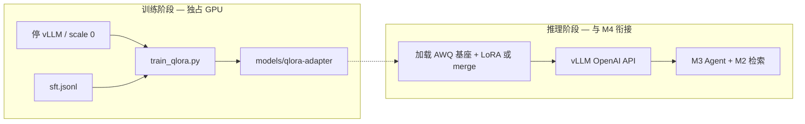

# M5 — QLoRA 微调与 RAG/SFT 对比

> **学习入口**：微调流程、参数、验收集中在此。  
> **操作命令**：[COLLABORATION.md](./COLLABORATION.md) §3.9、§3.9.1。  
> **线上完整 Epoch**：[m5_online_train.md](./m5_online_train.md)（**推荐 AutoDL 4090 24GB**）。  
> **Serving**（M4）：训练前须停 vLLM，见 [m4_serving.md](./m4_serving.md) §3.2。  
> **踩坑日记**：[finetune_pitfalls.md](./finetune_pitfalls.md)。

---

## 1. M5 解决什么问题？

| 里程碑 | 关注点 |
|--------|--------|
| **M4** | 纯 LLM 推理吞吐、Router、KEDA |
| **M5** | 领域 **SFT/QLoRA**；对比「只改模型」vs「只改 RAG」 |
| **M6** | RAGAS CI、完整评测流水线 |

M5 **不替代** M3 问答验收；验收重点是 **训练可跑通 + 文档化风险 + RAGAS 前后**。

### 1.1 M5「完整」分两档

| 档位 | 在哪里做 | 内容 |
|------|----------|------|
| **本地完整** | 6GB Windows | 数据划分、`verify_m5`、pitfalls、RAGAS 占位/对比脚本、adapter 回传流程 |
| **训练完整** | **线上 24GB** | `train-gpu-24g` 跑满 epoch → `qlora-adapter.tgz` 回传 → 再 RAGAS after |

本机 **不要** 跑完整 epoch；见 [m5_online_train.md](./m5_online_train.md)。

---

## 2. 模块与文件地图

```
pipelines/finetune/train_qlora.py   ← QLoRA 训练（profile 驱动）
data/processed/sft.jsonl.example    ← SFT 样例（复制为 sft.jsonl）
deploy/profiles/dev-single-node.yaml ← finetune.* 超参
deploy/helm/.../finetune-train-job.yaml ← K8s Job（默认 disabled）
scripts/verify_m5.py                ← M5 验收（无 GPU）
scripts/split_sft_by_doc_id.py      ← 按 doc_id 划分 train/holdout
scripts/init_ragas_reports.py       ← RAGAS 前后 JSON 模板
scripts/compare_ragas.py            ← 对比 before/after
docs/m5_online_train.md             ← 线上 4090 训练步骤
deploy/profiles/train-gpu-24g.yaml  ← 线上 profile
pipelines/finetune/merge_lora.py  ← merge adapter（大显存）
docs/finetune_pitfalls.md           ← 踩坑日记（≥8 条）
pipelines/evaluation/run_ragas.py   ← 评测（M6 实装；M5 用 JSON + compare）
```

---

## 3. 流程图

### 3.1 训练与推理分工



**记忆口诀**：

- **训练基座** = `Qwen/Qwen2.5-7B-Instruct`（全精度 HF），**不是** AWQ 权重  
- **推理默认** = `Qwen2.5-7B-Instruct-AWQ`（vLLM）— adapter 需 merge 或 vLLM `--enable-lora`（见 pitfalls #7）  
- **6GB 单卡**：`max_seq_length`、batch、checkpoint 见 profile；OOM 先减 seq 再减样本

### 3.2 RAG vs SFT 对比（M5 验收意图）

```mermaid
flowchart TD
    Base[同一 golden 集]
    Base --> R0[RAGAS baseline — 仅 RAG]
    R0 --> PathA[路径 A: 只跑 QLoRA]
    PathA --> R1[RAGAS after SFT]
    Base --> PathB[路径 B: 只调检索/提示 — 可选]
    R1 --> Compare{指标是否提升?}
    Compare -->|faithfulness 升、检索不变| SFT有效
    Compare -->|无提升| 优先改 RAG 或数据量
```

---

## 4. SFT 数据格式

`data/processed/sft.jsonl`：每行一条 JSON。

| 字段 | 必填 | 说明 |
|------|------|------|
| `messages` | 二选一 | `[{role, content}, ...]` 对话，须含 assistant |
| `instruction` + `output` | 二选一 | 简写指令对；可选 `input` |
| `doc_id` | 推荐 | 划分 train/eval，**防评测泄漏**（见 pitfalls #5） |

复制样例：

```powershell
copy data\processed\sft.jsonl.example data\processed\sft.jsonl
```

---

## 5. Profile 参数（`finetune.*`）

| 字段 | dev 默认 | 含义 |
|------|----------|------|
| `base_model` | `Qwen/Qwen2.5-7B-Instruct` | 训练用 HF 名 |
| `dataset_max_samples` | 5000 | 上限条数 |
| `qlora_r` / `qlora_alpha` | 8 / 16 | LoRA 秩 |
| `max_seq_length` | 2048 | 截断；6GB 可改 1024 |
| `per_device_train_batch_size` | 1 | 单卡 batch |
| `gradient_accumulation_steps` | 16 | 有效 batch |
| `gradient_checkpointing` | true | 省显存 |
| `bnb_4bit` | true | QLoRA 4bit |
| `learning_rate` | 2e-4 | AdamW |
| `num_train_epochs` | 1 | 小样本勿过大 |

---

## 6. 训练 CLI

| 参数 | 默认 | 说明 |
|------|------|------|
| `--dry-run` | off | 只校验 profile + JSONL |
| `--dataset` | `data/processed/sft.jsonl` | 训练集路径 |
| `--output-dir` | `models/qlora-adapter` | adapter 输出 |
| `--max-samples` | profile 上限 | 调试截断 |
| `--max-steps` | - | 覆盖 epoch，冒烟训练 |

---

## 7. 验收 `verify_m5.py`

```powershell
python scripts/verify_m5.py --write-report
# 使用自有 sft.jsonl：
python scripts/verify_m5.py --dataset data\processed\sft.jsonl --write-report
```

| 用例 | 验证什么 |
|------|----------|
| profile_finetune | `finetune.*` 关键字段存在 |
| sft_example | `sft.jsonl.example` 可解析 |
| train_dry_run | `train_qlora.py --dry-run` 退出 0 |
| pitfalls_doc | `finetune_pitfalls.md` ≥8 条 |
| helm_train_job | Helm Job 模板存在 |
| ragas_compare | 可选；`reports/ragas_before.json` + `ragas_after.json` |

**完整 M5 闭环（你本机，高 GPU 成本）**：

1. `python pipelines/evaluation/run_ragas.py ... -o reports/ragas_before.json`（M6 前可手写 5 指标 JSON）  
2. 停 vLLM → `train_qlora.py`（勿 `--dry-run`）  
3. 按 pitfalls #7 加载 adapter → 再跑 RAGAS → `ragas_after.json`  
4. `python scripts/verify_m5.py --check-ragas --write-report`  
5. 追加一行到 [evolution.md](./evolution.md)

---

## 8. K8s Train Job

`finetune.trainJob.enabled: true` 时 apply Job（**须** 集群 GPU + 含依赖的镜像）。默认 `values-dev-single-node.yaml` 为 `false`；与 vLLM **分时**调度。

---

## 9. M5 验收清单

**本地（必做）**

- [ ] `split_sft_by_doc_id.py` → `sft_train.jsonl` / `sft_holdout.jsonl`  
- [ ] `python scripts/verify_m5.py --write-report` → 全 PASS  
- [ ] `pytest tests/test_finetune_m5.py`  

**线上（训练完整）**

- [ ] [m5_online_train.md](./m5_online_train.md)：`train-gpu-24g` 完整 epoch  
- [ ] `qlora-adapter.tgz` 回传到 `models/qlora-adapter`  

**闭环（回传后）**

- [ ] `init_ragas_reports.py` before/after（或真 RAGAS）→ `compare_ragas.py`  
- [ ] `verify_m5.py --check-ragas` → `evolution.md` 追加一行  
- [ ] 新踩坑写入 `finetune_pitfalls.md`

---

## 10. 与 M4/M6 的分工

| | M4 | M5 | M6 |
|--|----|----|-----|
| GPU | vLLM 推理 | QLoRA 训练 | RAGAS CronJob |
| 文档 | `m4_serving.md` | 本文 | RAGAS CI + 一键 Helm |
