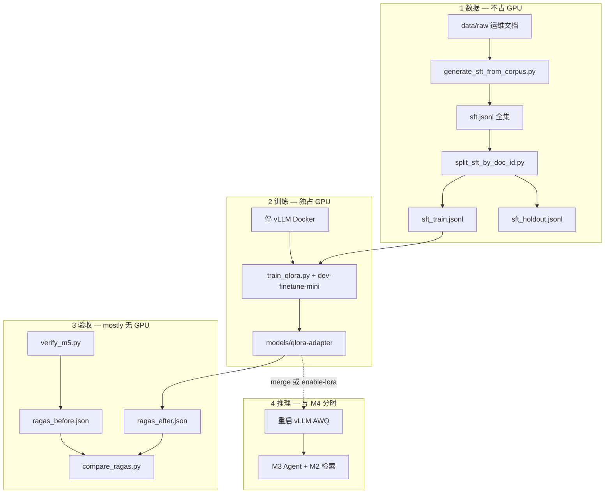
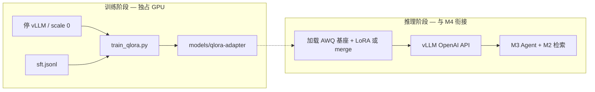

# M5 — QLoRA 微调与 RAG/SFT 对比

> **学习入口**：微调流程、参数、验收集中在此。  
> **操作命令**：[COLLABORATION.md](./COLLABORATION.md) §3.9、§3.9.1。  
> **线上完整 Epoch**：[m5_online_train.md](./m5_online_train.md)（**推荐 AutoDL 4090 24GB**）。  
> **Serving**（M4）：训练前须停 vLLM，见 [m4_serving.md](./m4_serving.md) §3.2。  
> **踩坑日记**：[finetune_pitfalls.md](./finetune_pitfalls.md)。

---

## 1. M5 解决什么问题？

| 里程碑 | 关注点 |
|--------|--------|
| **M4** | 纯 LLM 推理吞吐、Router、KEDA |
| **M5** | 领域 **SFT/QLoRA**；对比「只改模型」vs「只改 RAG」 |
| **M6** | RAGAS CI、完整评测流水线 |

M5 **不替代** M3 问答验收；验收重点是 **训练可跑通 + 文档化风险 + RAGAS 前后**。

### 1.1 M5「完整」分两档

| 档位 | 在哪里做 | 内容 |
|------|----------|------|
| **本地完整** | 6GB Windows | 数据划分、无 GPU 验收、**迷你 epoch**（`dev-finetune-mini`）、RAGAS 对比、adapter 产出 |
| **训练完整** | **线上 24GB** | `train-gpu-24g` 跑满 epoch → `qlora-adapter.tgz` 回传 → 再 RAGAS after |

本机用 **§11 迷你 epoch**（约 20 分钟、防 OOM）；**完整多 epoch** 见 [m5_online_train.md](./m5_online_train.md)。

---

## 2. 模块与文件地图

```
pipelines/finetune/train_qlora.py      ← QLoRA 训练（profile 驱动）
scripts/generate_sft_from_corpus.py    ← 从 data/raw 批量生成 SFT
data/processed/sft.jsonl               ← 全量语料（你维护）
data/processed/sft_train.jsonl         ← 真正拿去训练
data/processed/sft_holdout.jsonl       ← 留出、禁止进训练
data/processed/sft.jsonl.example       ← 格式样例
deploy/profiles/dev-single-node.yaml     ← 默认 finetune 超参
deploy/profiles/dev-finetune-mini.yaml   ← 6GB 迷你 epoch（防 OOM）
deploy/profiles/train-gpu-24g.yaml       ← 线上 24GB
scripts/verify_m5.py                     ← M5 验收（无 GPU）
scripts/split_sft_by_doc_id.py           ← 按 doc_id 划分
scripts/init_ragas_reports.py            ← RAGAS 前后 JSON 模板
scripts/compare_ragas.py                 ← 对比 before/after
docs/m5_online_train.md                  ← 线上 4090 完整 epoch
pipelines/finetune/merge_lora.py         ← merge adapter（大显存）
docs/finetune_pitfalls.md                ← 踩坑日记
pipelines/evaluation/run_ragas.py        ← 评测（M6 实装）
```

### 2.1 三个 JSONL 各干什么？（一句话）

| 文件 | 通俗理解 |
|------|----------|
| **`sft.jsonl`** | **题库全集** — 样例 + 生成的所有问答，你编辑、追加都在这里 |
| **`sft_train.jsonl`** | **真正用来上课的题** — 从全集按 `doc_id` 切出来，**喂给 QLoRA** |
| **`sft_holdout.jsonl`** | **期末模拟题（不能偷看）** — 指定 `doc_id` 整篇留出，**不进训练**，用来对照 RAGAS / 人工看是否「背题」 |

类比：全集 = 教材所有习题；train = 学生能见的练习册；holdout = 封存试卷（默认留出 `pump_p101_manual.md` 相关题，避免和 golden 评测重叠）。

---

## 3. 流程图

### 3.0 SFT / 微调端到端（M5）



### 3.1 训练与推理分工



### 3.2 训练基座 vs 推理基座（为什么不能同一个？）

| | **训练基座** | **推理基座** |
|--|--------------|--------------|
| **仓库里是谁** | `Qwen/Qwen2.5-7B-Instruct`（HF 全精度名） | `Qwen2.5-7B-Instruct-AWQ`（vLLM 挂载的 AWQ 权重） |
| **干什么** | 在 4bit 上挂 LoRA，**只更新 adapter 小矩阵** | **高吞吐在线答题**（M3/M4 Gateway） |
| **显存策略** | `bitsandbytes` 4bit + checkpoint，6GB 能训 | AWQ/Marlin 压缩权重，6GB 能推 |

**不能混用的原因**（见 [finetune_pitfalls.md](./finetune_pitfalls.md) #7）：

1. **QLoRA 训练**要在「可反传的全精度计算图 + 4bit 加载」上做；AWQ 已是推理专用量化格式，**不能再当训练底座**。  
2. **vLLM + AWQ** 为推理优化，**不承载** HuggingFace `Trainer` 那套训练循环。  
3. 产物是 **LoRA adapter**；要接到 AWQ 推理上，需 **merge 后再量化**，或换 **非 AWQ 基座 + `--enable-lora`**。

口诀：**训练用 HF 全精度名，推理用 AWQ 服务；中间靠 adapter 文件衔接。**

### 3.3 RAG vs SFT 对比（M5 验收意图）

```mermaid
flowchart TD
    Base[同一 golden 集]
    Base --> R0[RAGAS baseline — 仅 RAG]
    R0 --> PathA[路径 A: 只跑 QLoRA]
    PathA --> R1[RAGAS after SFT]
    Base --> PathB[路径 B: 只调检索/提示 — 可选]
    R1 --> Compare{指标是否提升?}
    Compare -->|faithfulness 升、检索不变| SFT有效
    Compare -->|无提升| 优先改 RAG 或数据量
```

---

## 4. SFT 数据格式

`data/processed/sft.jsonl`：每行一条 JSON。

| 字段 | 必填 | 说明 |
|------|------|------|
| `messages` | 二选一 | `[{role, content}, ...]` 对话，须含 assistant |
| `instruction` + `output` | 二选一 | 简写指令对；可选 `input` |
| `doc_id` | 推荐 | 划分 train/eval，**防评测泄漏**（见 pitfalls #5） |

复制样例：

```powershell
copy data\processed\sft.jsonl.example data\processed\sft.jsonl
```

---

## 5. Profile 参数（`finetune.*`）

| Profile | 用途 | `max_seq_length` | `gradient_accumulation_steps` |
|---------|------|------------------|-------------------------------|
| `dev-single-node` | 默认开发 | 2048 | 16 |
| **`dev-finetune-mini`** | **6GB 本机迷你 epoch** | **384** | **2** |
| `train-gpu-24g` | 线上 4090 完整训练 | 4096 | 8 |

| 字段 | 含义 |
|------|------|
| `base_model` | 训练基座：本机推荐 `models/Qwen2.5-7B-Instruct`（`hf download --local-dir`）；线上可用 Hub 名 |
| `qlora_r` / `qlora_alpha` | LoRA 秩 / 缩放 |
| `per_device_train_batch_size` | 单卡 micro-batch |
| `gradient_checkpointing` + `bnb_4bit` | 6GB 必开 |
| `num_train_epochs` | 小样本保持 1 |

### 5.1 本机 6GB 参数精读（`dev-finetune-mini`）

> **目的**：在 6GB 上跑通 QLoRA **链路**（非生产效果）。与线上 `train-gpu-24g` 对照，掌握微调时「调什么、为什么调」。  
> **Profile 文件**：`deploy/profiles/dev-finetune-mini.yaml`（本机） vs `deploy/profiles/train-gpu-24g.yaml`（4090）。

#### 总览对照表

| 参数 | 本机 mini | 线上 24G | 含义（为什么要调） |
|------|-----------|----------|-------------------|
| **`base_model`** | `models/Qwen2.5-7B-Instruct` | `Qwen/Qwen2.5-7B-Instruct` | 训练用 **HF 全精度族**（4bit 加载），不是 AWQ。本机复用 `hf download --local-dir` 路径，避免重复下载。 |
| **`device_map`** | `single_gpu` | （默认 auto） | `auto` 在 6GB 会把层卸到 CPU → QLoRA **禁止**。`single_gpu` = 整模钉在 GPU0（`{"": 0}`）。 |
| **`bnb_4bit`** | true | true | **QLoRA 核心**：基座权重 4bit 存显存（~4GB），只训练 LoRA 小矩阵。 |
| **`max_seq_length`** | **384** | 4096 | 单条样本最大 token 数。**越长，激活显存越大**（OOM 第一杀手）。384 够短问答 SFT。 |
| **`qlora_r`** | **4** | 16 | LoRA **秩**：可训练低秩矩阵的宽度。越小参数越少、显存越低，表达能力略降。 |
| **`qlora_alpha`** | **8** | 32 | LoRA 缩放，常取 **2×r**。影响 adapter 更新幅度。 |
| **`lora_dropout`** | 0.05 | 0.05 | LoRA 层 dropout，减轻小数据过拟合。 |
| **`per_device_train_batch_size`** | 1 | 2 | 每次 forward **几条样本**。6GB 只能 1。 |
| **`gradient_accumulation_steps`** | 2 | 8 | 累积 N 次 micro-batch 再 **optimizer step**。有效 batch = 1×2=2；小 train 集仍能出 step。 |
| **`gradient_checkpointing`** | true | true | 用算力换显存：反向时不存全部激活，**重算**部分层。训练变慢但省 VRAM。 |
| **`optim`** | `paged_adamw_8bit` | （默认 adamw） | **8bit 分页 Adam**：优化器状态也压显存；大模型微调常用。 |
| **`learning_rate`** | 2e-4 | 1e-4 | LoRA 常用 **1e-4～2e-4**；小数据略高可加快收敛，易过拟合则降低。 |
| **`num_train_epochs`** | 1 | 2 | 全数据扫几遍。7 条 train 时 1 epoch 即可验链路；样本少时多 epoch 易背题（pitfalls #3）。 |

#### 5.1.1 加载与基座

| 参数 | 本机取值 | 说明 |
|------|----------|------|
| **`base_model`** | 本地 `models/Qwen2.5-7B-Instruct` | 训练用 **HF 全精度族**（运行时经 `bnb_4bit` 以 4bit 载入），**不是** vLLM 的 AWQ 权重。LoRA 只更新 adapter 小矩阵，基座权重 frozen。 |
| **`bnb_4bit: true`** | 同线上 | **QLoRA**：7B 若 fp16/bf16 全精度加载约需 14GB+ 显存；4bit 量化后权重约 **4GB**，6GB 卡才装得下。 |
| **`device_map: single_gpu`** | 本机独有 | `device_map=auto` 在显存不足时会把部分层卸到 **CPU/磁盘**；k-bit QLoRA **要求量化权重全部在 GPU**。报错 `Some modules are dispatched on the CPU or the disk` 即此因（pitfalls #11）。 |

#### 5.1.2 显存三大旋钮（OOM 时按此顺序动）

| 参数 | 本机 | 线上 | 说明 |
|------|------|------|------|
| **`max_seq_length`** | **384** | 4096 | 每条训练样本截断后的最大 token 数。**激活显存大致与 seq 长度成正比**，是 OOM 时最先动的参数。 |
| **`per_device_train_batch_size`** | **1** | 2 | 每次 forward 并行处理的样本条数；6GB 上通常只能 1。 |
| **`gradient_checkpointing`** | true | true | 反向传播时**不保存全部中间激活**，需要时重新计算，用时间换显存。 |

显存不够时的顺序：**先降 `max_seq_length`，保持 batch=1，再降 `qlora_r`**。

#### 5.1.3 LoRA 可训练参数量

| 参数 | 本机 | 线上 | 说明 |
|------|------|------|------|
| **`qlora_r`** | **4** | 16 | LoRA **秩**（rank）：在 attention/MLP 旁插入的低秩矩阵「宽度」。r 越小 → 可训练参数越少、显存越低、拟合能力略弱。 |
| **`qlora_alpha`** | **8** | 32 | 缩放因子，实践中常设为 **约 2×r**，与 r 一起决定 LoRA 更新步长。 |
| **`lora_dropout`** | 0.05 | 0.05 | 训练时在 LoRA 路径上加 dropout，减轻 **小数据集过拟合**（pitfalls #3）。 |

#### 5.1.4 有效 batch 与优化器

| 参数 | 本机 | 说明 |
|------|------|------|
| **`gradient_accumulation_steps`** | **2** | 每做 2 次 micro-batch 的 backward，才执行 1 次 **optimizer step**。有效 batch size = `per_device_train_batch_size × gradient_accumulation_steps` = **1×2=2**。train 仅 7 条时，过大 accum 会导致 0 step。 |
| **`optim: paged_adamw_8bit`** | 本机 | Adam 的一阶/二阶矩用 **8bit** 存储并分页，进一步压缩优化器占用的显存。 |
| **`learning_rate`** | 2e-4 | LoRA 常用 **1e-4～2e-4**；数据很少时可略高以加快收敛，若 loss 震荡或过拟合则降低。 |
| **`num_train_epochs`** | 1 | 整个 train 集完整扫过的轮数；样本极少时不宜盲目加大 epoch。 |

#### 5.1.5 训练流程与 CLI（本机实践）

| 手段 | 作用 |
|------|------|
| **停 vLLM** | GPU **分时**：6GB 无法推理与 QLoRA 训练同占；训练前 `nvidia-smi` 显存应接近空闲。 |
| **`--max-steps 10`** | **冒烟**：不跑满 epoch，只跑 N 个 optimizer step，验证 6GB 能加载且能 backward。 |
| **`--local-files-only`** | 只读 profile 解析后的本地 `base_model` 目录，不联网补权重。 |
| **`--base-model`** | 临时覆盖 profile 中的基座路径。 |
| **CUDA 版 torch** | 须 `torch.cuda.is_available()==True`（如 `cu124` wheel）；CPU 版 torch 无法训练（pitfalls #12）。 |

#### 5.1.6 三个概念串起来

1. **QLoRA** = 4bit 冻住大模型 + 只训 LoRA 小 adapter → 6GB 才能碰 7B。  
2. **显存** ≈ 权重（4bit）+ 激活（seq × batch）+ 优化器（8bit Adam）→ OOM 时先砍 **seq**，再砍 **LoRA r**。  
3. **训练基座 ≠ 推理 AWQ**：训练产物是 `models/qlora-adapter/`；接到 vLLM AWQ 上需 **merge** 或 **`--enable-lora`（非 AWQ 基座）**（pitfalls #7）。

**口诀**：显存不够先砍 **seq_len** 和 **batch**，再降 **LoRA r**；QLoRA 必须 **4bit + gradient_checkpointing + single_gpu**；推理 AWQ 与训练 `base_model` **不是同一个文件**。

**延伸阅读**：踩坑实例见 [finetune_pitfalls.md](./finetune_pitfalls.md) #2、#7、#9–#13；本机验收清单见本文 §9。

---

## 6. 训练 CLI

| 参数 | 默认 | 说明 |
|------|------|------|
| `--dry-run` | off | 只校验 profile + JSONL |
| `--dataset` | `data/processed/sft.jsonl` | 训练集路径 |
| `--output-dir` | `models/qlora-adapter` | adapter 输出 |
| `--max-samples` | profile 上限 | 调试截断 |
| `--max-steps` | - | 覆盖 epoch，冒烟训练 |
| `--profile` | `IOR_PROFILE` | 本机迷你 epoch 用 **`dev-finetune-mini`** |

---

## 7. 验收 `verify_m5.py`

### 7.1 「无 GPU 验收」是什么意思？

**不启动 QLoRA 训练、不占 CUDA**，只检查「训练前该齐的东西是否齐了」：

- profile 里 `finetune.*` 字段齐全  
- SFT JSONL 能解析、格式合法  
- `train_qlora.py --dry-run` 能退出 0（只读数据 + 配置）  
- 踩坑文档、Helm Job 模板存在  

适合在 **停 vLLM 之前 / 下载模型之前** 先跑一遍，避免白占 GPU 才发现数据写错。

```powershell
.\.venv\Scripts\Activate.ps1
python scripts\verify_m5.py --write-report
python scripts\verify_m5.py --dataset data\processed\sft.jsonl --write-report
```

| 用例 | 验证什么 |
|------|----------|
| profile_finetune | `finetune.*` 关键字段存在 |
| sft_example | `sft.jsonl.example` 可解析 |
| sft_train.jsonl | 已划分训练集 |
| train_dry_run | `train_qlora.py --dry-run` 退出 0 |
| pitfalls_doc | `finetune_pitfalls.md` ≥8 条 |
| helm_train_job | Helm Job 模板存在 |
| ragas_compare | **可选**；见 §7.2 |

### 7.2 RAGAS 前后 JSON 对比是干什么的？

M6 之前没有强制跑真 RAGAS 流水线时，用两个 JSON 文件记录 **同一 golden 集** 上、**微调前后** 五个指标的数值：

| 文件 | 含义 |
|------|------|
| `reports/ragas_before.json` | 只有 RAG + 原模型（未挂 adapter） |
| `reports/ragas_after.json` | 同一套题，训练后 / 挂 adapter 再测 |

`compare_ragas.py` 打印 before / after / **delta**，回答：**「只改模型（SFT）有没有让 faithfulness 等变好？」**  
若检索没变、生成指标却涨 → SFT 有效；若没涨 → 优先加数据或改 RAG（见 §3.3）。

占位生成（指标可先为 `null`，训练后手填或跑真 RAGAS）：

```powershell
python scripts\init_ragas_reports.py --phase before
# 训练完成后
python scripts\init_ragas_reports.py --phase after
python scripts\compare_ragas.py
python scripts\verify_m5.py --check-ragas --write-report
```

**完整 M5 闭环（含 GPU 训练）**：§11 → 再 `ragas_after` → `compare_ragas` → `evolution.md` 记一行。

---

## 8. K8s Train Job

`finetune.trainJob.enabled: true` 时 apply Job（**须** 集群 GPU + 含依赖的镜像）。默认 `values-dev-single-node.yaml` 为 `false`；与 vLLM **分时**调度。

---

## 9. M5 验收清单

**本地（必做）** — 2026-06-02 本机已完成

- [x] `split_sft_by_doc_id.py` → `sft_train.jsonl` / `sft_holdout.jsonl`  
- [x] `python scripts/verify_m5.py --write-report` → 全 PASS  
- [x] `pytest tests/test_finetune_m5.py`  
- [x] 迷你 epoch → `models/qlora-adapter/`  
- [x] `init_ragas_reports.py --fill-example` → `verify_m5.py --check-ragas` PASS（M6 前为占位）

**线上（训练完整）** — 本项目不做

- [ ] [m5_online_train.md](./m5_online_train.md)：`train-gpu-24g` 完整 epoch  
- [ ] `qlora-adapter.tgz` 回传到 `models/qlora-adapter`  

**闭环（回传后）** — 跳过（无线上）

- [x] RAGAS 占位 before/after → `compare_ragas.py`  
- [x] `verify_m5.py --check-ragas`  
- [x] 踩坑 #9–#13 写入 `finetune_pitfalls.md`；指标 → `evolution.md`

---

## 10. 与 M4/M6 的分工

| | M4 | M5 | M6 |
|--|----|----|-----|
| GPU | vLLM 推理 | QLoRA 训练 | RAGAS CronJob |
| 文档 | `m4_serving.md` | 本文 | RAGAS CI + 一键 Helm |

---

## 11. 本机 20 分钟迷你 epoch（分步命令）

> **目标**：6GB 单卡、**不 OOM**、产出 `models/qlora-adapter/`（验证链路，非生产效果）。  
> **Profile**：`dev-finetune-mini`（`max_seq_length=512`，`gradient_accumulation_steps=2`）。  
> **数据**：`sft_train.jsonl`（不要用 holdout 训练）。  
> **操作副本**：[COLLABORATION.md](./COLLABORATION.md) §3.9.0。

### 前提

- 已安装 `.venv`（Python 3.12）  
- 训练前 **必须停** 占用 GPU 的 vLLM 容器  
- 首次训练会下载 `Qwen/Qwen2.5-7B-Instruct`（~15GB **磁盘**），**可能超过 20 分钟**；建议步骤 1～3 通过后再做步骤 4 预下载

### 下载前确认（6GB 必看）

| 项目 | 说明 |
|------|------|
| **下载体积** | ~15GB **硬盘**（HF 权重文件），不是占满 15GB 显存 |
| **训练显存** | `bnb_4bit` + LoRA + `max_seq_length=512` 峰值约 **5～6GB**；与 vLLM AWQ 推理同级，**须独占 GPU** |
| **本机能做什么** | **`dev-finetune-mini` 迷你 epoch**（链路验收、产出 adapter）；**完整多 epoch / 4096 seq** 见 [m5_online_train.md](./m5_online_train.md) |
| **风险** | RTX 3060 6GB 为 **边界配置**；vLLM AWQ 已实测，QLoRA 迷你 epoch 按 profile 设计但峰值仍可能 OOM → 见文末降级项 |
| **建议顺序** | 步骤 1 → 2 停 vLLM → 3 dry-run → **4 预下载** → **5 冒烟 10 step** → 6 迷你 epoch |

### 步骤 1 — 数据与无 GPU 验收

```powershell
cd d:\repo\RAG
.\.venv\Scripts\Activate.ps1

python scripts\split_sft_by_doc_id.py `
  --input data\processed\sft.jsonl `
  --train-out data\processed\sft_train.jsonl `
  --holdout-out data\processed\sft_holdout.jsonl `
  --holdout-doc-ids pump_p101_manual.md

python scripts\verify_m5.py --write-report
pytest tests\test_finetune_m5.py tests\test_split_sft_m5.py -q

python scripts\init_ragas_reports.py --phase before
```

### 步骤 2 — 释放 GPU（停 vLLM）

在跑 vLLM 的终端 **Ctrl+C**，或：

```powershell
docker ps --format "{{.ID}} {{.Image}}" | findstr vllm
docker stop <上一步看到的容器ID>
```

确认 GPU 空闲（可选）：

```powershell
nvidia-smi
```

### 步骤 3 — 训练前 dry-run（仍不占训练显存）

```powershell
cd d:\repo\RAG
.\.venv\Scripts\Activate.ps1

python pipelines\finetune\train_qlora.py `
  --profile dev-finetune-mini `
  --dataset data\processed\sft_train.jsonl `
  --dry-run
```

### 步骤 4 — 预下载训练基座（可选）

> **前置**：步骤 1～3 已通过；vLLM 已停。  
> **勿设** `HF_ENDPOINT=https://hf-mirror.com`：`huggingface_hub` ≥1.17 经镜像 HEAD 拿不到 `commit_hash`，会报 `FileMetadataError`。本机若可直连 `huggingface.co`，直接下载即可。

```powershell
cd d:\repo\RAG
.\.venv\Scripts\Activate.ps1
Remove-Item Env:HF_ENDPOINT -ErrorAction SilentlyContinue
$env:HF_HUB_DISABLE_SYMLINKS_WARNING = "1"   # Windows 无 symlink 时可消警告

.\.venv\Scripts\python.exe -c "from huggingface_hub import snapshot_download; snapshot_download('Qwen/Qwen2.5-7B-Instruct')"
```

或指定本地目录：

```powershell
Remove-Item Env:HF_ENDPOINT -ErrorAction SilentlyContinue
hf download Qwen/Qwen2.5-7B-Instruct --local-dir d:\repo\RAG\models\Qwen2.5-7B-Instruct
```

直连失败时可用 ModelScope（国内备选）：

```powershell
pip install modelscope
python -c "from modelscope import snapshot_download; snapshot_download('Qwen/Qwen2.5-7B-Instruct', cache_dir=r'd:\repo\RAG\models')"
```

### 步骤 5 — 冒烟 10 step（下载后，确认 6GB 不 OOM）

```powershell
python pipelines\finetune\train_qlora.py `
  --profile dev-finetune-mini `
  --max-steps 10 `
  --dataset data\processed\sft_train.jsonl `
  --output-dir models\qlora-adapter-smoke
```

通过后再做步骤 6；若 `CUDA out of memory`，见文末 OOM 降级项，**不要**直接跑满 epoch。

### 步骤 6 — 迷你 epoch 训练

```powershell
cd d:\repo\RAG
.\.venv\Scripts\Activate.ps1

python pipelines\finetune\train_qlora.py `
  --profile dev-finetune-mini `
  --dataset data\processed\sft_train.jsonl `
  --output-dir models\qlora-adapter `
  --num-train-epochs 1
```

若仍担心显存或时间，步骤 5 的 `--max-steps 10` 已足够验收链路；步骤 6 为完整 1 epoch。

成功标志：终端出现 `[done] adapter saved to ...`，目录下有 `adapter_config.json` 等。

### 步骤 7 — 恢复推理（重启 vLLM）

按 [m4_serving.md](./m4_serving.md) / [COLLABORATION.md](./COLLABORATION.md) §3.6 原命令启动 vLLM。  
**注意**：AWQ vLLM **不能** 直接加载 QLoRA；对比效果前需 merge 或 `enable-lora`（pitfalls #7）。

### 步骤 8 — RAGAS 占位与对比

> M6 实装真 RAGAS 前，用 **`--fill-example`** 写入演示分数，否则 `verify_m5 --check-ragas` 会因 `null` 失败。

```powershell
python scripts\init_ragas_reports.py --phase before --fill-example
python scripts\init_ragas_reports.py --phase after --fill-example
python scripts\compare_ragas.py
python scripts\verify_m5.py --check-ragas --write-report
```

### 6GB 本机训练失败时（放弃本机、改线上）

若冒烟/训练出现下列任一情况，**不必再调本机**，按 [m5_online_train.md](./m5_online_train.md) 在 **4090 24GB** 跑 `train-gpu-24g`：

- `Some modules are dispatched on the CPU or the disk`（`device_map=auto` 显存不够；profile 已改为 `single_gpu`，仍失败即硬件不够）
- `CUDA out of memory`
- `train_qlora.py` 退出码 `2` 且提示改走线上

本机 M5 **仍可完成**：数据划分、`verify_m5`、RAGAS 占位、adapter 从云上下载回传。

### OOM 时（仅当仍想赌本机）

1. 确认 vLLM 已停、`nvidia-smi` 显存空闲  
2. `dev-finetune-mini` 已含 `device_map: single_gpu`、`max_seq_length: 384`、`qlora_r: 4`  
3. 仍 OOM → **放弃本机训练**（见上）
