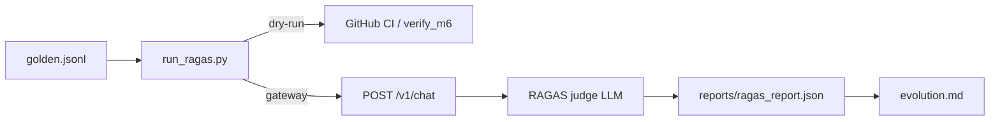

# M6 — RAGAS CI、Grafana、Helm 一键与交付文档

> **学习入口**：M6 评测流水线、可观测、一键部署集中在此。  
> **操作命令**：[COLLABORATION.md](./COLLABORATION.md) §3.10–3.11。  
> **上游**：M5 RAGAS 占位 → 本文实装真流水线；M0 Helm 骨架 → 本文补 Prometheus/Grafana/RAGAS CronJob。

---

## 1. M6 解决什么问题？

| 里程碑 | 关注点 | 典型问题 |
|--------|--------|----------|
| **M5** | 微调 + 占位对比 | adapter 有了，RAGAS 分数可信吗？ |
| **M6** | 交付与 CI | 新同事 15 分钟能否问答？评测能否自动跑？ |

M6 **不替代** M3 业务验收；重点是 **RAGAS 流水线 + Grafana + Helm 一键 + 文档闭环**。

---

## 2. 模块与文件地图

```
pipelines/evaluation/run_ragas.py   ← RAGAS 流水线（--dry-run / --gateway）
scripts/verify_m6.py                ← M6 验收
scripts/one_click_k8s.ps1|.sh       ← Helm 一键
.github/workflows/ragas-ci.yml      ← PR 自动 dry-run
deploy/monitoring/grafana/          ← 仪表盘 JSON（源）
deploy/helm/.../ragas-cronjob.yaml  ← K8s 定时评测
deploy/helm/.../prometheus-*.yaml   ← 监控栈
deploy/helm/.../grafana-*.yaml
```

---

## 3. RAGAS 流水线



| 模式 | 命令 | 用途 |
|------|------|------|
| **CI dry-run** | `--dry-run --golden data/eval/golden.jsonl.example` | 无 Gateway/GPU，确定性 stub |
| **真评测** | `--gateway http://localhost:8080` | 调 Gateway + RAGAS judge（须拍板） |

五指标：`faithfulness`, `answer_relevancy`, `context_precision`, `context_recall`, `answer_correctness`。

---

## 4. Grafana

- 仪表盘：`deploy/monitoring/grafana/dashboards/ior-overview.json`（Helm 打包于 `dashboards/`）
- 默认数据源：集群内 Prometheus `http://ior-prometheus:9090`
- 面板：vLLM/Gateway up、vLLM QPS（若导出）、RAGAS 说明区

本地 port-forward（K8s 已装 monitoring 时）：

```bash
kubectl -n industrial-ops port-forward svc/ior-grafana 3000:3000
# 浏览器 http://localhost:3000  admin / ior_dev（values 默认，生产请改）
```

---

## 5. Helm 一键

```powershell
# Windows（WSL2 内亦可 bash 版）
.\scripts\one_click_k8s.ps1
```

```bash
bash scripts/one_click_k8s.sh
```

等价于：k3d 集群（若无）→ GPU plugin → `helm upgrade --install ior` + `values-dev-single-node.yaml`。

启用 RAGAS CronJob（按需，会调 Gateway + 占 CPU/内存）：

```yaml
# values-dev-single-node.yaml
evaluation:
  ragasCronJob:
    enabled: true
```

---

## 6. 新环境 15 分钟问答（验收）

| 分钟 | 步骤 |
|------|------|
| 0–3 | `python -m venv .venv` → `pip install -e ".[dev]"` → `cp .env.example .env` |
| 3–8 | `docker compose -f deploy/compose/docker-compose.yml up -d` |
| 8–12 | 启动 vLLM（COLLABORATION §3.5）+ `uvicorn apps.gateway.main:app --port 8080` |
| 12–15 | `curl -X POST localhost:8080/v1/chat -d '{"session_id":"demo","query":"故障码 E1024 如何处理？"}'` |

脚手架验收（无需 GPU）：

```powershell
python scripts\verify_m6.py --write-report
pytest tests\test_ragas_m6.py -q
```

---

## 7. 验收清单

- [ ] `run_ragas.py --dry-run` 写出五指标 JSON
- [ ] `.github/workflows/ragas-ci.yml` 绿
- [ ] `verify_m6.py --write-report` PASS
- [ ] Grafana dashboard JSON 有效；Helm 含 prometheus/grafana/ragas 模板
- [ ] `one_click_k8s` 脚本存在；README 含 15min 路径
- [ ] 真 RAGAS（可选）：`copy golden.jsonl.example golden.jsonl` → §3.10 命令 → 更新 `evolution.md`

---

## 8. 与 M5/M7 的分工

| | M5 | M6 | M7 |
|--|----|----|-----|
| RAGAS | 占位 before/after | 流水线 + CI + CronJob | 真实语料 golden |
| 监控 | profile 声明 | Grafana 仪表盘 | 业务 SLA |
| 部署 | Train Job 模板 | 一键 Helm + 全套 docs | 脱敏 demo |
