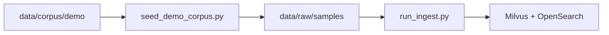
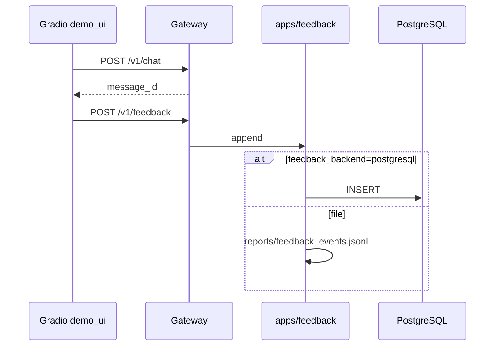

# M7 — 真实脱敏语料、反馈闭环、业务演示

> **学习入口**：M7 演示语料、ingest、反馈导出、Gradio demo。  
> **前提**：M1 ingest、M3 Gateway、M6 评测脚手架（见各 `m{N}_*.md`）。  
> **操作命令**：[COLLABORATION.md](./COLLABORATION.md) §3.12。

### 本机执行 vs 脚手架验收（必读）

| 类型 | 含义 | 6GB 本机 |
|------|------|----------|
| **执行操作** | 你本机跑的命令：Compose、ingest、起 vLLM、live 问答、真 RAGAS、Gradio 演示等 | **硬件不足可跳过**（不跑不算 M7 失败） |
| **脚手架验收** | `verify_m7` + `pytest`：检查语料/脚本/反馈/Gateway 接线是否齐全 | **不可跳过**（无 GPU 也应 PASS） |

「跳过」**仅指前者**；仓库交付以 `verify_m7` 为准，不要求本机跑通全流程。

---

## 1. M7 解决什么问题？

| 里程碑 | 关注点 |
|--------|--------|
| M6 | RAGAS CI、Grafana、Helm 一键 |
| **M7** | **可给业务方看的 demo**：脱敏语料入库、点赞踩闭环、golden 扩展路径 |

---

## 2. 模块与文件地图

```
data/corpus/demo/              ← 脱敏虚构语料（git 跟踪）
scripts/seed_demo_corpus.py    ← 复制到 data/raw/samples/
data/eval/golden_m7.jsonl.example
apps/feedback.py               ← 反馈 file / PostgreSQL
apps/gateway/main.py           ← /v1/chat message_id + /v1/feedback
apps/web/demo_ui.py            ← Gradio 演示 UI
pipelines/feedback/export_feedback.py
deploy/sql/feedback_schema.sql
scripts/verify_m7.py
```

---

## 3. 语料与 ingest

### 3.1 脱敏约定

- 设备位号、参数均为 **虚构**（P-101、R-201、SA-01）。
- 禁止写入真实客户名、工号、现场坐标；自有语料入库前见 §5 检查清单。

### 3.2 入库流程



```powershell
python scripts\seed_demo_corpus.py
python pipelines\ingest\run_ingest.py --input data/raw --batch-size 8
python scripts\verify_m1.py --write-report
```

| 执行操作 | 依赖 | 6GB 本机 |
|----------|------|----------|
| `seed_demo_corpus.py` | 无 | 可跑（复制文件） |
| `run_ingest` + `verify_m1` | Milvus、OpenSearch、embedding | **可跳过**（中间件/内存不足时） |
| 起 vLLM + live `/v1/chat` | GPU 显存 | **可跳过**（502/超时见 evolution.md） |
| `demo_ui` 真问答 | Gateway + vLLM | **可跳过**（UI 可起，生成失败不算交付缺口） |
| 真 RAGAS on `golden_m7` | Gateway + vLLM | **可跳过**（大显存/线上再跑） |

---

## 4. 反馈闭环

### 4.1 数据流



### 4.2 Profile（`demo` 段）

| 字段 | 默认 | 说明 |
|------|------|------|
| `corpus_path` | `data/corpus/demo` | 演示语料根 |
| `golden_example` | `golden_m7.jsonl.example` | 业务 golden 模板 |
| `feedback_backend` | `file` | `postgresql` 需 init 表 |
| `feedback_file` | `reports/feedback_events.jsonl` | file 模式路径 |

PostgreSQL 模式：

```powershell
python scripts\init_feedback_db.py
# profile: demo.feedback_backend: postgresql
```

### 4.3 导出与 golden 扩展

```powershell
python pipelines\feedback\export_feedback.py --output reports\feedback_export.jsonl `
  --golden-candidates data\eval\golden_candidates.jsonl
```

人工补全 `ground_truth` 与 `doc_ids` 后，合并进 `data/eval/golden.jsonl`（本地 gitignore）。

---

## 5. 自有语料脱敏检查清单

- [ ] 已替换/删除客户名称、合同号、人员姓名
- [ ] 已模糊化具体工厂地址与 GPS
- [ ] 故障案例无未授权现场照片链接
- [ ] `doc_id` / 文件名不含敏感编号
- [ ] 抽样 10% 人工审阅通过后再 `run_ingest --recreate`

---

## 6. 业务演示（Gradio）

```powershell
# 终端 1：Gateway（及 vLLM，若需 live 生成）
uvicorn apps.gateway.main:app --host 0.0.0.0 --port 8080

# 终端 2：UI
$env:GATEWAY_URL="http://localhost:8080"
python apps\web\demo_ui.py
```

浏览器打开 `http://localhost:7860`。推荐演示问句见 `golden_m7.jsonl.example` 前 3 条。

**无 vLLM 时**：UI 仍可打开；问答会显示 Gateway 错误，可改用 `verify_m1` / `verify_m3 --case 1` 证明检索链路。

---

## 7. 验收

### 7.1 脚手架验收（必跑，不依赖 GPU / vLLM）

```powershell
python scripts\verify_m7.py --write-report
pytest tests\test_m7_feedback.py -q
```

`verify_m7` 默认检查：demo 语料、golden 模板、profile `demo` 段、seed 脚本、反馈往返、导出/SQL、Gradio 源码、Gateway 反馈接线、文档。**以上任一项 FAIL 即 M7 未交付。**

### 7.2 运行时执行（硬件允许再做，非脚手架必过项）

| 执行操作 | 说明 |
|----------|------|
| `run_ingest` + `verify_m1` | 证明索引命中；无 Compose 可跳过 |
| `uvicorn` + `demo_ui` live 问答 | 业务演示；6GB vLLM 不稳可跳过 |
| `run_ragas --golden golden_m7` | 真评测；见 M6 §3.10，本机可跳过 |
| `verify_m7 --check-live` | **额外**探测 Gateway `/v1/health`；默认不跑，非省略验收项 |

---

## 8. CI（仅脚手架，零 GPU）

GitHub Actions：`.github/workflows/ragas-ci.yml`

| CI 步骤 | 说明 |
|---------|------|
| `verify_m7` + `test_m7_feedback` | **必跑**；不 ingest、不启 vLLM |
| `run_ragas --dry-run --golden golden_m7 --limit 3` | mini 条数，无 LLM 调用 |

**不消耗 Cursor 对话 token**（在 GitHub 跑）；也 **不应** 把 ingest/真 RAGAS 放进 CI（费时、要中间件）。

---

## 9. 真实业务语料 vs `data/corpus/demo`

| 方式 | 适用 | git |
|------|------|-----|
| 继续用 `demo` | 技术演示/开源演示 | 跟踪 **5 篇** 脱敏 MD（git 公开样例） |
| 替换 `demo` 内文件 | 脱敏后仍可当公开样例 | 可提交（须过 §5 清单） |
| `data/corpus/business/` | 真实脱敏语料 | **默认 gitignore**，仅 README 进库 |

```powershell
python scripts\seed_demo_corpus.py --src data\corpus\business --dst data\raw\business
python pipelines\ingest\run_ingest.py --input data/raw --max-docs 3 --batch-size 4
```

`golden_m7.jsonl.example` 的 `doc_ids` 需与入库后的 `source_file` 一致；替换语料后应同步改 golden（或从 `export_feedback` 生成候选）。

---

## 10. Mini 批量（演示、省本机时间 / 少贴日志）

| 操作 | 命令 | 说明 |
|------|------|------|
| RAGAS dry-run | `run_ragas.py --dry-run --limit 3` | **无 Gateway**；CI 同款 |
| RAGAS live | `run_ragas.py --limit 3 --gateway ...` | 仍要 vLLM；仅 3 条，省 GPU 时间 |
| ingest | `run_ingest.py --max-docs 3 --batch-size 4` | 少 embed 批次 |

对 **Agent 对话 token**：你本地跑 mini 后只把 `reports/*.json` 五指标或 `verify_m*` 最后一行贴回即可，**勿贴** ingest/RAGAS 全文 stdout（见 COLLABORATION §3）。

---

## 11. 与 M6 的分工

| | M6 | M7 |
|--|----|-----|
| golden | `golden.jsonl.example` 通用 | `golden_m7.jsonl.example` 对齐语料 |
| 反馈 | file/PostgreSQL + `/v1/feedback/export-golden` | 导出候选 golden |
| 演示 | 15min README | Gradio + 业务话术 |
| CI | `verify_m6` + dry-run | + `verify_m7` + golden_m7 `--limit 3` |
