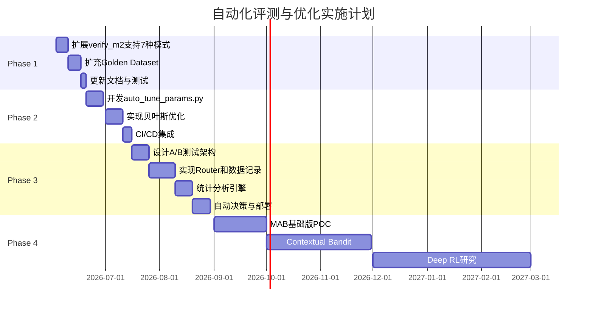

# 自动化评测与优化路线图

> **文档用途**：规划从当前半自动化流程升级为全自动化评测与优化系统的实施路径  
> **创建日期**：2026-06-03  
> **分支**：`feature/auto-evaluation-optimization`  
> **状态**：Phase 1 ✅ · Phase 2 ✅（含贝叶斯/holdout/CI dry-run）；**Phase 3 设计稿** → [phase3-ab-test-design.md](./phase3-ab-test-design.md)；P3 编码 / P4 ⬜  
> **落地说明**：下文「规划代码块」为设计参考；**以仓库实际文件与 CLI 为准**（见 §2.6、§3.6）。

---

## 0. 落地进度速查

| 阶段 | 功能点 | 状态 | 交付物 |
|------|--------|------|--------|
| P1 | verify_m2 扩展 graph/summary/tree | ✅ | `scripts/verify_m2.py`（`--extended` / `--mode` / `--timeout` / `--parallel`） |
| P1 | Golden 80 题 + 5 类 category | ✅ | `data/eval/m2_golden.jsonl.example`、`generate_m2_golden_from_corpus.py` |
| P1 | 指标文档 + 对比 Markdown 报告 | ✅ | `docs/retrieval_modes.md`、`reports/m2_mode_comparison.md`（`--extended` 时生成） |
| P1 | 单元测试 | ✅ | `tests/test_verify_m2.py` |
| P1 | 模型加载缓存（Step 4） | ⬜ 未做 | 路线图建议项，非 P1 阻塞 |
| P1 | sub_question 纳入 M2 | ❌ 刻意排除 | 需 LLM，归 M6 RAGAS |
| P2 | 网格搜索调参 | ✅ | `scripts/auto_tune_params.py` |
| P2 | holdout + tiny golden + `--limit` | ✅ | `apps/eval/tune_common.py`、`m2_golden_tiny.jsonl` |
| P2 | 贝叶斯/随机联合优化 | ✅ | `scripts/bayesian_optimize.py`（`pip install -e ".[tune]"` 可选） |
| P2 | Git 自动分支/PR | ⬜ | 需人工 Review 后再做 |
| P2 | CI 每周调参 | ✅ dry-run | `.github/workflows/auto-tune.yml`（无 Milvus，仅脚手架） |
| P3 | A/B 设计稿 | ✅ 文档 | [phase3-ab-test-design.md](./phase3-ab-test-design.md) |
| P3 | search-only A/B（/v1/search） | ✅ | `apps/ab_test/*`、`mode_dispatch` |
| P3 | chat A/B + analyze + admin | ✅ | `pipeline`、`analyze_ab_test.py` |
| P3 | Demo UI 展示 variant | ⬜ | `demo_ui.py` |
| P4 | RL / Bandit | ⬜ | 见 §5 |

**本地验收（需 Compose + M1 ingest）：**

```powershell
python scripts/verify_m2.py --golden data/eval/m2_golden_tiny.jsonl --limit 8
python scripts/auto_tune_params.py --param rrf_k --values 50,60,70 --dry-run
python scripts/bayesian_optimize.py --dry-run --n-calls 3
# 真检索（慢）：去掉 --dry-run，且需 Compose + ingest
```

---


## 1. 背景与目标

### 1.1 当前状态（2026-06-03 更新）

项目已实现**半自动化评测流程**：
- ✅ 自动执行评测（`verify_m2.py`，默认 5 模式，`--extended` 为 7 模式）
- ✅ 自动生成报告（JSON + 可选 Markdown 对比表）
- ✅ 自动更新文档占位符（`--write-evolution` → `retrieval_modes.md`）
- ✅ Phase 2 网格搜索调参骨架（`auto_tune_params.py`，改 profile 后跑 verify_m2）
- ❌ 贝叶斯联合调参、Git 自动 PR、A/B 测试、RL — 尚未实现
- ❌ 调参结果仍须人工 Review 后合并 profile

**verify_m2 覆盖模式**：
- **默认 5 种**：vector, bm25, hybrid, hybrid_rerank, router
- **`--extended` 追加 3 种**：graph, summary, tree（共 7 种）
- **仍不纳入 M2**：sub_question（需 LLM，见 M6）

**M2 通过线（已实现）**：`hybrid_rerank` Recall@5 ≥ **80%**（10 题时为 ≥8/10；80 题时为 ≥64/80）

### 1.2 优化目标

构建**分阶段自动化体系**，逐步升级：

| 阶段 | 名称 | 难度 | 自动化程度 | 预计周期 |
|------|------|------|-----------|---------|
| **Phase 1** | 评测所有7种模式 | 低 | 半自动 → 半自动+ | 1-2周 |
| **Phase 2** | 基于规则的自动调参 | 中 | 半自动 → 自动化L1 | 3-4周 |
| **Phase 3** | A/B测试框架 | 高 | 自动化L1 → 自动化L2 | 6-8周 |
| **Phase 4** | 强化学习自动优化 | 极高 | 自动化L2 → 智能化 | 3-6月 |

### 1.3 成功标准

- **Phase 1**：7种模式全部纳入自动化评测，指标可对比
- **Phase 2**：参数自动调优，人工仅需Review结果
- **Phase 3**：生产环境A/B测试，数据驱动决策
- **Phase 4**：系统自动学习最优策略，人工仅监控

---

## 2. Phase 1: 评测所有7种模式

### 2.1 目标

将 LlamaIndex 的7种引擎全部纳入自动化评测框架。

### 2.2 模式覆盖（Phase 1 后）

| 模式 | 文件 | 是否需 LLM | verify_m2 | 说明 |
|------|------|-----------|-----------|------|
| vector / bm25 / hybrid / hybrid_rerank | `hybrid_chain.py` 等 | 否 | 默认 | LangChain 主链路 |
| router | `router_engine.py` | 否 | 默认 | LlamaIndex 路由 |
| summary | `summary_engine.py` | 否 | `--extended` | 章节级摘要召回 |
| tree | `tree_engine.py` | 否 | `--extended` | 目录层级排序 |
| graph | `graph_engine.py` | 否 | `--extended` | hybrid 种子 + 图谱 1-hop |
| sub_question | `subquestion_engine.py` | **是** | **不纳入** | 放 M6 RAGAS / 在线评测 |

### 2.3 实施方案

#### Step 1: 扩展 verify_m2.py ✅

**已实现文件**：`scripts/verify_m2.py`

**实际 CLI**（与设计等价，以代码为准）：

```powershell
python scripts/verify_m2.py                          # 5 模式
python scripts/verify_m2.py --extended               # 7 模式（不含 sub_question）
python scripts/verify_m2.py --mode graph             # 单模式（graph 时自动 extended）
python scripts/verify_m2.py --timeout 120           # 单题超时（秒），超时计 miss
python scripts/verify_m2.py --parallel               # 多模式并行（非逐题并行）
python scripts/verify_m2.py --extended --write-evolution
python scripts/verify_m2.py --comparison-md reports/m2_mode_comparison.md
```

**程序化调用**（供调参脚本）：`run_benchmark(golden_path, extended=..., mode=...)`

<details>
<summary>规划参考代码（已实现，仅供对照）</summary>

```python
MODES_EXTENDED = MODES_BASE + [
    ("graph", lambda q: query_graph(q, top_k=5)),
    ("summary", lambda q: query_summary(q, top_k=5)),
    ("tree", lambda q: query_tree(q, top_k=5)),
]
# sub_question 未导入 — 违反 M2 无 LLM 原则
```
</details>

#### Step 2: 扩充 Golden Dataset ✅

**已实现**：
- 模板 `data/eval/m2_golden.jsonl.example`：**80 题**
- 生成脚本 `scripts/generate_m2_golden_from_corpus.py`（可重复运行）
- 本地无 `m2_golden.jsonl` 时，`verify_m2` 经 `resolve_eval_jsonl` **自动回退 `.example`**

**category 覆盖**（5 类）：

| category | 题量（约） | 用途 |
|----------|-----------|------|
| parameter | 核心题 | 设备参数查询 |
| fault_code | 核心题 | 故障码 / 告警 |
| procedure | 核心题 | 操作规程 |
| troubleshooting | 核心题 | 异常排查 |
| component_relation | 8 题 | **graph 模式**（实体关联问法） |
| section | 其余 | 章节模板题（扩召回覆盖面） |

**示例**（component_relation，与语料/图谱一致）：

```json
{"question": "E01 故障会影响哪台离心泵？", "doc_ids": ["samples/pump_p101_manual.md"], "category": "component_relation"}
```

> 原规划示例中的 `E1024` / `component_relations.md` 为示意；实现使用 demo 语料 + `data/graph/relations.yaml` 别名（如 E1024→E01）。

#### Step 3: 更新指标文档 ✅

**已实现**：`docs/retrieval_modes.md`（7 行模式 + RAGAS 列占位）、`docs/m2_retrieval.md` §7（CLI 与通过线）。

- 扩展三行：`graph engine` / `summary engine` / `tree engine` — Recall/P95 **仅**由 `--write-evolution` 填入，勿手填虚构数。
- 对比 Markdown：`--extended` 默认写 `reports/m2_mode_comparison.md`；JSON 始终为 `reports/m2_verify.json`。

#### Step 4: 性能优化

| 项 | 状态 | 说明 |
|----|------|------|
| `--timeout` | ✅ | 单题超时，超时计 miss |
| `--parallel` | ✅ | 多 **模式** 并行（非逐题） |
| embedder/reranker 缓存 | ⬜ 未做 | hybrid_rerank 仍分时加载；大规模矩阵评测前再评估 |

### 2.6 Phase 1 实现要点（与规划差异）

| 主题 | 规划/常见误解 | 实际实现 |
|------|--------------|----------|
| 通过线 | 固定 8/10 | `pass_threshold()` = max(8, 80%×题数) |
| 7 模式 | 含 sub_question | **不含**；LLM 归 M6 |
| 指标表 | 新增「适用场景」列 | 保留 RAGAS 列，与现有 evolution 表一致 |
| Golden 示例 | `E1024` + 独立 relations 文件 | demo `samples/*.md` + `relations.yaml` 别名 |
| 对比报告 | 仅 JSON | JSON + 可选/extended 默认 Markdown |

### 2.4 验收标准

- [x] `verify_m2.py --extended` 能成功运行7种模式评测
- [x] Golden Dataset 扩充到≥40题，覆盖5个类别
- [x] `docs/retrieval_modes.md` 显示7种模式对比表
- [x] 生成详细的对比分析报告（Markdown格式）
- [x] 单元测试覆盖新增代码

### 2.5 风险评估

| 风险 | 概率 | 影响 | 缓解措施 |
|------|------|------|---------|
| sub_question需要LLM，评测慢 | 高 | 中 | 暂不纳入M2，放到M6 RAGAS评测 |
| graph/tree模式需要额外依赖 | 中 | 低 | 检查依赖，必要时添加optional dependencies |
| Golden Dataset不足导致误判 | 中 | 高 | 扩充测试集，人工review边界case |

---

## 3. Phase 2: 基于规则的自动调参

### 3.1 目标

实现参数自动搜索和优化，人工仅需Review结果并确认应用。

### 3.2 可调参数清单

| 参数类别 | 参数名 | 当前值 | 搜索范围 | 影响 |
|---------|--------|--------|---------|------|
| **检索** | vector_top_k | 20 | [10, 50] | 召回数 |
| **检索** | bm25_top_k | 20 | [10, 50] | 召回数 |
| **RRF** | rrf_k | 60 | [30, 100] | 融合平滑度 |
| **Rerank** | rerank_top_n | 5 | [3, 10] | 最终输出数 |
| **Agent** | context_top_k | 5（= rerank_top_n） | [3, 10] | 脚本别名，无独立 profile 键 |
| **Agent** | max_history_turns | 3 | [1, 5] | 多轮历史 |

### 3.3 实施方案

#### Step 1: 创建自动调参脚本 ✅

**文件**：`scripts/auto_tune_params.py` · **测试**：`tests/test_auto_tune_params.py`

```powershell
# 单参数（默认用 SEARCH_SPACE 或 --values 覆盖）
python scripts/auto_tune_params.py --param rrf_k --values 50,60,70

# 各参数独立网格（慢；可先 --dry-run 看组合数）
python scripts/auto_tune_params.py --all

# 指定验收模式与 profile
python scripts/auto_tune_params.py --param rrf_k --mode hybrid_rerank --profile dev-single-node
```

**行为**：

- `profile_override()` 备份 → 修改 `deploy/profiles/{profile}.yaml` → 跑 `run_benchmark(..., mode=--mode)` → **必定还原**。
- 评分：`score = recall×0.7 + (10000/p95_ms)×0.3`（与下文伪代码一致）。
- 输出：`reports/auto_tune_results.json`（**不**自动改 profile、不自动 commit）。
- `context_top_k` 别名 → `retrieval.rerank_top_n`（见 §3.2、§3.6）。

#### Step 2: 多参数联合优化 ✅

**文件**：`scripts/bayesian_optimize.py` · **共用**：`apps/eval/tune_common.py` · **测试**：`tests/test_bayesian_optimize.py`

```powershell
# 本地默认：tiny 10 题 + 5 次迭代（不连 Milvus）
python scripts/bayesian_optimize.py --dry-run --n-calls 3

# 真评测（慢）：tiny golden，可选 scikit-optimize
pip install -e ".[tune]"
python scripts/bayesian_optimize.py --golden data/eval/m2_golden_tiny.jsonl --n-calls 5

# holdout：80% 题调参，最优组合在 holdout 上再评一次
python scripts/bayesian_optimize.py --holdout-ratio 0.2 --n-calls 5 --golden data/eval/m2_golden.jsonl.example
```

- **optimizer**：`auto` = 有 `scikit-optimize` 用 GP，否则 **random search**（行为等价于低成本 fallback）。
- **小样本**：`--limit N` 截断题数；默认 golden = `m2_golden_tiny.jsonl`。
- **输出**：`reports/bayesian_tune_results.json`（含 `holdout_eval` 若启用 holdout）。

<details>
<summary>规划参考代码（已实现，仅供对照）</summary>

</details>

#### Step 2b: 小样本与 holdout（低算力）

| 机制 | 文件/参数 | 用途 |
|------|-----------|------|
| tiny golden | `data/eval/m2_golden_tiny.jsonl`（10 题） | 本机 smoke / 调参默认集 |
| `--limit` | `verify_m2` / `auto_tune` / `bayesian` | 只评前 N 题 |
| `--holdout-ratio` | 调参脚本 | 20% 题不参与搜索，仅验最优组合 |
| `--dry-run` | 调参脚本 | 只输出计划组合，**零检索** |

#### Step 3: 自动应用与 Git 集成 ⬜

**规划**（未实现）：最优参数写入 profile 并 `git checkout -b auto-tune/...` 提交。

**当前流程（人工）**：

1. 查看 `reports/auto_tune_results.json` 中 `best` / 最高 `score` 行。
2. 手动修改 `deploy/profiles/dev-single-node.yaml` 对应字段。
3. 再跑 `verify_m2.py --write-evolution` 确认无回归。
4. 自行 commit（禁止脚本自动改 profile 后直接 push）。

#### Step 4: CI/CD 集成 ✅（dry-run 脚手架）

**文件**：`.github/workflows/auto-tune.yml`

- push/PR 跑 pytest + `auto_tune_params --dry-run` + `bayesian_optimize --dry-run`
- **不**启动 Milvus / 不跑真 hybrid_rerank（与 RAGAS CI dry-run 策略一致）
- 全量 weekly 真调参：留 `workflow_dispatch` + 大显存 runner（后续 overlay）

<details>
<summary>规划参考 workflow（真调参版，未启用）</summary>

</details>

### 3.4 验收标准

- [x] `auto_tune_params.py` 能自动搜索单参数最优值（profile 临时覆盖 + 还原）
- [x] `--all` 对各参数独立网格搜索并汇总 best
- [x] `bayesian_optimize.py` 能搜索多参数组合（GP 或 random fallback）
- [x] holdout + tiny golden + `--limit` 支持低算力验证
- [ ] 自动生成 Git 分支和 PR
- [x] CI dry-run 脚手架（`.github/workflows/auto-tune.yml`）
- [x] 人工 Review 流程（见 Step 3 + `decisions.md` 2026-06-03）

### 3.5 风险评估

| 风险 | 概率 | 影响 | 缓解措施 |
|------|------|------|---------|
| 过拟合Golden Dataset | 高 | 高 | 保留20%测试集不参与调优 |
| 搜索空间过大导致时间长 | 中 | 中 | 使用贝叶斯优化，限制调用次数 |
| 自动提交的参数不合理 | 低 | 高 | 当前 **不自动 commit**；结果 JSON + 人工改 profile |

### 3.6 Phase 2 实现要点

| 主题 | 规划 | 实际 |
|------|------|------|
| CLI | `--range` | **`--values`**（逗号分隔） |
| 默认 golden | 80 题全量 | **`m2_golden_tiny.jsonl`（10 题）** |
| 静默评测 | `run_verify_m2_silent()` | **`run_benchmark()`** |
| profile 修改 | 永久写入 | **`profile_override` 必还原** |
| 贝叶斯 | 50 calls + 全量 | **默认 5 calls + tiny/limit** |
| 过拟合 | 20% holdout | **`--holdout-ratio`**（可选） |
| CI | 每周真调参 | **PR 仅 dry-run + pytest** |
| 自动 PR | Step 3 规划 | **未做** |

---

## 4. Phase 3: A/B测试框架

> **详细设计**（与现网 M7 对齐）：[phase3-ab-test-design.md](./phase3-ab-test-design.md)  
> **要点**：复用 `feedback_events` + `retrieval_logs`；新增 `ab_assignments`；**不自动 promote**；先 `/v1/search` 后 `/v1/chat`。

### 4.1 目标

在生产环境同时运行多个检索策略，基于真实用户反馈数据驱动决策。

### 4.2 架构设计

```mermaid
flowchart TB
    User[用户请求] --> Router[A/B Test Router]
    Router -->|50%流量| VersionA[hybrid_rerank v1]
    Router -->|50%流量| VersionB[graph engine v2]
    
    VersionA --> ResponseA[返回答案A]
    VersionB --> ResponseB[返回答案B]
    
    ResponseA & ResponseB --> Logger[日志记录]
    Logger --> DB[(PostgreSQL)]
    
    UserFeedback[用户反馈] --> FeedbackAPI[/v1/feedback]
    FeedbackAPI --> DB
    
    Analyzer[数据分析器] --> DB
    Analyzer --> Stats[统计分析]
    Stats --> Decision{哪个版本更好?}
    Decision -->|A胜| PromoteA[提升A为默认]
    Decision -->|B胜| PromoteB[提升B为默认]
    Decision -->|平局| Continue[继续测试]
```

### 4.3 实施方案

> 下列代码块为 **早期规划参考**；表结构、模块路径、反馈复用策略以 [phase3-ab-test-design.md](./phase3-ab-test-design.md) 为准。

#### Step 1: A/B Test Router

**规划路径**（设计稿）：`apps/ab_test/router.py`（Gateway 调用，非独立 `gateway/ab_test_router.py`）

```python
"""A/B测试路由器.

根据配置的流量分配比例，将请求分发到不同检索策略。
"""

import random
from typing import Literal

RetrievalMode = Literal[
    "vector", "bm25", "hybrid", "hybrid_rerank",
    "graph", "summary", "tree", "router"
]

class ABTestConfig:
    """A/B测试配置."""
    def __init__(self):
        self.version_a: RetrievalMode = "hybrid_rerank"
        self.version_b: RetrievalMode = "graph"
        self.traffic_split: float = 0.5  # 50%流量到B
        
        # 实验元数据
        self.experiment_id: str = "exp_20260603_graph_vs_hybrid"
        self.start_time: str = "2026-06-03T00:00:00Z"
        self.min_sample_size: int = 1000  # 最小样本量

class ABTestRouter:
    """A/B测试路由器."""
    
    def __init__(self, config: ABTestConfig):
        self.config = config
    
    def select_version(self, session_id: str) -> RetrievalMode:
        """根据session_id一致性哈希选择版本."""
        # 确保同一用户的多次请求走到同一版本
        hash_val = hash(session_id) % 100
        if hash_val < (1 - self.config.traffic_split) * 100:
            return self.config.version_a
        else:
            return self.config.version_b
    
    async def route_and_retrieve(self, query: str, session_id: str) -> dict:
        """路由并执行检索，记录实验数据."""
        version = self.select_version(session_id)
        
        # 执行对应版本的检索
        if version == self.config.version_a:
            hits = await retrieve_context(query, mode="hybrid_rerank")
        elif version == self.config.version_b:
            hits = await query_graph(query, top_k=5)
        else:
            raise ValueError(f"Unsupported version: {version}")
        
        # 记录实验数据
        log_ab_test_event(
            experiment_id=self.config.experiment_id,
            session_id=session_id,
            version=version,
            query=query,
            hits_count=len(hits),
        )
        
        return {
            "hits": hits,
            "version": version,
            "experiment_id": self.config.experiment_id,
        }
```

#### Step 2: 实验数据记录

**设计稿 Schema**：`deploy/sql/ab_test_schema.sql` — 仅 `ab_assignments`；反馈走 M7 `feedback_events`。

<details>
<summary>早期规划 SQL（已废弃，勿实现）</summary>

```sql
CREATE TABLE ab_test_events (
    event_id UUID PRIMARY KEY DEFAULT gen_random_uuid(),
    experiment_id VARCHAR(100) NOT NULL,
    session_id VARCHAR(100) NOT NULL,
    version VARCHAR(50) NOT NULL,  -- 'A' or 'B'
    query TEXT NOT NULL,
    hits_count INTEGER,
    latency_ms FLOAT,
    created_at TIMESTAMP DEFAULT NOW()
);

CREATE TABLE ab_test_feedback (
    feedback_id UUID PRIMARY KEY DEFAULT gen_random_uuid(),
    experiment_id VARCHAR(100) NOT NULL,
    session_id VARCHAR(100) NOT NULL,
    version VARCHAR(50) NOT NULL,
    rating INTEGER CHECK (rating IN (-1, 0, 1)),  -- -1踩, 0无, 1赞
    comment TEXT,
    created_at TIMESTAMP DEFAULT NOW()
);

CREATE INDEX idx_ab_test_experiment ON ab_test_events(experiment_id);
CREATE INDEX idx_ab_test_session ON ab_test_events(session_id);
```

</details>

**记录函数**（设计稿）：`apps/ab_test/assignment_log.py`

```python
def log_ab_test_event(experiment_id, session_id, version, query, hits_count):
    """记录A/B测试事件."""
    # 写入PostgreSQL
    pass

def log_ab_test_feedback(experiment_id, session_id, version, rating):
    """记录A/B测试反馈."""
    # 写入PostgreSQL
    pass
```

#### Step 3: 统计分析引擎

**新文件**：`scripts/analyze_ab_test.py`

```python
"""分析A/B测试结果.

用法：
  python scripts/analyze_ab_test.py --experiment exp_20260603_graph_vs_hybrid
"""

import psycopg2
import numpy as np
from scipy import stats

def analyze_experiment(experiment_id: str):
    """分析实验结果."""
    conn = psycopg2.connect("dbname=rag user=rag password=xxx")
    cur = conn.cursor()
    
    # 获取各版本的指标
    cur.execute("""
        SELECT 
            version,
            COUNT(*) as total_requests,
            AVG(hits_count) as avg_hits,
            AVG(latency_ms) as avg_latency
        FROM ab_test_events
        WHERE experiment_id = %s
        GROUP BY version
    """, (experiment_id,))
    
    version_stats = cur.fetchall()
    
    # 获取用户反馈
    cur.execute("""
        SELECT 
            version,
            AVG(CASE WHEN rating = 1 THEN 1 ELSE 0 END) as positive_rate,
            AVG(CASE WHEN rating = -1 THEN 1 ELSE 0 END) as negative_rate
        FROM ab_test_feedback
        WHERE experiment_id = %s
        GROUP BY version
    """, (experiment_id,))
    
    feedback_stats = cur.fetchall()
    
    # 统计显著性检验
    # ... 实现t检验或卡方检验
    
    # 生成报告
    report = generate_report(version_stats, feedback_stats)
    save_report(report, f"reports/ab_test_{experiment_id}.md")
    
    return report

def generate_report(version_stats, feedback_stats):
    """生成分析报告."""
    # 实现报告生成逻辑
    pass
```

#### Step 4: 决策与部署（人工）

**不实现自动 promote**（ADR 2026-06-03）。分析脚本仅输出 `recommendation`；人工改 profile 后关闭实验。

<details>
<summary>早期规划：自动 promote（已否决）</summary>

```python
def should_promote_winner(report: dict) -> bool:
    """判断是否应该提升优胜版本."""
    criteria = {
        "min_sample_size": 1000,
        "min_improvement": 0.05,  # 至少5%提升
        "statistical_significance": 0.95,  # 95%置信度
        "no_regression_latency": True,  # 延迟不能退化超过10%
    }
    
    if report["total_samples"] < criteria["min_sample_size"]:
        return False
    
    if report["improvement"] < criteria["min_improvement"]:
        return False
    
    if report["p_value"] > (1 - criteria["statistical_significance"]):
        return False
    
    if report["latency_increase"] > 0.10:
        return False
    
    return True

def promote_winner(winner_version: str):
    """提升优胜版本为默认."""
    # 1. 更新Profile
    update_profile("agent.default_retrieval_mode", winner_version)
    
    # 2. 更新Gateway配置
    update_gateway_config("default_mode", winner_version)
    
    # 3. 提交Git
    git_commit(f"Promote {winner_version} to default based on A/B test")
    
    # 4. 触发部署
    trigger_deployment()
```

</details>

### 4.6 与现网差异（设计稿摘要）

| 主题 | 路线图初稿 | 设计稿 / 现网 |
|------|-----------|----------------|
| 反馈存储 | `ab_test_feedback` 表 | **`feedback_events`** + JOIN |
| 请求事件 | `ab_test_events` 表 | **`ab_assignments` + retrieval_logs** |
| Router 位置 | `apps/gateway/ab_test_router.py` | **`apps/ab_test/router.py`** |
| 分流算法 | `hash(session_id)` | **SHA256 稳定分桶** |
| Chat 路径 | 示例直接 `retrieve_context` | **pipeline `_retrieve` 可配置 mode** |
| Promote | 自动改 profile + git | **人工清单**（同 Phase 2） |
| 落地顺序 | 四步并行 | **先 search，后 chat** |

### 4.4 验收标准

- [ ] A/B Router 粘性分流（见设计稿 §2、§11）
- [ ] `ab_assignments` + `retrieval_logs` 实验字段完整（file 或 PostgreSQL）
- [ ] `analyze_ab_test.py` 生成显著性报告（CI `--dry-run` fixture）
- [ ] 人工 promote 清单文档化；**无**自动改 profile
- [ ] （可选）Demo UI 显示 variant

### 4.5 风险评估

| 风险 | 概率 | 影响 | 缓解措施 |
|------|------|------|---------|
| 流量不均导致偏差 | 中 | 高 | 使用一致性哈希，确保用户粘性 |
| 样本量不足就决策 | 高 | 高 | 设置最小样本量阈值 |
| 多变量混淆 | 中 | 中 | 一次只测试一个变量 |

---

## 5. Phase 4: 强化学习自动优化（远期）

### 5.1 目标

使用强化学习（RL）自动学习最优检索策略，实现真正的智能化。

### 5.2 技术方案概述

#### 核心概念

- **Agent**：检索策略选择器
- **Environment**：RAG系统 + 用户反馈
- **State**：query特征（长度、关键词、意图等）
- **Action**：选择检索模式（vector/bm25/hybrid/graph等）
- **Reward**：用户反馈评分 + 检索质量指标

#### 算法选择

1. **Multi-Armed Bandit (MAB)**：适合离散动作空间
   - Thompson Sampling
   - UCB (Upper Confidence Bound)
   
2. **Contextual Bandit**：考虑query上下文
   - LinUCB
   - Neural Bandit

3. **Deep RL**（长期）：复杂状态空间
   - DQN
   - PPO

### 5.3 实施路线图

#### Quarter 1: MAB基础版

```python
# 简化版Thompson Sampling
class ThompsonSamplingRouter:
    def __init__(self):
        # 每个模式的Beta分布参数
        self.modes = {
            "hybrid_rerank": {"alpha": 1, "beta": 1},
            "graph": {"alpha": 1, "beta": 1},
            "router": {"alpha": 1, "beta": 1},
        }
    
    def select_mode(self) -> str:
        """根据Beta分布采样选择模式."""
        samples = {
            mode: np.random.beta(params["alpha"], params["beta"])
            for mode, params in self.modes.items()
        }
        return max(samples, key=samples.get)
    
    def update(self, mode: str, reward: float):
        """根据反馈更新分布."""
        # reward: 1表示好评，0表示差评
        self.modes[mode]["alpha"] += reward
        self.modes[mode]["beta"] += (1 - reward)
```

#### Quarter 2: Contextual Bandit

引入query特征，实现个性化策略选择。

#### Quarter 3+: Deep RL

使用深度神经网络建模复杂的state-action价值函数。

### 5.4 资源需求

| 资源 | 需求 | 说明 |
|------|------|------|
| **人力** | 1名ML工程师全职3-6月 | 需要RL专业知识 |
| **计算** | GPU服务器 | 训练RL模型 |
| **数据** | ≥10K用户交互 | 足够的探索数据 |
| **基础设施** | Feature Store | 存储query特征 |

### 5.5 风险评估

| 风险 | 概率 | 影响 | 缓解措施 |
|------|------|------|---------|
| 技术复杂度超出团队能力 | 高 | 高 | 先外包POC，内部学习 |
| 数据不足导致训练失败 | 中 | 高 | 先用Rule-based积累数据 |
| ROI不明确 | 中 | 中 | Phase 3成功后再投入 |

---

## 6. 实施计划与里程碑

### 6.1 时间线



### 6.2 关键里程碑

| 日期 | 里程碑 | 交付物 |
|------|--------|--------|
| 2026-06-17 | Phase 1完成 | 7种模式评测框架 |
| 2026-07-16 | Phase 2完成 | 自动参数调优系统 |
| 2026-08-30 | Phase 3完成 | A/B测试平台上线 |
| 2026-09-30 | Phase 4 POC | MAB原型验证 |
| 2027-03-30 | Phase 4完成 | 智能化检索系统 |

---

## 7. 成功度量指标

### 7.1 技术指标

| 指标 | 当前 | Phase 1目标 | Phase 2目标 | Phase 3目标 |
|------|------|------------|------------|------------|
| 评测模式数 | **7**（`--extended`） | 7 | 7 | 7+ |
| 参数调优时间 | 网格搜索可用（慢） | 自动30min | 自动10min | 实时 |
| 决策依据 | 数据+人工 Review | 数据+人工 | 数据驱动 | 全自动 |
| Golden Dataset | **80题/5类** | 40题 | 80题 | 持续扩充 |

### 7.2 业务指标

| 指标 | 当前 | 目标 |
|------|------|------|
| Recall@5 | 100% | ≥95%（更多模式） |
| P95延迟 | 14s | ≤10s（优化后） |
| 用户满意度 | - | ≥4.0/5.0 |
| 运维工作量 | 高 | 降低50% |

---

## 8. 相关文档

- [research-to-production.md](./research-to-production.md) — 当前半自动化流程详解
- [m2_retrieval.md](./m2_retrieval.md) — M2检索评测方法
- [architecture.md](./architecture.md) — 系统架构
- [decisions.md](./decisions.md) — 架构决策记录

---

## 9. 下一步行动

### 立即执行（本周）

1. ✅ 创建分支 `feature/auto-evaluation-optimization`
2. ✅ Phase 1 全部落地（verify_m2 / golden / 文档 / 测试）
3. ✅ Phase 2 Step 1–2 + CI dry-run
4. ⬜ 本机可选：`bayesian_optimize --dry-run`（零成本）或 tiny golden 真评（需 ingest）

### 短期计划（本月）

1. Phase 2 Step 3：调参 Review 清单（已记入 `decisions.md`）；Git 自动 PR 可选
2. ✅ Phase 3 设计稿：[phase3-ab-test-design.md](./phase3-ab-test-design.md)
3. Phase 3 编码：P3.1 `search` A/B → P3.2 `chat` → analyze

### 中期计划（本季度）

1. Phase 3 实现（设计稿 §10）；生产启用 `demo.feedback_backend: postgresql`
2. Phase 4 仅 POC 调研，不删架构组件

---

**文档维护者**：开发团队  
**最后更新**：2026-06-03（P2 全量 + Phase 3 设计稿）  
**下次 Review**：Phase 3 P3.1 编码启动前
