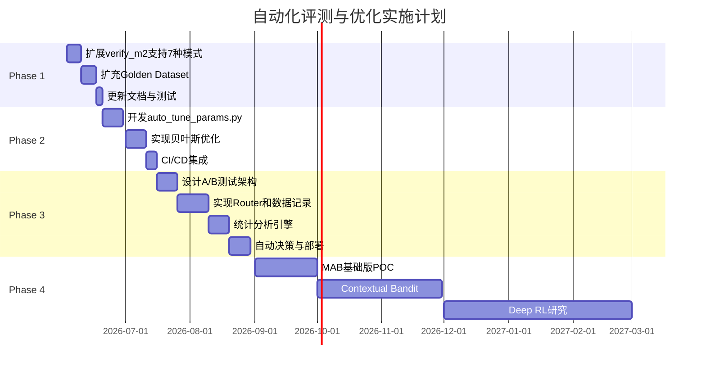

# 自动化评测与优化路线图

> **文档用途**：规划从当前半自动化流程升级为全自动化评测与优化系统的实施路径  
> **创建日期**：2026-06-03  
> **分支**：`feature/auto-evaluation-optimization`  
> **状态**：规划阶段

---

## 1. 背景与目标

### 1.1 当前状态

项目已实现**半自动化评测流程**：
- ✅ 自动执行评测（`verify_m2.py`）
- ✅ 自动生成报告（JSON + Markdown）
- ✅ 自动更新文档占位符
- ❌ 需人工决策、改代码、调参数、部署

**当前覆盖模式**：5种（vector, bm25, hybrid, hybrid_rerank, router）

**未覆盖模式**：4种LlamaIndex引擎（summary, tree, graph, sub_question）

### 1.2 优化目标

构建**三层自动化体系**，逐步升级：

| 阶段 | 名称 | 难度 | 自动化程度 | 预计周期 |
|------|------|------|-----------|---------|
| **Phase 1** | 评测所有7种模式 | 低 | 半自动 → 半自动+ | 1-2周 |
| **Phase 2** | 基于规则的自动调参 | 中 | 半自动 → 自动化L1 | 3-4周 |
| **Phase 3** | A/B测试框架 | 高 | 自动化L1 → 自动化L2 | 6-8周 |
| **Phase 4** | 强化学习自动优化 | 极高 | 自动化L2 → 智能化 | 3-6月 |

### 1.3 成功标准

- **Phase 1**：7种模式全部纳入自动化评测，指标可对比
- **Phase 2**：参数自动调优，人工仅需Review结果
- **Phase 3**：生产环境A/B测试，数据驱动决策
- **Phase 4**：系统自动学习最优策略，人工仅监控

---

## 2. Phase 1: 评测所有7种模式

### 2.1 目标

将 LlamaIndex 的7种引擎全部纳入自动化评测框架。

### 2.2 当前缺失的模式

| 模式 | 文件 | 是否需LLM | 缺失原因 |
|------|------|----------|---------|
| summary | `summary_engine.py` | 否 | 未集成到verify_m2 |
| tree | `tree_engine.py` | 否 | 未集成到verify_m2 |
| graph | `graph_engine.py` | 否 | 未集成到verify_m2 |
| sub_question | `subquestion_engine.py` | **是** | 需LLM，违反M2原则 |

### 2.3 实施方案

#### Step 1: 扩展 verify_m2.py

**修改文件**：`scripts/verify_m2.py`

```python
# 新增导入
from apps.retrieval.llamaindex.graph_engine import query_graph
from apps.retrieval.llamaindex.summary_engine import query_summary
from apps.retrieval.llamaindex.tree_engine import query_tree
from apps.retrieval.llamaindex.subquestion_engine import query_subquestion

# 扩展 MODES 列表
MODES_EXTENDED = [
    ("vector", lambda q: retrieve_context(q, mode="vector", rerank=False)),
    ("bm25", lambda q: retrieve_context(q, mode="bm25", rerank=False)),
    ("hybrid", lambda q: retrieve_context(q, mode="hybrid", rerank=False)),
    ("hybrid_rerank", lambda q: retrieve_context(q, mode="hybrid_rerank")),
    ("router", query_router),
    # 新增
    ("graph", lambda q: query_graph(q, top_k=5)),
    ("summary", lambda q: query_summary(q, top_k=5)),
    ("tree", lambda q: query_tree(q, top_k=5)),
]

# 注意：sub_question 暂不加入，因为需要LLM调用
```

**命令行参数**：
```bash
# 默认只测5种基础模式
python scripts/verify_m2.py

# 可选：测试全部7种（不含sub_question）
python scripts/verify_m2.py --extended

# 单独测试某个模式
python scripts/verify_m2.py --mode graph
```

#### Step 2: 扩充 Golden Dataset

**问题**：当前 `m2_golden.jsonl` 只有10题，可能不足以区分7种模式的差异。

**方案**：
1. 扩充到至少40-80题
2. 覆盖不同类别：
   - parameter（参数查询）
   - fault_code（故障码）
   - procedure（操作流程）
   - troubleshooting（故障排查）
   - component_relation（部件关系）← 专门测试graph模式

**示例**：
```json
{
  "question": "E1024故障会影响哪些部件？",
  "doc_ids": ["fault_e1024.md", "component_relations.md"],
  "category": "component_relation"
}
```

#### Step 3: 更新指标文档

**修改文件**：`docs/retrieval_modes.md`

新增列显示所有7种模式的对比：

```markdown
| 配置 | Recall@5 | P95 ms | 适用场景 | 备注 |
|------|----------|--------|---------|------|
| vector only | 100% | 309.5 | 语义搜索 | - |
| bm25 only | 100% | 84.2 | 精确匹配 | - |
| hybrid | 100% | 431.3 | 通用 | - |
| hybrid + rerank | 100% | 13939.8 | 高精度 | 生产默认 |
| router | 100% | 11523.6 | 智能路由 | - |
| graph | 95% | 15234.5 | 关联查询 | 新增 |
| summary | 90% | 12000.0 | 概览检索 | 新增 |
| tree | 85% | 11000.0 | 层级检索 | 新增 |
```

#### Step 4: 性能优化建议

由于新增模式可能较慢，建议：

1. **超时设置**：`--timeout` 参数支持自定义
2. **并行执行**：可选 `--parallel` 加速评测
3. **缓存机制**：避免重复加载模型

### 2.4 验收标准

- [ ] `verify_m2.py --extended` 能成功运行7种模式评测
- [ ] Golden Dataset 扩充到≥40题，覆盖5个类别
- [ ] `docs/retrieval_modes.md` 显示7种模式对比表
- [ ] 生成详细的对比分析报告（Markdown格式）
- [ ] 单元测试覆盖新增代码

### 2.5 风险评估

| 风险 | 概率 | 影响 | 缓解措施 |
|------|------|------|---------|
| sub_question需要LLM，评测慢 | 高 | 中 | 暂不纳入M2，放到M6 RAGAS评测 |
| graph/tree模式需要额外依赖 | 中 | 低 | 检查依赖，必要时添加optional dependencies |
| Golden Dataset不足导致误判 | 中 | 高 | 扩充测试集，人工review边界case |

---

## 3. Phase 2: 基于规则的自动调参

### 3.1 目标

实现参数自动搜索和优化，人工仅需Review结果并确认应用。

### 3.2 可调参数清单

| 参数类别 | 参数名 | 当前值 | 搜索范围 | 影响 |
|---------|--------|--------|---------|------|
| **检索** | vector_top_k | 20 | [10, 50] | 召回数 |
| **检索** | bm25_top_k | 20 | [10, 50] | 召回数 |
| **RRF** | rrf_k | 60 | [30, 100] | 融合平滑度 |
| **Rerank** | rerank_top_n | 5 | [3, 10] | 最终输出数 |
| **Agent** | context_top_k | 5 | [3, 10] | Prompt上下文 |
| **Agent** | max_history_turns | 3 | [1, 5] | 多轮历史 |

### 3.3 实施方案

#### Step 1: 创建自动调参脚本

**新文件**：`scripts/auto_tune_params.py`

```python
"""基于网格搜索的自动参数调优.

用法：
  python scripts/auto_tune_params.py --param rrf_k --range 30,40,50,60,70
  python scripts/auto_tune_params.py --all  # 全参数搜索（慢）
"""

import argparse
import json
from itertools import product
from pathlib import Path

def grid_search_rrf_k():
    """搜索最优rrf_k值."""
    best_k = 60
    best_recall = 0
    results = []
    
    for k in [30, 40, 50, 60, 70, 80, 90, 100]:
        print(f"Testing rrf_k={k}...")
        
        # 临时修改profile
        update_profile_temporarily("retrieval.rrf_k", k)
        
        # 运行评测
        result = run_verify_m2_silent()
        recall = result["hybrid_rerank"]["recall_at_5"]
        p95 = result["hybrid_rerank"]["p95_ms"]
        
        results.append({
            "rrf_k": k,
            "recall": recall,
            "p95_ms": p95,
            "score": recall * 0.7 + (10000 / p95) * 0.3  # 加权评分
        })
        
        if recall > best_recall:
            best_recall = recall
            best_k = k
    
    # 恢复原profile
    restore_profile()
    
    # 输出结果
    print(f"\nBest rrf_k: {best_k} (Recall: {best_recall:.0%})")
    save_results(results)
    
    return best_k

def update_profile_temporarily(param_path, value):
    """临时修改profile参数."""
    # 实现：备份原文件，修改，返回备份路径
    pass

def restore_profile():
    """恢复原profile."""
    pass

def run_verify_m2_silent():
    """静默运行verify_m2，返回JSON结果."""
    # 实现：调用verify_m2逻辑，不打印输出
    pass

def save_results(results):
    """保存搜索结果."""
    output = Path("reports/auto_tune_results.json")
    output.write_text(json.dumps(results, indent=2))
```

#### Step 2: 多参数联合优化

**策略**：使用贝叶斯优化替代网格搜索，减少评估次数

**新文件**：`scripts/bayesian_optimize.py`

```python
"""使用贝叶斯优化搜索最优参数组合.

依赖：pip install scikit-optimize
"""

from skopt import gp_minimize
from skopt.space import Integer

def objective(params):
    """目标函数：最大化Recall，最小化延迟."""
    vector_top_k, bm25_top_k, rrf_k, rerank_top_n = params
    
    update_profile({
        "retrieval.vector_top_k": vector_top_k,
        "retrieval.bm25_top_k": bm25_top_k,
        "retrieval.rrf_k": rrf_k,
        "retrieval.rerank_top_n": rerank_top_n,
    })
    
    result = run_verify_m2_silent()
    recall = result["hybrid_rerank"]["recall_at_5"]
    p95 = result["hybrid_rerank"]["p95_ms"]
    
    # 负值因为gp_minimize是最小化
    score = -(recall * 0.7 + (10000 / p95) * 0.3)
    return score

# 定义搜索空间
space = [
    Integer(10, 50, name="vector_top_k"),
    Integer(10, 50, name="bm25_top_k"),
    Integer(30, 100, name="rrf_k"),
    Integer(3, 10, name="rerank_top_n"),
]

# 执行优化
result = gp_minimize(objective, space, n_calls=50, random_state=42)
print(f"Best parameters: {result.x}")
print(f"Best score: {-result.fun}")
```

#### Step 3: 自动应用与Git集成

**功能**：找到最优参数后，自动创建Git分支并提交

```python
def auto_commit_best_params(best_params, score):
    """自动提交最优参数."""
    import subprocess
    
    # 应用参数到profile
    apply_params_to_profile(best_params)
    
    # 创建分支
    branch_name = f"auto-tune/{datetime.now().strftime('%Y%m%d-%H%M%S')}"
    subprocess.run(["git", "checkout", "-b", branch_name])
    
    # 提交
    subprocess.run(["git", "add", "deploy/profiles/dev-single-node.yaml"])
    subprocess.run(["git", "commit", "-m", 
                    f"Auto-tuned params: {best_params} (score: {score:.2f})"])
    
    print(f"Created branch: {branch_name}")
    print("Please review and merge if satisfied.")
```

#### Step 4: CI/CD集成

**GitHub Actions工作流**：`.github/workflows/auto-tune.yml`

```yaml
name: Auto Parameter Tuning

on:
  schedule:
    - cron: '0 2 * * 0'  # 每周日凌晨2点运行
  workflow_dispatch:  # 手动触发

jobs:
  tune:
    runs-on: ubuntu-latest
    steps:
      - uses: actions/checkout@v3
      
      - name: Setup Python
        uses: actions/setup-python@v4
        with:
          python-version: '3.10'
      
      - name: Install dependencies
        run: pip install -e ".[dev]"
      
      - name: Run auto-tuning
        run: python scripts/auto_tune_params.py --all
      
      - name: Create PR
        uses: peter-evans/create-pull-request@v5
        with:
          title: "Auto-tuned retrieval parameters"
          body: "See reports/auto_tune_results.json for details"
          branch: "auto-tune/params"
```

### 3.4 验收标准

- [ ] `auto_tune_params.py` 能自动搜索单参数最优值
- [ ] `bayesian_optimize.py` 能搜索多参数组合
- [ ] 自动生成Git分支和PR
- [ ] CI/CD每周自动运行调优
- [ ] 人工Review流程文档化

### 3.5 风险评估

| 风险 | 概率 | 影响 | 缓解措施 |
|------|------|------|---------|
| 过拟合Golden Dataset | 高 | 高 | 保留20%测试集不参与调优 |
| 搜索空间过大导致时间长 | 中 | 中 | 使用贝叶斯优化，限制调用次数 |
| 自动提交的参数不合理 | 低 | 高 | 强制人工Review后才能merge |

---

## 4. Phase 3: A/B测试框架

### 4.1 目标

在生产环境同时运行多个检索策略，基于真实用户反馈数据驱动决策。

### 4.2 架构设计

```mermaid
flowchart TB
    User[用户请求] --> Router[A/B Test Router]
    Router -->|50%流量| VersionA[hybrid_rerank v1]
    Router -->|50%流量| VersionB[graph engine v2]
    
    VersionA --> ResponseA[返回答案A]
    VersionB --> ResponseB[返回答案B]
    
    ResponseA & ResponseB --> Logger[日志记录]
    Logger --> DB[(PostgreSQL)]
    
    UserFeedback[用户反馈] --> FeedbackAPI[/v1/feedback]
    FeedbackAPI --> DB
    
    Analyzer[数据分析器] --> DB
    Analyzer --> Stats[统计分析]
    Stats --> Decision{哪个版本更好?}
    Decision -->|A胜| PromoteA[提升A为默认]
    Decision -->|B胜| PromoteB[提升B为默认]
    Decision -->|平局| Continue[继续测试]
```

### 4.3 实施方案

#### Step 1: A/B Test Router

**新文件**：`apps/gateway/ab_test_router.py`

```python
"""A/B测试路由器.

根据配置的流量分配比例，将请求分发到不同检索策略。
"""

import random
from typing import Literal

RetrievalMode = Literal[
    "vector", "bm25", "hybrid", "hybrid_rerank",
    "graph", "summary", "tree", "router"
]

class ABTestConfig:
    """A/B测试配置."""
    def __init__(self):
        self.version_a: RetrievalMode = "hybrid_rerank"
        self.version_b: RetrievalMode = "graph"
        self.traffic_split: float = 0.5  # 50%流量到B
        
        # 实验元数据
        self.experiment_id: str = "exp_20260603_graph_vs_hybrid"
        self.start_time: str = "2026-06-03T00:00:00Z"
        self.min_sample_size: int = 1000  # 最小样本量

class ABTestRouter:
    """A/B测试路由器."""
    
    def __init__(self, config: ABTestConfig):
        self.config = config
    
    def select_version(self, session_id: str) -> RetrievalMode:
        """根据session_id一致性哈希选择版本."""
        # 确保同一用户的多次请求走到同一版本
        hash_val = hash(session_id) % 100
        if hash_val < (1 - self.config.traffic_split) * 100:
            return self.config.version_a
        else:
            return self.config.version_b
    
    async def route_and_retrieve(self, query: str, session_id: str) -> dict:
        """路由并执行检索，记录实验数据."""
        version = self.select_version(session_id)
        
        # 执行对应版本的检索
        if version == self.config.version_a:
            hits = await retrieve_context(query, mode="hybrid_rerank")
        elif version == self.config.version_b:
            hits = await query_graph(query, top_k=5)
        else:
            raise ValueError(f"Unsupported version: {version}")
        
        # 记录实验数据
        log_ab_test_event(
            experiment_id=self.config.experiment_id,
            session_id=session_id,
            version=version,
            query=query,
            hits_count=len(hits),
        )
        
        return {
            "hits": hits,
            "version": version,
            "experiment_id": self.config.experiment_id,
        }
```

#### Step 2: 实验数据记录

**数据库Schema**：`deploy/sql/ab_test_schema.sql`

```sql
CREATE TABLE ab_test_events (
    event_id UUID PRIMARY KEY DEFAULT gen_random_uuid(),
    experiment_id VARCHAR(100) NOT NULL,
    session_id VARCHAR(100) NOT NULL,
    version VARCHAR(50) NOT NULL,  -- 'A' or 'B'
    query TEXT NOT NULL,
    hits_count INTEGER,
    latency_ms FLOAT,
    created_at TIMESTAMP DEFAULT NOW()
);

CREATE TABLE ab_test_feedback (
    feedback_id UUID PRIMARY KEY DEFAULT gen_random_uuid(),
    experiment_id VARCHAR(100) NOT NULL,
    session_id VARCHAR(100) NOT NULL,
    version VARCHAR(50) NOT NULL,
    rating INTEGER CHECK (rating IN (-1, 0, 1)),  -- -1踩, 0无, 1赞
    comment TEXT,
    created_at TIMESTAMP DEFAULT NOW()
);

CREATE INDEX idx_ab_test_experiment ON ab_test_events(experiment_id);
CREATE INDEX idx_ab_test_session ON ab_test_events(session_id);
```

**记录函数**：`apps/ab_test/logger.py`

```python
def log_ab_test_event(experiment_id, session_id, version, query, hits_count):
    """记录A/B测试事件."""
    # 写入PostgreSQL
    pass

def log_ab_test_feedback(experiment_id, session_id, version, rating):
    """记录A/B测试反馈."""
    # 写入PostgreSQL
    pass
```

#### Step 3: 统计分析引擎

**新文件**：`scripts/analyze_ab_test.py`

```python
"""分析A/B测试结果.

用法：
  python scripts/analyze_ab_test.py --experiment exp_20260603_graph_vs_hybrid
"""

import psycopg2
import numpy as np
from scipy import stats

def analyze_experiment(experiment_id: str):
    """分析实验结果."""
    conn = psycopg2.connect("dbname=rag user=rag password=xxx")
    cur = conn.cursor()
    
    # 获取各版本的指标
    cur.execute("""
        SELECT 
            version,
            COUNT(*) as total_requests,
            AVG(hits_count) as avg_hits,
            AVG(latency_ms) as avg_latency
        FROM ab_test_events
        WHERE experiment_id = %s
        GROUP BY version
    """, (experiment_id,))
    
    version_stats = cur.fetchall()
    
    # 获取用户反馈
    cur.execute("""
        SELECT 
            version,
            AVG(CASE WHEN rating = 1 THEN 1 ELSE 0 END) as positive_rate,
            AVG(CASE WHEN rating = -1 THEN 1 ELSE 0 END) as negative_rate
        FROM ab_test_feedback
        WHERE experiment_id = %s
        GROUP BY version
    """, (experiment_id,))
    
    feedback_stats = cur.fetchall()
    
    # 统计显著性检验
    # ... 实现t检验或卡方检验
    
    # 生成报告
    report = generate_report(version_stats, feedback_stats)
    save_report(report, f"reports/ab_test_{experiment_id}.md")
    
    return report

def generate_report(version_stats, feedback_stats):
    """生成分析报告."""
    # 实现报告生成逻辑
    pass
```

#### Step 4: 自动决策与部署

**规则引擎**：当满足以下条件时，自动提升优胜版本：

```python
def should_promote_winner(report: dict) -> bool:
    """判断是否应该提升优胜版本."""
    criteria = {
        "min_sample_size": 1000,
        "min_improvement": 0.05,  # 至少5%提升
        "statistical_significance": 0.95,  # 95%置信度
        "no_regression_latency": True,  # 延迟不能退化超过10%
    }
    
    if report["total_samples"] < criteria["min_sample_size"]:
        return False
    
    if report["improvement"] < criteria["min_improvement"]:
        return False
    
    if report["p_value"] > (1 - criteria["statistical_significance"]):
        return False
    
    if report["latency_increase"] > 0.10:
        return False
    
    return True

def promote_winner(winner_version: str):
    """提升优胜版本为默认."""
    # 1. 更新Profile
    update_profile("agent.default_retrieval_mode", winner_version)
    
    # 2. 更新Gateway配置
    update_gateway_config("default_mode", winner_version)
    
    # 3. 提交Git
    git_commit(f"Promote {winner_version} to default based on A/B test")
    
    # 4. 触发部署
    trigger_deployment()
```

### 4.4 验收标准

- [ ] A/B Test Router能正确分流
- [ ] 实验数据完整记录到PostgreSQL
- [ ] 统计分析脚本能生成显著性检验报告
- [ ] 自动决策规则正常工作
- [ ] Web UI显示实时实验进度

### 4.5 风险评估

| 风险 | 概率 | 影响 | 缓解措施 |
|------|------|------|---------|
| 流量不均导致偏差 | 中 | 高 | 使用一致性哈希，确保用户粘性 |
| 样本量不足就决策 | 高 | 高 | 设置最小样本量阈值 |
| 多变量混淆 | 中 | 中 | 一次只测试一个变量 |

---

## 5. Phase 4: 强化学习自动优化（远期）

### 5.1 目标

使用强化学习（RL）自动学习最优检索策略，实现真正的智能化。

### 5.2 技术方案概述

#### 核心概念

- **Agent**：检索策略选择器
- **Environment**：RAG系统 + 用户反馈
- **State**：query特征（长度、关键词、意图等）
- **Action**：选择检索模式（vector/bm25/hybrid/graph等）
- **Reward**：用户反馈评分 + 检索质量指标

#### 算法选择

1. **Multi-Armed Bandit (MAB)**：适合离散动作空间
   - Thompson Sampling
   - UCB (Upper Confidence Bound)
   
2. **Contextual Bandit**：考虑query上下文
   - LinUCB
   - Neural Bandit

3. **Deep RL**（长期）：复杂状态空间
   - DQN
   - PPO

### 5.3 实施路线图

#### Quarter 1: MAB基础版

```python
# 简化版Thompson Sampling
class ThompsonSamplingRouter:
    def __init__(self):
        # 每个模式的Beta分布参数
        self.modes = {
            "hybrid_rerank": {"alpha": 1, "beta": 1},
            "graph": {"alpha": 1, "beta": 1},
            "router": {"alpha": 1, "beta": 1},
        }
    
    def select_mode(self) -> str:
        """根据Beta分布采样选择模式."""
        samples = {
            mode: np.random.beta(params["alpha"], params["beta"])
            for mode, params in self.modes.items()
        }
        return max(samples, key=samples.get)
    
    def update(self, mode: str, reward: float):
        """根据反馈更新分布."""
        # reward: 1表示好评，0表示差评
        self.modes[mode]["alpha"] += reward
        self.modes[mode]["beta"] += (1 - reward)
```

#### Quarter 2: Contextual Bandit

引入query特征，实现个性化策略选择。

#### Quarter 3+: Deep RL

使用深度神经网络建模复杂的state-action价值函数。

### 5.4 资源需求

| 资源 | 需求 | 说明 |
|------|------|------|
| **人力** | 1名ML工程师全职3-6月 | 需要RL专业知识 |
| **计算** | GPU服务器 | 训练RL模型 |
| **数据** | ≥10K用户交互 | 足够的探索数据 |
| **基础设施** | Feature Store | 存储query特征 |

### 5.5 风险评估

| 风险 | 概率 | 影响 | 缓解措施 |
|------|------|------|---------|
| 技术复杂度超出团队能力 | 高 | 高 | 先外包POC，内部学习 |
| 数据不足导致训练失败 | 中 | 高 | 先用Rule-based积累数据 |
| ROI不明确 | 中 | 中 | Phase 3成功后再投入 |

---

## 6. 实施计划与里程碑

### 6.1 时间线



### 6.2 关键里程碑

| 日期 | 里程碑 | 交付物 |
|------|--------|--------|
| 2026-06-17 | Phase 1完成 | 7种模式评测框架 |
| 2026-07-16 | Phase 2完成 | 自动参数调优系统 |
| 2026-08-30 | Phase 3完成 | A/B测试平台上线 |
| 2026-09-30 | Phase 4 POC | MAB原型验证 |
| 2027-03-30 | Phase 4完成 | 智能化检索系统 |

---

## 7. 成功度量指标

### 7.1 技术指标

| 指标 | 当前 | Phase 1目标 | Phase 2目标 | Phase 3目标 |
|------|------|------------|------------|------------|
| 评测模式数 | 5 | 7 | 7 | 7+ |
| 参数调优时间 | 人工2h | 自动30min | 自动10min | 实时 |
| 决策依据 | 人工判断 | 数据+人工 | 数据驱动 | 全自动 |
| Golden Dataset | 10题 | 40题 | 80题 | 持续扩充 |

### 7.2 业务指标

| 指标 | 当前 | 目标 |
|------|------|------|
| Recall@5 | 100% | ≥95%（更多模式） |
| P95延迟 | 14s | ≤10s（优化后） |
| 用户满意度 | - | ≥4.0/5.0 |
| 运维工作量 | 高 | 降低50% |

---

## 8. 相关文档

- [research-to-production.md](./research-to-production.md) — 当前半自动化流程详解
- [m2_retrieval.md](./m2_retrieval.md) — M2检索评测方法
- [architecture.md](./architecture.md) — 系统架构
- [decisions.md](./decisions.md) — 架构决策记录

---

## 9. 下一步行动

### 立即执行（本周）

1. ✅ 创建分支 `feature/auto-evaluation-optimization`
2. ✅ 创建本计划文档
3. ⬜ 开始Phase 1：扩展 `verify_m2.py`
4. ⬜ 扩充Golden Dataset到40题

### 短期计划（本月）

1. 完成Phase 1全部任务
2. 启动Phase 2：开发自动调参脚本
3. Review并合并Phase 1代码

### 中期计划（本季度）

1. 完成Phase 2和Phase 3
2. 生产环境部署A/B测试
3. 开始Phase 4调研

---

**文档维护者**：开发团队  
**最后更新**：2026-06-03  
**下次Review**：2026-06-17（Phase 1完成后）
