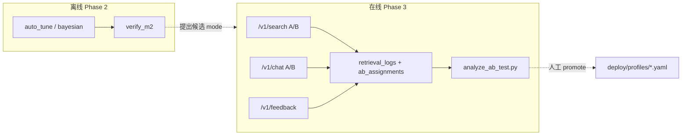
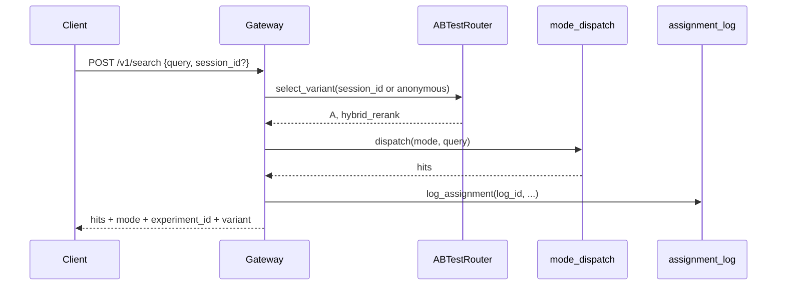

# Phase 3：A/B 测试框架 — 设计稿

> **状态**：P3.1 search ✅ · P3.2 chat ✅ · P3.3 analyze + admin ✅（2026-06-03）；P3.4 Demo UI ⬜  
> **关联**：[auto-evaluation-roadmap.md](./auto-evaluation-roadmap.md) §4 · [m7_demo.md](../m7_demo.md) · [m3_agent.md](../m3_agent.md)  
> **前置**：Phase 1（`verify_m2`）✅ · Phase 2（`auto_tune_params` / `bayesian_optimize`）✅  
> **原则**：不删架构组件；**不自动改 profile / 不自动部署**（与 Phase 2 ADR 一致）

### 拍板（2026-06-03）

1. **首个实验**：`scope: search`，仅 `/v1/search` 分流（hybrid_rerank vs graph）。  
2. **生产启 A/B 前**：`demo.feedback_backend: postgresql` 且 `persistence.retrieval_log_backend: postgresql`，并执行 `python scripts/init_db.py`。

---

## 1. 目标与非目标

### 1.1 目标

| # | 目标 | 可验收信号 |
|---|------|------------|
| G1 | 生产流量在 **两个检索策略** 间可复现分流 | 同 `session_id` 多次请求落在同一 variant |
| G2 | 每次实验请求可关联 **检索日志 + 用户反馈** | `message_id` ↔ `retrieval_log_id` ↔ `experiment_id` + `variant` |
| G3 | 离线脚本输出 **显著性 + 业务可读报告** | `reports/ab_test_{experiment_id}.md` |
| G4 | 与 Phase 2 衔接：离线调参 → 小流量 A/B → 人工 promote | 优胜 `mode` 写入 profile 仍走人工 Review |

### 1.2 非目标（本阶段不做）

- **不**新建独立 `ab_test_feedback` 表（复用 M7 `feedback_events`）
- **不**自动 `git commit` / Helm 滚动 / 提升默认模式（Phase 4 前均人工）
- **不**在 A/B 中纳入 `sub_question`（需 LLM，与 M2 一致，归 M6/在线 bandit）
- **不**做多变量实验（一次实验只变 **检索 mode** 或 **一组 profile 检索参数**，二选一）

---

## 2. 与现网组件对齐

| 组件 | 现状 | Phase 3 改动 |
|------|------|--------------|
| `POST /v1/search` | 客户端显式传 `mode` | 实验开启时 **忽略** 请求体 `mode`，由 Router 选 variant |
| `POST /v1/chat` | `run_agentic_rag` → 固定 `hybrid_rerank` | 实验开启时 pipeline 使用 **variant 对应 mode** |
| `write_retrieval_log` | 无 `mode` / 实验字段 | 增加可选 `experiment_id`, `variant`, `retrieval_mode` |
| `POST /v1/feedback` | `FeedbackEvent` + `retrieval_log_id` | 响应/存储带出 `experiment_id`, `variant`（便于分析，可选冗余） |
| `demo.feedback_backend` | `file` \| `postgresql` | 与 A/B 分配日志 **同一后端策略** |
| `persistence.retrieval_log_backend` | `file` \| `postgresql` | 同上 |
| Phase 2 调参 | `reports/*_tune_results.json` | 仅作 **实验假设来源**（如 `graph` vs `hybrid_rerank`） |

**粘性分流**：不用 `hash(session_id) % 100`（Python `hash` 进程间不稳定）。采用 **确定性分桶**：

```text
bucket = int(sha256(f"{experiment_id}:{session_id}").hexdigest()[:8], 16) % 10000
variant = B if bucket < traffic_split * 10000 else A
```

---

## 3. 实验面（两条入口）



### 3.1 推荐分期

| 子阶段 | 范围 | 理由 |
|--------|------|------|
| **P3.1** | 仅 `/v1/search` | 无 LLM 成本；与 `verify_m2` 同栈；本机可压测 |
| **P3.2** | `/v1/chat` + `pipeline._retrieve` 可配置 mode | 需改 `hybrid_search` 或并行 `mode_dispatch` |
| **P3.3** | 分析脚本 + Admin 只读 API | 复用 `GET /v1/admin/retrieval-logs` 模式 |
| **P3.4** | Demo UI 展示 variant（可选） | `demo_ui.py` 显示当前实验 arm |

**默认首个实验**：`hybrid_rerank` (A) vs `graph` (B)，`traffic_split=0.5`，与路线图示例一致。

---

## 4. 配置（Profile）

在 `deploy/profiles/dev-single-node.yaml`（及生产 overlay）增加 **`ab_test`** 段，默认 `enabled: false`：

```yaml
ab_test:
  enabled: false
  experiment_id: ""          # 非空且 enabled 时生效
  traffic_split: 0.5         # [0,1]，分给 version_b 的比例
  min_sample_size: 200       # analyze 脚本告警阈值（可覆盖）
  scope: search              # search | chat | both
  version_a:
    label: A
    mode: hybrid_rerank
  version_b:
    label: B
    mode: graph
  # 可选：参数实验（与 mode 互斥，二期）
  # version_b_params: { retrieval.rrf_k: 70 }
```

| 字段 | 说明 |
|------|------|
| `scope: search` | 只改 `/v1/search`；chat 仍走默认 hybrid |
| `scope: chat` | 只改 Agent 检索；search API 仍尊重请求 `mode` |
| `scope: both` | 两入口统一 Router（生产常用） |

**启停**：`enabled: false` 或 `experiment_id: ""` 时零开销路径，行为与当前代码完全一致。

---

## 5. 模块划分

| 模块 | 路径 | 职责 |
|------|------|------|
| 配置加载 | `apps/ab_test/config.py` | 读 profile `ab_test`，校验 mode 合法性 |
| 路由器 | `apps/ab_test/router.py` | `select_variant(session_id) -> (label, mode)` |
| 分配日志 | `apps/ab_test/assignment_log.py` | file / postgresql，与 `retrieval_log` 同模式 |
| Gateway 接入 | `apps/gateway/main.py` | search/chat 入口调用 router + 写日志 |
| Pipeline 接入 | `apps/agent/pipeline.py` | `_retrieve` 按 mode 分发（复用 gateway `_dispatch_search` 逻辑，抽到 `apps/retrieval/mode_dispatch.py`） |
| 分析 | `scripts/analyze_ab_test.py` | 聚合 + 检验 + Markdown 报告 |
| Schema | `deploy/sql/ab_test_schema.sql` | 仅 **assignments** 表；不重复 feedback |
| 初始化 | `scripts/init_db.py` | 追加 schema 文件名 |
| 测试 | `tests/test_ab_test_router.py` | 粘性、边界 traffic_split、disabled 回退 |

---

## 6. 数据模型

### 6.1 新表：`ab_assignments`（PostgreSQL）

```sql
CREATE TABLE IF NOT EXISTS ab_assignments (
    log_id UUID PRIMARY KEY,              -- = retrieval_logs.log_id = message_id
    experiment_id TEXT NOT NULL,
    session_id TEXT NOT NULL,
    variant CHAR(1) NOT NULL CHECK (variant IN ('A', 'B')),
    retrieval_mode TEXT NOT NULL,
    scope TEXT NOT NULL,                  -- search | chat
    latency_ms REAL,
    created_at TIMESTAMPTZ NOT NULL DEFAULT NOW()
);

CREATE INDEX IF NOT EXISTS idx_ab_assign_experiment ON ab_assignments (experiment_id);
CREATE INDEX IF NOT EXISTS idx_ab_assign_variant ON ab_assignments (experiment_id, variant);
```

**File 模式**：`reports/ab_assignments.jsonl`（一行一条，字段与上一致）。

### 6.2 扩展 `retrieval_logs`（可选列，向后兼容）

```sql
ALTER TABLE retrieval_logs
  ADD COLUMN IF NOT EXISTS experiment_id TEXT,
  ADD COLUMN IF NOT EXISTS variant CHAR(1),
  ADD COLUMN IF NOT EXISTS retrieval_mode TEXT;
```

File JSONL 同步增加三字段（缺省为 `null`）。**写入点**：`write_retrieval_log(..., experiment_id=, variant=, retrieval_mode=)`。

### 6.3 反馈：不新表，JOIN 分析

`feedback_events` 已有 `retrieval_log_id`。分析时：

```sql
SELECT a.variant, f.rating, a.retrieval_mode, r.refused, r.hit_count
FROM feedback_events f
JOIN ab_assignments a ON a.log_id::text = f.retrieval_log_id
LEFT JOIN retrieval_logs r ON r.log_id = a.log_id
WHERE a.experiment_id = $1;
```

客户端 **可选** 在 `POST /v1/feedback` 增加只读字段 `variant` / `experiment_id`（服务端以 assignment 为准，防篡改）。

---

## 7. 请求路径（序列）

### 7.1 Search A/B（P3.1）



- 若请求无 `session_id`：用 **IP + User-Agent 哈希** 或要求客户端传 `session_id`（与 chat 一致，文档标明）。
- 响应 `SearchResponse` 扩展：`experiment_id`, `variant`（实验关闭时不返回）。

### 7.2 Chat A/B（P3.2）

在 `run_agentic_rag` 内：

1. `select_variant(session_id)`  
2. `_retrieve` → `dispatch_search(mode, search_query, top_k)`  
3. `write_retrieval_log(..., retrieval_mode=mode, experiment_id=, variant=)`  
4. `ChatResponse` 可增加 `variant` 供 UI 展示（`message_id` 不变）。

---

## 8. 指标与决策规则

### 8.1 主指标（产品）

| 指标 | 来源 | 说明 |
|------|------|------|
| **点赞率** | `feedback_events.rating = 1` | 主决策指标 |
| **点踩率** | `rating = -1` | 护栏 |
| **拒答率** | `retrieval_logs.refused` | 质量护栏 |
| **平均 hit_count** | `retrieval_logs` | 检索充分性 |
| **P95 latency** | assignment `latency_ms` 或端到端扩展 | 性能护栏 |

### 8.2 统计（`analyze_ab_test.py`）

| 检验 | 条件 | 方法 |
|------|------|------|
| 样本量 | `n < min_sample_size` | 退出码 2，报告标注「不足」 |
| 点赞率差异 | 每 arm ≥30 条反馈 | 两比例 **z 检验** 或 **Fisher**（稀疏时） |
| 拒答率 | 每 arm ≥100 次请求 | 同上 |
| 延迟退化 | B 的 P95 vs A | 若 `p95_B > 1.1 * p95_A` → **禁止自动 promote**（仅警告） |

**Promote 清单（人工，不写脚本自动执行）**：

1. `analyze_ab_test` 报告 `recommendation: promote_B` 且 `p_value < 0.05`  
2. 再跑 `verify_m2 --mode {winner} --extended` 无回归  
3. 人工改 `deploy/profiles/*.yaml` 默认 mode / 关闭 `ab_test.enabled`  
4. `docs/decisions.md` 追加 ADR 行  

---

## 9. CLI 与 API

### 9.1 分析脚本

```powershell
# file 后端：读 reports/*.jsonl，零 DB
python scripts/analyze_ab_test.py --experiment exp_20260603_graph_vs_hybrid --dry-run

# PostgreSQL
python scripts/analyze_ab_test.py --experiment exp_20260603_graph_vs_hybrid
```

输出：`reports/ab_test_{experiment_id}.md` + `reports/ab_test_{experiment_id}.json`（机器可读）。

**依赖**：`scipy` 放入 `[tune]` 或新 extra `[ab]`；无 scipy 时仅输出描述统计、不做检验。

### 9.2 Admin（只读，P3.3）

| 方法 | 路径 | 说明 |
|------|------|------|
| GET | `/v1/admin/ab-test/status` | 当前 `experiment_id`、traffic_split、各 arm 计数 |
| GET | `/v1/admin/ab-test/report?experiment_id=` | 缓存最近一次 analyze 结果（可选） |

---

## 10. 实施步骤与工时（估）

| 步骤 | 交付 | 估时 |
|------|------|------|
| 1 | `apps/ab_test/*` + `tests/test_ab_test_router.py` | 2d |
| 2 | `mode_dispatch.py` 抽离 + `/v1/search` 接入 | 2d |
| 3 | `retrieval_log` / `ab_assignments` schema + file 后端 | 2d |
| 4 | `analyze_ab_test.py` + 样例 JSONL fixture 测试 | 2d |
| 5 | `pipeline` chat 接入 + `verify_m7` 扩展 1 例 | 3d |
| 6 | Admin API + `docs/m7_demo.md` 更新 | 1d |
| 7 | CI：`analyze_ab_test --dry-run` on fixture | 1d |

**合计**：约 2–3 周（不含 Web UI 图表）。

---

## 11. 验收标准

- [ ] `ab_test.enabled: false` 时，search/chat 行为与现网 byte-level 兼容（pytest 回归）
- [ ] 同 `session_id` 在 1000 次调用中 variant 一致（粘性测试）
- [ ] 实验开启时，每条 chat/search 在 `ab_assignments`（或扩展 retrieval_log）可查到 `experiment_id` + `variant`
- [ ] `/v1/feedback` 后，analyze 能按 variant 汇总点赞率
- [ ] `analyze_ab_test.py --dry-run` 在 CI 无 PostgreSQL 通过
- [ ] 文档与 `decisions.md` 含「不自动 promote」ADR

---

## 12. 风险与缓解

| 风险 | 缓解 |
|------|------|
| Chat 改 mode 引入回归 | 先 P3.1 search-only；chat 小流量 `traffic_split≤0.1` |
| 反馈稀疏 | 降低 `min_sample_size` 仅用于 **探索**；决策仍以 M2 golden + 人工 |
| file 后端并发写 | 与 `feedback` 相同 append 模式；生产切 postgresql |
| graph 延迟高于 hybrid | 报告 latency 护栏；Phase 2 已测 P95 |
| 无 session_id 的 search | API 文档要求传 `session_id`；或 Gateway 生成匿名 id 返回客户端 |

---

## 13. 与 Phase 4 边界

Phase 3 产出 **带标签的在线日志**（variant + feedback），作为 Phase 4 Contextual Bandit / Thompson Sampling 的训练数据。  
Phase 4 的 `ThompsonSamplingRouter` 可 **替换** `ABTestRouter` 的 `select_variant`，保留同一 `assignment_log`  schema。

---

## 14. 路线图 §4 修订说明

原 §4 独立 `ab_test_events` / `ab_test_feedback` 表 **合并** 为本设计：

- 事件 → `ab_assignments` + `retrieval_logs`  
- 反馈 → `feedback_events`  
- 自动 `promote_winner()` → **删除**，改为 §8.2 人工清单  

实现时以 **本文 + 仓库实际 CLI** 为准；路线图保留高层 mermaid 与里程碑日期。

---

**维护**：开发团队  
**最后更新**：2026-06-03
