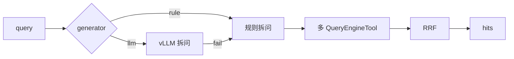

# SubQuestion 完整落地 — 开发计划

> **分支**：`feature/subquestion-complete`（自 commit `3d09b32` 起）  
> **拍板**（2026-06-03）：**生产默认自研 SubQuestionQueryEngine**；官方 `llama-index` **仅 benchmark 对照**，不替换 Gateway/Agent 默认路径。  
> **关联**：[m2_retrieval.md](../m2_retrieval.md) §4.7 · [decisions.md](../decisions.md) · [auto-evaluation-roadmap.md](./auto-evaluation-roadmap.md)

---

## 1. 基线（`3d09b32` 已交付）

| 项 | 状态 |
|----|------|
| `SubQuestionQueryEngine` 自研骨架 | ✅ `apps/retrieval/llamaindex/subquestion/` |
| `RuleBasedQuestionGenerator`（规则拆分 + 故障码→keyword） | ✅ |
| 工具 `hybrid` / `keyword` + 多路 RRF | ✅ |
| `LLMQuestionGenerator` | ⬜ 桩（`NotImplementedError`） |
| `ResponseSynthesizer` | ⬜ 未实现 |
| Gateway `mode=sub_question` | ✅ |
| `query_subquestion_detail`（调试） | ✅ 代码内，未暴露 HTTP |
| `verify_m2 --extended --mode sub_question` | ✅ rule-based |
| Profile `retrieval.sub_question.*` | ✅ |

---

## 2. 目标与非目标

### 2.1 目标

| # | 目标 | 验收信号 |
|---|------|----------|
| G1 | vLLM 驱动的 LLM 子问题生成，失败回退 rule_based | `generator=llm` 可跑；LLM 挂掉仍返回 hits |
| G2 | 工具池覆盖现有 LI 引擎（summary/tree/graph/hybrid_rerank） | 复合问句可路由到 ≥5 种 tool |
| G3 | 可选「检索 + 合成」完整 QueryEngine 语义 | 新端点或 chat 路径可返回合成答案 + citations |
| G4 | 可观测：子问题轨迹进日志/API | retrieval_log 或 Search 扩展字段含 `sub_questions` |
| G5 | 官方 LI SubQuestion **对照 benchmark** | `scripts/benchmark_subquestion.py` 或 pytest 对比 recall/延迟 |
| G6 | M6 复合问句评测集 | golden + RAGAS 子集（用户代劳跑 live） |

### 2.2 非目标

- **不**将 ingest/M1 改为 LlamaIndex Index 双写
- **不**用官方 LI 替换生产默认 `hybrid_rerank` / Agent 主链
- **不**在 Phase 3 首个 search-only A/B 中默认纳入 `sub_question`（可 Phase 3+ 单独实验）
- **不**自动改 profile / 不自动 promote（与 [phase3-ab-test-design.md](./phase3-ab-test-design.md) 一致）

---

## 3. 分阶段实施

### Phase A — 检索增强（优先，无 ResponseSynthesizer）



| Step | 任务 | 主要文件 | 验收 |
|------|------|----------|------|
| A1 | 实现 `LLMQuestionGenerator`（async，JSON 输出 sub_question + tool_name） | `question_gen.py`，复用 `apps/generation/llm_router` | 单测 mock vLLM；复合问句拆 ≥2 子问 |
| A2 | `QuestionGenerator.generate` 改 async；engine 适配 | `engine.py`，`mode_dispatch.py` | pytest asyncio 通过 |
| A3 | LLM 失败 → `RuleBasedQuestionGenerator` fallback | `question_gen.py` | 故意 mock 503 仍返回 hits |
| A4 | 扩展 `DEFAULT_TOOLS`：`summary`/`tree`/`graph`/`hybrid_rerank` | `tools.py` | 各 tool 单测 + verify_m2 单 mode |
| A5 | `get_default_engine()` 随 profile 重建（去 lru 僵死或加 cache key） | `engine.py` | 改 yaml 后 generator 生效 |
| A6 | retrieval_log 写入 `sub_questions`、`generator` | `apps/retrieval_log/`、Gateway search | 日志 JSON 可解析 |

**Profile 扩展（`retrieval.sub_question`）：**

```yaml
sub_question:
  generator: rule_based      # rule_based | llm
  llm_fallback: true
  llm_max_subquestions: 5
  include_original: true
  min_subquestion_len: 4
```

---

### Phase B — 问答合成（完整 SubQuestion 语义）

| Step | 任务 | 主要文件 | 验收 |
|------|------|----------|------|
| B1 | 每子问：检索 top_k → 短答 prompt → vLLM（`SubQuestionAnswerGenerator`） | `subquestion/synthesizer.py` 或 `answer_gen.py` | 单测 mock；每子问 ≤256 token |
| B2 | `ResponseSynthesizer`：合并 sub-answers → 最终答案 | 同上 | 复合问句返回连贯中文 |
| B3 | API：`POST /v1/subquestion/query` 或扩展 Search 可选 `synthesize=true` | `apps/gateway/main.py` | curl 返回 answer + hits + sub_questions |
| B4 | Agent 可选：`agent.sub_question_for_compound=true` 检测复合问句走 sub_question | `apps/agent/pipeline.py` | verify 脚本或 pytest；默认仍 hybrid_rerank |

**注意**：`/v1/search` 默认仍只返 **hits**；合成走独立字段或端点，避免破坏 M2 检索验收口径。

---

### Phase C — 评测、对照与运营

| Step | 任务 | 主要文件 | 验收 |
|------|------|----------|------|
| C1 | 复合问句 golden：`data/eval/m2_compound.jsonl` | data + `verify_m2.py --golden` | ≥20 题，含「A？还有 B」类 |
| C2 | `verify_m2` 区分 `sub_question` rule vs llm（`--subquestion-generator llm`） | `scripts/verify_m2.py` | 报告分 generator 列 |
| C3 | 官方 LI benchmark 模块（**不接入生产 dispatch**） | `subquestion/li_benchmark.py` | pytest 对比自研 vs LI recall（dry-run mock 可 CI） |
| C4 | 文档：`m2_retrieval.md`、`retrieval_modes.md`、本 roadmap 状态列 | docs | 与实现同步 |
| C5 | （可选）A/B：`sub_question` vs `hybrid_rerank` on compound golden | `ab_test` config | 人工 promote |

---

## 4. 官方 LlamaIndex benchmark 边界

| 项 | 生产（自研） | Benchmark（官方 LI） |
|----|--------------|----------------------|
| 入口 | `dispatch_search(..., mode=sub_question)` | `li_benchmark.run_official(...)` |
| 检索数据源 | `core.py` Milvus/OpenSearch | `CustomQueryEngine` 适配器调同一 core **或** 最小 VectorStoreIndex POC |
| LLM | `llm_router` → vLLM | `OpenAILike` → 同一 vLLM base_url |
| 指标输出 | `reports/subquestion_compare.json` | 与自研并列 |
| CI | 自研单测必跑 | benchmark 可 `@pytest.mark.gpu` /  nightly |

依赖已在 `pyproject.toml`：`llama-index>=0.11.0`；benchmark 模块 **禁止** 被 `mode_dispatch` 默认 import。

---

## 5. 里程碑与拍板节点

| 里程碑 | 内容 | 建议对话 |
|--------|------|----------|
| **SQ-A** | Phase A 完成 | 新对话：`按 subquestion roadmap 验收 Phase A` |
| **SQ-B** | Phase B 合成 API | 拍板：扩展 Search vs 新端点（见 §2.2） |
| **SQ-C** | M6 live RAGAS 复合问句 | **用户代劳** vLLM + ingest（COLLABORATION §3） |

---

## 6. 风险

| 风险 | 缓解 |
|------|------|
| LLM 拆问 JSON 不稳定 | 严格 schema + fallback rule_based |
| 延迟 = N 子问 × (检索 + 生成) | `llm_max_subquestions`、并行 asyncio.gather |
| M2 与 M6 口径混淆 | search 默认 hits-only；RAGAS 走 chat/新端点 |
| LI 版本升级 | benchmark 模块 pin；生产路径零 import |

---

## 7. 建议执行顺序（单 PR 粒度）

1. A1 + A2 + A3（LLM 拆问 + async + fallback）  
2. A4 + A5（tools + cache）  
3. A6（日志）  
4. C1 + C2（golden + verify 分 generator）  
5. B1 → B3（合成与 API）  
6. C3（LI benchmark）  
7. B4 + C5（Agent/A/B，可选）

<!-- 状态更新：完成某 Step 后在 §1 表与上文打 ✅ -->
