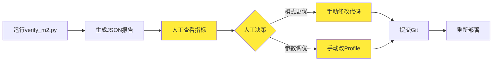

# 从研究到生产：检索优化闭环指南

> **文档用途**：说明如何将 LlamaIndex 检索模式的研究成果应用到生产环境  
> **最后更新**：2026-06-03  
> **相关文档**：[m2_retrieval.md](./m2_retrieval.md)、[architecture.md](./architecture.md)

---

## 1. 核心原则

### 1.1 半自动化流程

本项目采用**数据驱动的半自动化优化流程**：



**自动化部分：**
- ✅ 评测执行
- ✅ 指标计算
- ✅ 报告生成（JSON + Markdown）
- ✅ 文档占位符更新

**需人工介入部分：**
- ❌ 决策判断（准确率 vs 延迟权衡）
- ❌ 代码修改（固定最优模式）
- ❌ 参数调整（Profile配置）
- ❌ 部署应用（Git + CI/CD）

> **为什么不是全自动？**  
> 完全自动化的 MLOps 系统成本很高，需要 A/B 测试框架、强化学习等复杂基础设施。  
> 当前半自动化方案已能满足大多数团队需求，且易于理解和维护。

---

## 2. 研究成果输出机制

### 2.1 自动化评测框架

**评测脚本**：`scripts/verify_m2.py`

**当前覆盖的模式（5种）：**
```python
MODES = [
    ("vector", ...),        # 纯向量检索
    ("bm25", ...),          # 纯关键词检索
    ("hybrid", ...),        # RRF融合（无rerank）
    ("hybrid_rerank", ...), # RRF + BGE重排 ⭐生产默认
    ("router", ...),        # LlamaIndex Router引擎
]
```

**评测指标：**
- **Recall@5**：Top5命中率（≥8/10 为通过）
- **P95 latency**：95%请求的延迟上限
- **通过率**：是否达到阈值

**执行命令：**
```bash
python scripts/verify_m2.py --write-evolution
```

**输出文件：**
- `reports/m2_verify.json` — 详细JSON报告
- `docs/retrieval_modes.md` — 自动更新指标表

### 2.2 Golden Dataset 管理

**文件结构：**
```
data/eval/
├── m2_golden.jsonl          # M2检索评测集（question + doc_ids）
├── m2_golden.jsonl.example  # 模板（~40-80条）
├── golden.jsonl             # RAGAS评测集（含ground_truth）
└── golden.jsonl.example     # 模板
```

**Golden数据格式：**
```json
{
  "question": "P-101 出口压力正常范围是多少？",
  "doc_ids": ["pump_p101_manual.md"],
  "category": "parameter"
}
```

**扩充Golden数据集：**
```bash
# 从用户反馈导出候选问题
python pipelines/feedback/export_feedback.py \
  --golden-candidates data/eval/golden_candidates.jsonl

# 人工审核后加入 m2_golden.jsonl
```

### 2.3 指标演进文档

**文件**：`docs/retrieval_modes.md`

**示例表格：**
```markdown
| 配置 | Recall@5 | RAGAS faithfulness | P95 ms | 备注 |
|------|----------|-------------------|--------|------|
| vector only | 100% | - | 309.5 | m2_golden |
| bm25 only | 100% | - | 84.2 | m2_golden |
| hybrid | 100% | - | 431.3 | m2_golden |
| hybrid + rerank | 100% | - | 13939.8 | m2_golden |
| llamaindex router | 100% | - | 11523.6 | m2_golden |
```

**自动更新机制：**
```python
# verify_m2.py 第116-131行
def write_outputs(results, json_path, write_evolution):
    if write_evolution:
        hybrid = next(r for r in results if r["mode"] == "hybrid_rerank")
        recall_pct = f"{hybrid['recall_at_5']:.0%}"
        # 自动替换 docs/retrieval_modes.md 中的占位符
        text = text.replace(
            "| hybrid + rerank | | | | |",
            f"| hybrid + rerank | {recall_pct} | - | {hybrid['p95_ms']} | m2_golden |"
        )
```

---

## 3. 研究成果应用到生产的路径

### 路径1：固定最优模式（当前采用）⭐

**适用场景**：某模式在所有测试case上表现稳定优于其他模式

**决策流程：**
```mermaid
flowchart TD
    Start[M2评测完成] --> Compare[对比5种模式]
    Compare --> Result{hybrid_rerank<br/>Recall@5 ≥ 8/10?}
    Result -->|是| Select[选定为生产默认]
    Result -->|否| Optimize[调整参数/扩充golden]
    Optimize --> Compare
    
    Select --> Code[硬编码到Agent工具]
    Code --> Prod[生产环境使用]
```

**代码固化示例**（`apps/agent/tools/hybrid_search.py`）：
```python
async def hybrid_search(query: str, top_k: int = 20) -> list[dict]:
    # ✅ 研究成果：固定使用 hybrid_rerank 模式
    hits = await retrieve_context(query, mode="hybrid_rerank")
    return hits[:top_k]
```

**优点**：
- 简单可靠，易于维护
- 性能可预测
- 适合通用场景

**缺点**：
- 无法针对特定query类型优化
- 新场景需要重新评估

### 路径2：动态路由策略（Router Engine）

**适用场景**：不同query类型适合不同检索模式

**实现示例**（`apps/retrieval/llamaindex/router_engine.py`）：
```python
FAULT_CODE_PATTERN = re.compile(
    r"\b(?:ALM|E|F)[-_]?\d{2,4}\b|\b(?:故障码|报警码)\s*[A-Z0-9-]+\b",
    re.IGNORECASE,
)

async def query_router(query: str) -> list[dict]:
    # 规则：故障码优先用BM25
    if FAULT_CODE_PATTERN.search(query):
        keyword_hits = await query_keyword(query, top_k=10)
        if len(keyword_hits) >= 3:
            return keyword_hits[:5]
    # 否则用 hybrid_rerank
    return await retrieve_context(query, mode="hybrid_rerank")
```

**Gateway API支持动态切换**（`apps/gateway/main.py`）：
```python
async def _dispatch_search(query: str, mode: str, top_k: int) -> list[dict]:
    if mode == "vector":
        hits = await query_vector(query, top_k=top_k)
    elif mode == "graph":
        hits = await query_graph(query, top_k=top_k)
    elif mode == "router":
        hits = await query_router(query)  # 智能路由
    # ... 其他7种模式
    return hits[:top_k]
```

**优点**：
- 针对性优化
- 灵活性高
- 可逐步扩展规则

**缺点**：
- 规则维护成本高
- 需要持续更新规则库

### 路径3：Profile配置驱动调优

**适用场景**：同一模式下，通过调整参数优化效果

**配置文件**：`deploy/profiles/dev-single-node.yaml`

```yaml
retrieval:
  vector_top_k: 20        # Milvus召回数
  bm25_top_k: 20          # OpenSearch召回数
  rrf_k: 60               # RRF融合常数
  rerank_top_n: 5         # 最终输出条数

agent:
  context_top_k: 5        # 进prompt的chunk数
  max_history_turns: 3
```

**调优流程：**
```bash
# 1. 修改profile参数
vim deploy/profiles/dev-single-node.yaml

# 2. 重新评测
python scripts/verify_m2.py --write-evolution

# 3. 查看指标变化
cat docs/retrieval_modes.md

# 4. 如果改进，提交代码；否则回滚
git diff deploy/profiles/dev-single-node.yaml
```

**优点**：
- 无需改代码
- 快速迭代
- 易于回滚

**缺点**：
- 优化空间有限
- 可能需要多次尝试

---

## 4. 完整闭环流程图

```mermaid
flowchart TB
    subgraph 研究阶段
        A[新增检索模式/Engine] --> B[编写LlamaIndex引擎]
        B --> C[添加到Gateway /v1/search]
        C --> D[扩充m2_golden.jsonl]
        D --> E[运行verify_m2.py]
    end
    
    subgraph 评估阶段
        E --> F[生成reports/m2_verify.json]
        F --> G[对比Recall@5/P95]
        G --> H{是否优于现有?}
        H -->|否| I[放弃或继续优化]
        H -->|是| J[记录到retrieval_modes.md]
    end
    
    subgraph 决策阶段
        J --> K{应用策略}
        K -->|固定模式| L[修改Agent工具代码]
        K -->|动态路由| M[更新Router规则]
        K -->|参数调优| N[调整Profile配置]
    end
    
    subgraph 生产部署
        L --> O[代码Review + Merge]
        M --> O
        N --> O
        O --> P[CI/CD自动测试]
        P --> Q[部署到K8s/Helm]
        Q --> R[监控指标Grafana]
    end
    
    subgraph 持续优化
        R --> S[收集用户反馈/v1/feedback]
        S --> T[导出golden_candidates]
        T --> U[扩充Golden Dataset]
        U --> A
    end
    
    style 研究阶段 fill:#e3f2fd
    style 评估阶段 fill:#fff3e0
    style 决策阶段 fill:#f3e5f5
    style 生产部署 fill:#e8f5e9
    style 持续优化 fill:#fce4ec
```

---

## 5. 实际案例演示

### 案例：发现 Graph Engine 在故障关联查询上表现更好

#### Step 1: 研究验证

```bash
# 测试graph模式
curl -X POST http://localhost:8080/v1/search \
  -H "Content-Type: application/json" \
  -d '{"query":"E1024故障相关部件","mode":"graph","top_k":10}'

# 批量评测（需先扩展verify_m2.py支持graph模式）
python scripts/verify_m2.py --write-evolution
```

#### Step 2: 指标对比

```markdown
# docs/retrieval_modes.md 新增一行
| graph engine | 95% | - | 15234.5ms | 故障关联查询优秀 |
```

#### Step 3: 决策应用

**方案A：创建专用Endpoint**
```python
# apps/gateway/main.py 新增
@app.post("/v1/search/graph")
async def search_graph(req: SearchRequest):
    hits = await query_graph(req.query, top_k=req.top_k)
    return SearchResponse(query=req.query, mode="graph", hits=hits)
```

**方案B：增强Router规则**
```python
# apps/retrieval/llamaindex/router_engine.py
GRAPH_KEYWORDS = ["故障关联", "相关部件", "影响范围"]

async def query_router(query: str) -> list[dict]:
    if any(kw in query for kw in GRAPH_KEYWORDS):
        return await query_graph(query, top_k=10)
    # ... 原有逻辑
```

**方案C：提供Mode选项给前端**
```javascript
// Web UI 让用户选择
const modes = ['hybrid_rerank', 'graph', 'router'];
fetch('/v1/search', {
  body: JSON.stringify({ query, mode: selectedMode })
});
```

#### Step 4: 监控与迭代

```bash
# 查看Grafana看板
# - 各mode调用次数
# - 平均延迟
# - 用户反馈评分

# 导出低评分case优化golden
python pipelines/feedback/export_feedback.py \
  --golden-candidates data/eval/golden_candidates.jsonl
```

---

## 6. 关键文件清单

| 文件 | 作用 | 修改频率 |
|------|------|---------|
| `scripts/verify_m2.py` | 自动化评测脚本 | 低（稳定后不变） |
| `data/eval/m2_golden.jsonl` | Golden测试集 | 中（持续扩充） |
| `docs/retrieval_modes.md` | 指标演进记录 | 高（每次评测更新） |
| `apps/retrieval/llamaindex/*.py` | 新检索引擎 | 中（探索期） |
| `apps/agent/tools/hybrid_search.py` | 生产固定链路 | 低（确定后不变） |
| `deploy/profiles/*.yaml` | 参数调优 | 中（根据评测调整） |
| `apps/gateway/main.py` | API路由分发 | 低（稳定后不变） |

---

## 7. 最佳实践总结

1. **数据驱动决策**：所有优化必须通过 `verify_m2.py` 量化验证
2. **文档先行**：指标变化自动同步到 `retrieval_modes.md`
3. **渐进式上线**：
   - 先在 `/v1/search` 暴露新模式供测试
   - 验证通过后在 Agent 中试用
   - 最终固化为生产默认
4. **反馈闭环**：用户反馈 → golden candidates → 扩充测试集 → 重新评测
5. **配置分离**：参数调优通过 Profile，避免频繁改代码
6. **定期回顾**：每月review一次指标演进，识别优化机会

---

## 8. 未来展望：真正的自动化闭环

当前为**半自动化**流程，未来可逐步升级为全自动化：

### 阶段1：基于规则的自动调参（中等难度）

```python
# 伪代码示例
def auto_tune_rrf_k():
    best_k = 60
    best_recall = 0
    
    for k in [40, 50, 60, 70, 80]:
        update_profile(rrf_k=k)
        result = run_verify_m2()
        if result.recall > best_recall:
            best_recall = result.recall
            best_k = k
    
    # 自动应用最优参数
    apply_profile(rrf_k=best_k)
    git_commit(f"Auto-tuned rrf_k to {best_k}")
```

⚠️ **风险**：可能过拟合Golden Dataset，需要人工Review

### 阶段2：A/B测试框架（高难度）

```python
# 生产环境同时跑两个版本
class ABTestRouter:
    def __init__(self):
        self.version_a = "hybrid_rerank"
        self.version_b = "graph"
        self.traffic_split = 0.5  # 50%流量
    
    def route(self, query):
        if random() < self.traffic_split:
            return retrieve_context(query, mode=self.version_a)
        else:
            return query_graph(query)
    
    def collect_feedback(self, query, mode, rating):
        # 收集用户反馈
        # 统计分析哪个模式评分更高
        pass
```

### 阶段3：强化学习自动优化（极高难度）

需要：
- 定义奖励函数（Recall + 延迟加权）
- 训练Agent选择最佳检索策略
- 在线学习用户偏好

详见开发计划：[plans/auto-evaluation-roadmap.md](./plans/auto-evaluation-roadmap.md)

---

## 9. 相关文档

- [m2_retrieval.md](./m2_retrieval.md) — M2检索详解、评测方法
- [architecture.md](./architecture.md) — 双框架架构图
- [retrieval_modes.md](./retrieval_modes.md) — 指标演进表
- [plans/auto-evaluation-roadmap.md](./plans/auto-evaluation-roadmap.md) — 自动化优化路线图
