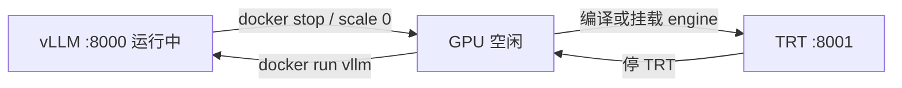

# TensorRT-LLM 服务

> **M4 学习**：[docs/m4_serving.md](../docs/m4_serving.md)（含 vLLM↔TRT 切换流程图）。  
> **M4 用户操作**（TRT 行 + K8s/KEDA）：[m4_user_runbook.md](../docs/m4_user_runbook.md)

与 vLLM **GPU 互斥**（`mutual_exclusive_gpu: true`）。架构保留双引擎，6GB 本机 **分时** 使用。

---

## 为什么要有 TRT-LLM？

| | vLLM | TensorRT-LLM |
|--|------|----------------|
| 优势 | 开发友好、动态 batch | 编译后低延迟、生产演示 |
| 成本 | 拉镜像即用 | **编译 engine 耗时长、占磁盘** |
| 本机 | Docker 日常 | WSL2 编译 + 分时压测 |

---

## 分时切换总览



完整步骤（本机 Docker + K8s + .env）： [m4_serving.md §3.2](../docs/m4_serving.md#32-vllm--tensorrt-llm-分时切换6gb-单卡)。

---

## 流程（首次启用 TRT）

### 1. 停 vLLM 释放 GPU

```powershell
docker stop <vllm_container_id>
# 或 K8s: kubectl scale deployment ...-vllm --replicas=0
```

### 2. 编译 TRT engine（WSL2 Ubuntu 推荐）

> **须拍板**：下载 TRT、编译 Qwen AWQ engine 可能数十 GB 磁盘与数小时 CPU/GPU。

占位流程（具体版本随 NVIDIA 发布变，以官方文档为准）：

1. 安装 TensorRT-LLM 与 CUDA  toolchain（WSL2）
2. 将 `Qwen2.5-7B-Instruct-AWQ` 转为 TRT engine 目录
3. 构建推理镜像，暴露 OpenAI 兼容 **8001**

### 3. 启动 TRT 服务

本机开发：容器或进程监听 `http://localhost:8001/v1`。

### 4. 改路由配置

`.env`：

```
LLM_ACTIVE_BACKEND=tensorrt_llm
TENSORRT_LLM_BASE_URL=http://localhost:8001/v1
```

重启 Gateway 后探活：

```powershell
python scripts/verify_m4.py --skip-gateway --write-report
```

### 5. 压测并对比

```powershell
python scripts/benchmark_serving.py --backend tensorrt_llm --lite --update-doc
```

对比 `docs/serving_benchmark.md` 中 vLLM 与 TensorRT-LLM 两行。

---

## K8s Helm

```powershell
kubectl -n industrial-ops scale deployment ior-industrial-ops-rag-vllm --replicas=0
kubectl -n industrial-ops scale deployment ior-industrial-ops-rag-tensorrt-llm --replicas=1
```

values：`tensorrtLlm.replicaCount: 1` 且 `vllm.replicaCount: 0`（见 `values-dev-single-node.yaml`）。

模板：`deploy/helm/industrial-ops-rag/templates/tensorrt-llm-deployment.yaml`

---

## TRT 部署参数（profile）

| 字段 | dev 值 | 含义 |
|------|--------|------|
| `port` | 8001 | 与 vLLM 8000 错开 |
| `max_batch_size` | 1 | 6GB 保守；生产可增大 |
| `max_input_len` | 2048 | 输入 token 上限 |
| `max_output_len` | 1024 | 输出 token 上限 |

---

## 注意

- TensorRT-LLM 构建 **不要** 与 vLLM / QLoRA 同时占 GPU
- engine 与 CUDA/TRT 版本强绑定，换驱动可能需重编译
- 本机可仅完成 **架构 + 文档 + vLLM 压测**；TRT 行留空仍可通过 M4 配置验收，完整对比需你本地编译后补跑
